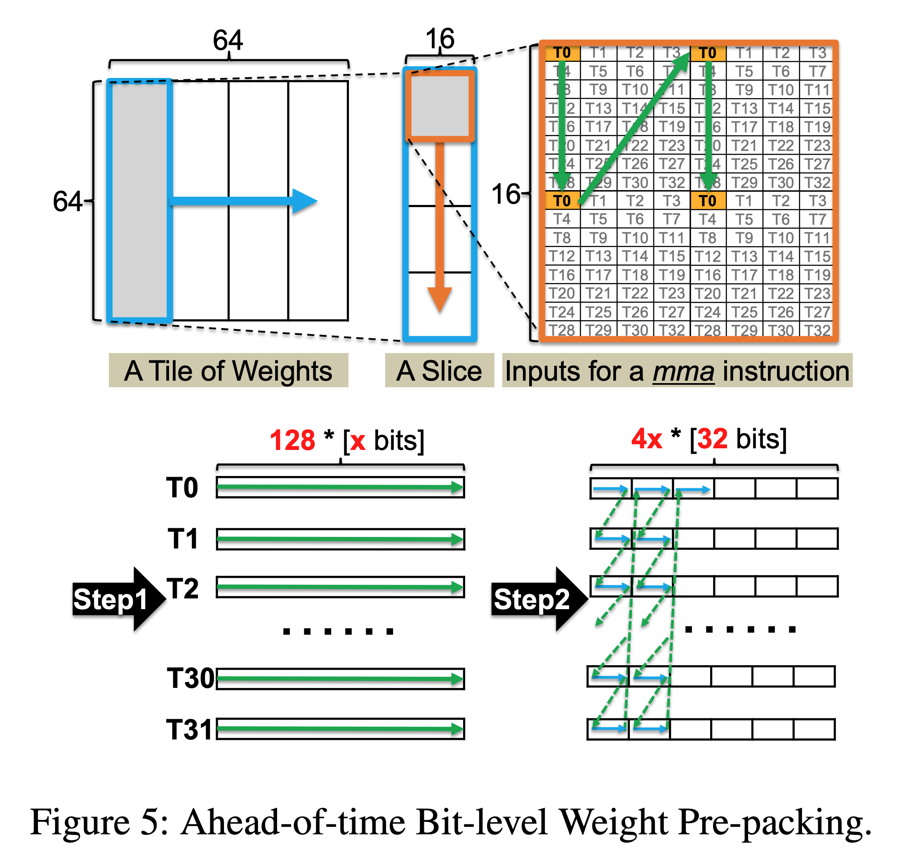
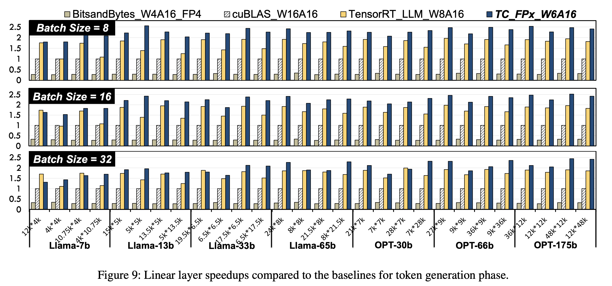
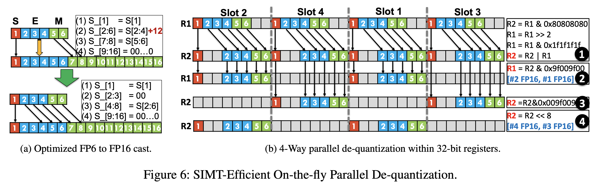

### The key idea

Post training quantisation of LLMs can reduce the cost of inference as models are typically memory bound. Compressing the weights of the model into lower precision reduces the burden of memory transfers.
Currently there ino good hardware support for post training quantisation in non-power-of-2 bits and the authors propose a full stack GPU kernel for floating-point weights of various bit widths (eg FP6).
The authors follow on from previous work showing that FP6 can be used without a noticeable drop in accuracy.
They provide an end-to-end inference pipeline for FP6 training and using this, show a substantial speedup on the FP8 baseline for a variety of models.

### Their method

The main challenges in quantising to non power of 2 values is that GPUs registers are generally designed to read at the granularity of 32-bit words. To read 6-bit weights this means a large fraction of the memory read will be unused and therefore wasted.
To solve this problem the authors propose a method of ahead-of-time bit-level pre-packing. In which you can combined the memory read of every 32 x-bit weights, resulting in x requests of 4-byte words per GPU thread. In this case, all the memory access would be aligned at the granularity of 32-bit words rather than irregular bit width.
In order to do this is it required to rearrange the weights in memory but it is only required to do this once and this cost can be amortised over many inference calls.

The other challenge the authors face is how to best hide the latency of the FP-x to FP16 cast during dequantisation.
They leverage parallelism by using the SIMT cores to do the dequantisation while the Tensor Cores run the model.
Furthermore, they can dequantise multiple FP-x weights in parallel due to the bit level parallelism within each 32 bit register, reducing SIMT overhead by 4x.

### Results

Evaluation is conducted with reference to an FP16 base model and quantised FP8 model. They show consistent speedups over these models by around 2.2x and 1.3x respectively.
Furthermore quantising to FP6 allows LLaMA-70B to be deployed using only a single GPU, achieving a speedup of 1.69-2.65x the FP16 baseline. Overall we think this is a promising method to break the hardware lock of quantising to powers of 2 and allow more flexible and efficient LLM inference.

