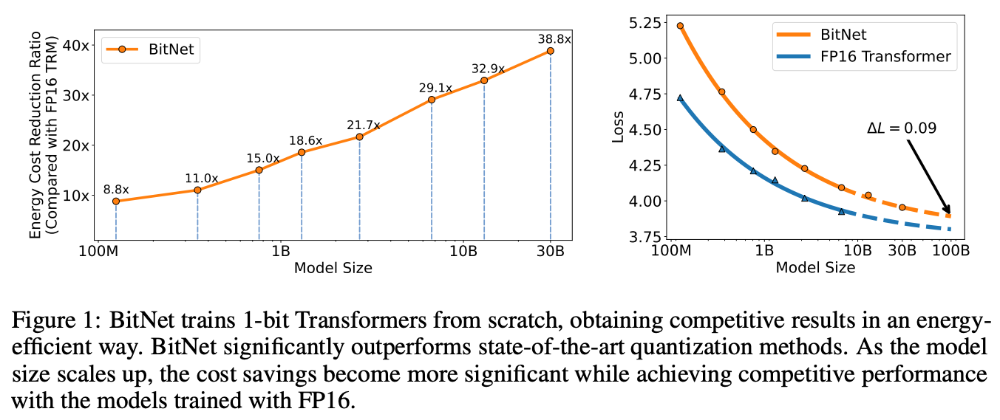
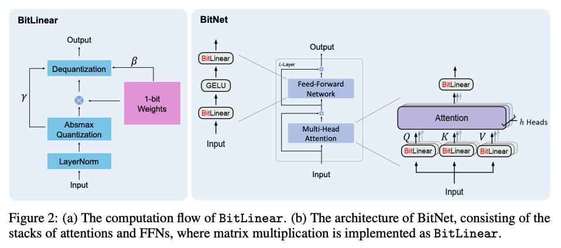
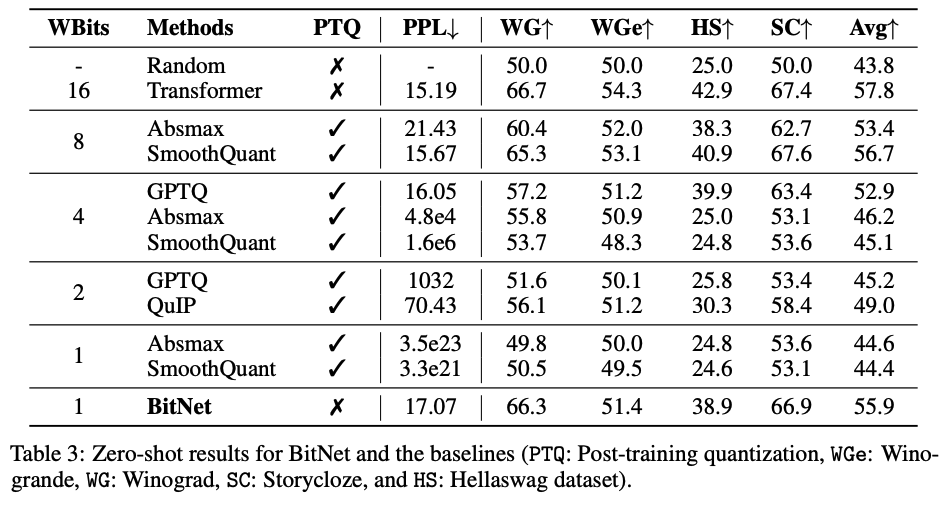

### The key idea

The authors demonstrate a method for training LLMs using 1-bit linear layers. In this architecture, weights are stored in a 1 bit format, and input activations are quantized on-the-fly after normalization.

This work is only considering quantization aware training (QAT), not post-training quantization (PTQ).

### Their method

In terms of implementation, the approach is following previous lower precision papers, with an ad-hoc quantized linear layer. Their quantization method is based on absmax quantisation, and is applied in both the FFN and self-attention layers. The main difference is the addition of (sharded) layer norm before quantization.

The method can be used together with other acceleration methods for LLMs, such as PagedAttention, FlashAttention, and speculative decoding.

_Diagram showing how a standard transformer is modified to use 1-bit linear layers._

### Results

Results are promising, showing that despite the reduction in terms of accuracy, it could be an order of magnitude more efficient that FP16 and FP8 on hardware.
They compare against all the relevant alternative methods, across a reasonable range of tasks.

### Takeaways

Note nevertheless that 4-bits baselines look a bit weak, and additional experiments on SOTA models like LLama would be useful to confirm the results.
Overall then, a promising set of results given the level of compression, but more experiments required to validate this fully.