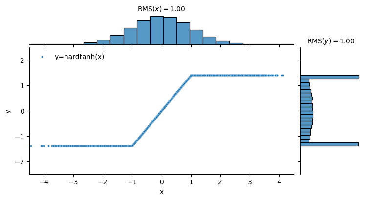
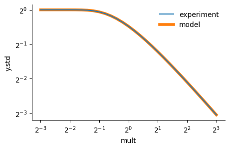

My colleagues and I always get excited when, every once in a while, deep learning research throws up a fun little maths problem. Our recent work on [u-μP](https://arxiv.org/abs/2407.17465) does just this, and in a reasonably systematic way, since we need to work out how to compensate for changes in scale (standard deviation) through deep learning ops. In this post and the [accompanying notebook](https://github.com/graphcore-research/unit-scaling/blob/main/examples/how_to_scale_op.ipynb), we explore this problem.

<!-- more -->

Our lofty goal? To put multipliers in the forward and backward passes of the hardtanh nonlinearity to make it look like this:

{:.img-medium}

Which might look quite like a regular `hardtanh(x) = clip(x, -1, 1)`, but the eagle-eyed reader will notice it doesn't saturate at ±1. And crucially, the output standard deviation (and RMS) ≈ 1.

Why do we want this? It turns out that this _unit scale_ property can lead to more stable training if applied throughout the model (it's all in the paper). But to get there we first have to figure out how to set these scaling factors.

We'll learn how to write code that looks like this (assuming of course that you want to write code that looks like this):

```python
def hardtanh(x: Tensor, mult: float = 1.0,
             constraint: Optional[str] = "to_output_scale") -> Tensor:

    Z = erf(1 / (mult * sqrt(2)))
    y_scale = 1 / sqrt(Z + (1 - Z) / mult**2 - sqrt(2/pi) / mult * exp(-1/2 / mult**2))
    grad_scale = 1 / sqrt(Z)
    y_scale, grad_scale = apply_constraint(constraint, y_scale, grad_scale)

    x = scale_bwd(x, grad_scale)
    y = F.hardtanh(x, -1/mult, 1/mult)
    return scale_fwd(y, y_scale)
```

Most excitingly, we'll learn where those mysterious `sqrt(Z)` and `sqrt(Z + (1 - Z) / mult**2 - sqrt(2/pi) / mult * exp(-1/2 / mult**2))` factors come from.

_This post will remain somewhat high-level; to dive in to the detail, see our [accompanying notebook](https://github.com/graphcore-research/unit-scaling/blob/main/examples/how_to_scale_op.ipynb)._

## Warmup - Empirical scaling

The first approach to scaling an op like `F.hardtanh` is to feed in random data with an appropriate distribution (usually unit Gaussian), and measure the change in scale:

```python
x = torch.randn(int(1e6)).requires_grad_()
y = F.hardtanh(x)
y.backward(torch.randn_like(y))

print("x.std", x.std().item())  # => 1.000
print("y.std", y.std().item())  # => 0.718
print("x.grad.std", x.grad.std().item())  # => 0.826
```

Then, in our scaled op code we can set `y_scale = 1 / 0.718` and `grad_scale = 1 / 0.826`, and we're done!

This is grand, and a 100% legitimate approach to scaling. But it can get a bit trickier if we add a `mult` (inverse-temperature) parameter, as recommended by u-μP, as the scaling rule depends on the `mult`. So we'll consider an alternative approach that divies into the maths.

## The business - Statistical scaling

For this part, we'll extend the problem to scaling `hardtanh(x, mult) = clip(x, -1/mult, 1/mult)`. Let's eyeball the output distribution when we feed in Gaussian samples:

{.img-small}

This joint plot shows a Gaussian distribution coming in (top), the joint distribution which is a line since `F.hardtanh` is deterministic, and the output distribution (right), which is a mixture of two spikes at ±1 and a truncated Gaussian in between.

If we write out the pdf of the output distribution ($Y = \mathrm{hardtanh}(X, \alpha)$ when $X \sim \mathcal{N}(0,1)$, and $\alpha = \mathrm{mult}$), we get:

$ \mathrm{P}(Y=y) = \begin{cases} \frac{1-Z}{2}\, \delta(y - \alpha^{-1}) + \frac{1-Z}{2}\, \delta(y + \alpha^{-1}) + \varphi(y) & \textrm{if } {-\alpha^{-1}} \leq y \leq \alpha^{-1} \\\\\\\\
0 & \textrm{otherwise} \end{cases} $

where $Z = \mathrm{erf}(\sqrt{\frac{1}{2}}\, \alpha^{-1})$ is the probability that $X$ falls in the range $[-\alpha^{-1}, \alpha^{-1}]$, $\delta(\cdot)$ is the Dirac delta function and $\varphi(\cdot)$ is the Gaussian pdf (note that the $Z$ normaliser for a truncated Gaussian cancels exactly with the mixture weight).

Following through the maths for $\mathrm{Var}(Y)$ (see [notebook](https://github.com/graphcore-research/unit-scaling/blob/main/examples/how_to_scale_op.ipynb) for details), we get the output standard deviation or **forward scale**:

$\sigma_Y = \sqrt{\alpha^{-2} + (1 - \alpha^{-2})\,\mathrm{erf}(\sqrt{\frac{1}{2}}\, \alpha^{-1}) - \sqrt{\frac{2}{\pi}}\, \alpha^{-1}\, e^{-\frac{1}{2}\alpha^{-2}}}$

If we use the empirical scaling technique that we saw previously to test this rule, we see:

{.img-small}

This looks like an excellent fit - the maths works!

We apply the same procedure for the input gradient $\dot{X}$, obtaining the **backward scale**:

$\sigma_{\dot{X}} = \sqrt{\mathrm{erf}(\sqrt{\frac{1}{2}}\, \alpha^{-1})}$

Now we set `y_scale` and `grad_scale` to $1/\sigma_Y$ and $1/\sigma_{\dot{X}}$ respectively, as seen in the code at the top of this post.

## Finishing up

The final piece of the puzzle to get the final code is to apply any _constraints_, which allow the user to specify how the forward and backward scales should be constrained. We can add this support using a helper function from the unit scaling library: `y_scale, grad_scale = apply_constraint(constraint, y_scale, grad_scale)`. This allows `y_scale` and `grad_scale` to be independent (`constraint = None`) or to be constrained to the same value, e.g. using the output scale `constraint = "to_output_scale"`. This sacrifices exact scaling of `x.grad` in order to use the same scale in forward and backward passes, which is important in many parts of the deep learning compute graph (see the [unit scaling](https://arxiv.org/abs/2303.11257) paper for more detail).

Our final scaled op looks like this:

{:.img-large}

_That's it! We've successfully unit-scaled `hardtanh`, given a light spattering of stats._

Hopefully you now have the tools to find a scaling rule for your favourite nonlinearity (although, not all ops are as amenable to the statistical approach). To use the compendium of ops for which we have proposed scaling rules, or to develop your own rules, see [https://github.com/graphcore-research/unit-scaling](https://github.com/graphcore-research/unit-scaling).

To learn why this matters, see our work on [u-μP: The Unit-Scaled Maximal Update Parametrization](https://arxiv.org/abs/2407.17465).

Thanks for reading, well done for reaching the end & happy scaling!
