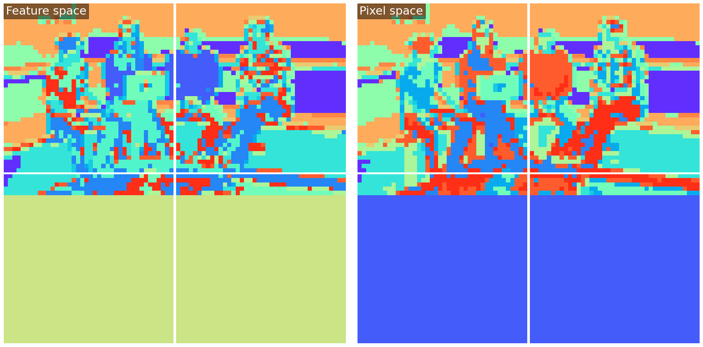
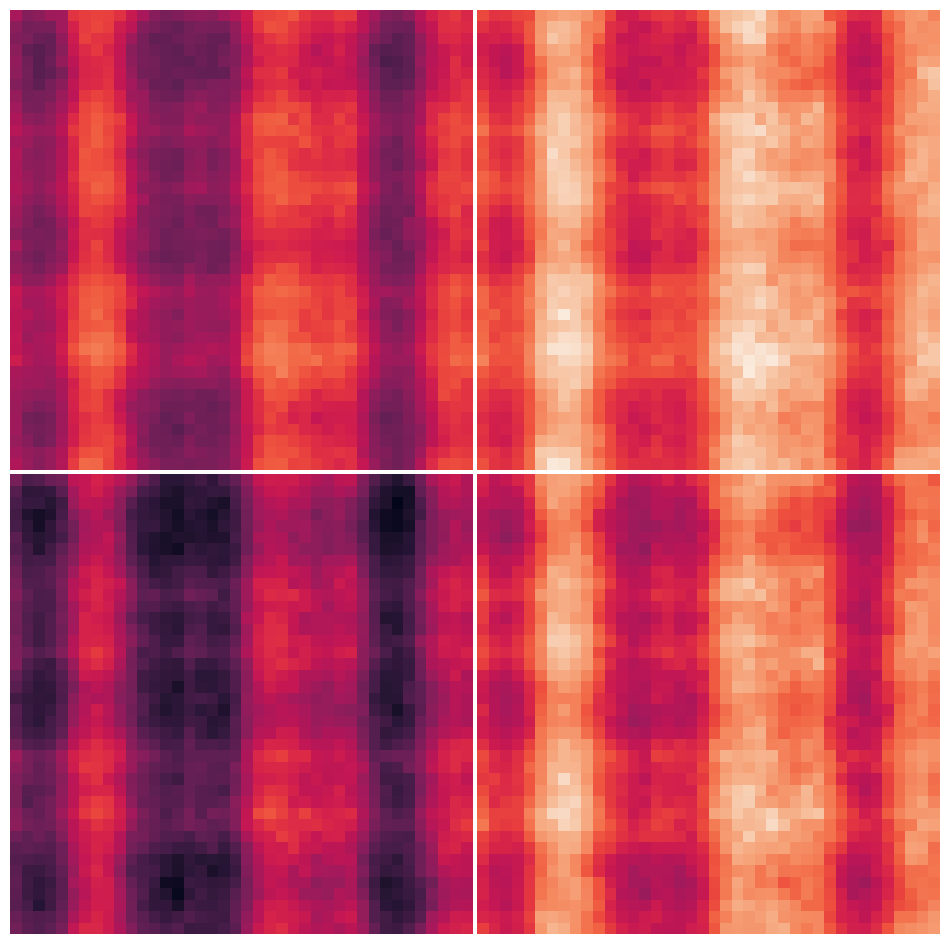

Vision-Language Models (VLMs) allow LLMs to "see", but how do they work? In this post, we'll walk through the model changes needed to turn an LLM into a VLM for inference. To understand the LLM starting point, please see [A transformer walk-through with Gemma](/posts/2024/04-gemma/gemma.md), as we shall assume that content here.

<!-- more -->

**Problem** — Text generation, _conditioned on an image_: take an RGB image (below) and a short string prompt _"What colour shirt is the person to the left of the laptop wearing?"_, then use an already-trained VLM ([Llama-3.2-11B-Vision-Instruct](https://huggingface.co/meta-llama/Llama-3.2-11B-Vision-Instruct) by Meta) to generate an answer to the prompt.

{:class="constrained_img_large"}

**Code** — This post is accompanied by an [IPython notebook](https://github.com/graphcore-research/graphcore-research.github.io/blob/main/notebooks/2024-12-LlamaVision.ipynb), which requires 40 GB of accelerator memory to run. It includes a barebones implementation of the Llama 3.2 VLM in pure PyTorch (and code to generate the plots).

**Overview** — To turn an LLM into a VLM, the crucial problem is how to _represent and process the image_, and how to use it as _context while generating_ the response text. We'll cover each of the major components that handle this in turn: image preprocessing, patch embedding, positional embedding, the vision transformer and cross-attention. Each section is accompanied by an optional explanation section _"Understanding X..."_, providing more depth on that component.

## Image preprocessing

Given image pixels in a `(height, width, 3)` array of RGB values ranging `[0, 255]`, we must resize/resample, pad and rescale, before feeding into the model itself. Here's the code for the rescaling step:

```python
image = ((image / 255) - tensor([0.48, 0.46, 0.41])) / tensor([0.27, 0.26, 0.28])
```

Apart from rescaling, in this particular model the image is resampled and padded to fit into 4 square 560px x 560px tiles. The arrangement of tiles is flexible, allowing different aspect ratios. In this case, the preprocessed image is of shape `(4, 560, 560, 3)`.

<details markdown="1" open="true"><summary>Understanding preprocessing</summary>

Learning can be a bit faster if inputs are "whitened", giving them zero mean and unit standard deviation, over the dataset. Unlike `LayerNorm` and `RMSNorm`, this operation is not per-example, instead using some fixed scales which were chosen prior to training, based on the dataset.

Here's what happens — at first sight, just the x-axis is shifted and scaled, but on close inspection, you can see that each colour component has a slightly different shift and scale value.

{:class="constrained_img_large"}

(Don't worry, we're just warming up — the next components are a bit more interesting!)

</details>

## Patch embedding

The next step aims to present the image in a transformer-friendly way, as simply as possible. We divide the image up into "patches" of 14x14 pixels, and then flatten each patch into a vector of length `588 (= 14 * 14 * 3)`. After this, we project each patch through a `patch_embedding` matrix of shape `(1280, 588)` to get "embedded" patches, each a vector of length 1280. At this point, the embedded image is of shape `(4, 1600, 1280)`; note that there are 1600 patches per tile, `1600 = (560/14) * (560/14)`.

```python
img = preprocessed_image   # shape=(4, 560, 560, 3)
img = img.reshape(4, 40, 14, 40, 14, 3)
img = img.permute(0, 1, 3, 2, 4, 5)
img = img.flatten(1, 2).flatten(2, 4)  # shape=(4, 1600, 588)

embeddings = img @ patch_embedding.T  # shape=(4, 1600, 1290)
```

<details markdown="1" open="true"><summary>Understanding patch embedding</summary>

The "patched" image looks like this:

{:class="constrained_img_large"}

The `patch_embedding` takes each patch of 588 scaled-RGB values and converts it to a 1280-vector. This is a dot product (see [transformer walk-through](/posts/2024/04-gemma/gemma.md)), which compares each patch with 1280 different vectors, testing for similarity. These vectors were learned during pre-training to extract useful information from the RGB values. We can visualise them as 1280 14x14-pixel RGB images (note that the intensity scale is somewhat artificial, and for readability, they are sorted by standard deviation since feature ordering is arbitrary):

{:class="constrained_img_large"}

A few brief observations:

 - There are approximately 300 "strong" features, and 900 weaker ones (see figure below). We probably shouldn't assume the weaker ones are irrelevant, however, as the rest of the network may amplify them.
 - Features seem to correspond to different frequencies - some are broad and flat, some are single edges while others are fine-grained / texture-like.
 - Although full RGB colour is available for every feature, many features appear colour-agnostic.

{:class="constrained_img_small"}

Finally, let's take a look at the image after transformation with `patch_embedding`. To visualise this `(4, 40, 40, 1280)` tensor, we'll perform k-means (16 clusters) on the hidden dimension, then map each patch to a unique colour for its closest cluster. This gives us some sense of which areas of the image are nearby in feature space.

{:class="constrained_img_large"}

There doesn't seem to be much qualitative difference between clusters in pixel space or feature space; perhaps this is unsurprising for a linear up-projection.

</details>

## Positional embedding

Llama's raw model has quite a complex positional embedding scheme, but for inference, it can be merged into a single parameter, `positional_embedding`. This is indexed by an `aspect_ratio_id`, which identifies which arrangement of the 4 tiles is employed for the given image. After selecting the appropriate row, the positional embedding is added to the embedded patches.

We call this an _absolute_ positional embedding since it is based on the absolute position of a patch within the image, rather than being _relative_ (during attention) to the offset between two patches.

```python
# params.positional_embedding.shape == (8, 4, 1600, 1280)
embeddings += params.positional_embedding[aspect_ratio_id]  # shape (4, 1600, 1280)
```

<details markdown="1" open="true"><summary>Understanding positional embedding</summary>

It's somewhat hard to visualise the positional embedding, a `(4, 40, 40, 1280)` tensor. The reason for this is that it exists primarily to influence attention between two patches, which is described by a `(4, 40, 40, 4, 40, 40)` attention map. Unfortunately, the effect of the positional embedding on these attention maps is not linearly separable from the input-dependent patch embedding. But if we pretend for an instant that it is, for a selected head in the first layer, we can see the following "average pre-softmax attention map", where the averaging is over all `(4, 40, 40)` query locations:

{:class="constrained_img_small"}

This particular head (layer 0, head 4) has a preference for content appearing in certain vertical bands of the right-hand two tiles. The repeating pattern between the tiles is an artifact of the way the pre-trained image model has been extended using tiles to handle larger images, and it is hard to argue that it's semantically appropriate.

</details>

## Vision transformer

Llama's vision transformer is a pre-norm residual network with alternating self-attention and MLP blocks, much like the text transformer of Llama (and Gemma). The differences are:

 - No causal masking, so each patch attends to all patches
 - No grouped query attention
 - Simple (not gated) MLP
 - Layer Norm, not RMS Norm

The implementation of a transformer layer given `params` looks like this:

```python
z = F.layer_norm(hidden, (1280,), *params.attn_norm)
q, k, v = (
    (z @ m.T).view(-1, 16, 80).transpose(-2, -3)
    for m in (params.attn_q, params.attn_k, params.attn_v)
)
mix = F.scaled_dot_product_attention(q, k, v).squeeze(0)
hidden += mix.transpose(-2, -3).flatten(start_dim=-2) @ params.attn_o.T

z = F.layer_norm(hidden, (1280,), *params.mlp_norm)
z = F.gelu(z @ params.mlp_up.T + params.mlp_up_bias)
hidden += z @ params.mlp_down.T + params.mlp_down_bias
```

All following the standard transformer pattern. The vision transformer (40 layers, hidden size 1280) is quite small compared with the text transformer (40 layers, hidden size 4096). In this model, only patches (not tokens) are fed as input to the vision transformer, and only tokens (not patches) are fed as direct input to the text transformer.

<details markdown="1" open="true"><summary>Understanding the vision transformer</summary>

**Differences:** Of the differences listed above, _no causal masking_ and _no grouped query attention_ are because the vision model isn't trained autoregressively, to predict patches in order. This means there is no need to mask out "future information" so that the model can't cheat during training. It also means the model is not expected to run with a KV cache and sequence length 1 at inference time, reducing the need for grouped query attention to save KV cache bandwidth.

The remaining differences - _non-gated MLP_ and using _layer norm_ instead of RMS norm aren't obviously necessary to me, although there may be reasons of which I'm not aware favouring these for vision models.

**Self-attention:** To inspect what the self-attention attention layers are doing, we can visualise the attention weights (each in the range [0, 1]) of layer 16, head 3, for the top-left tile. Note that the transparency is log-scaled between `1/(4*40*40)` (opaque) and `1` (transparent). Hover over the picture to select different "query patches" and see which "key-value patches" they attend to.

<script src="/assets/js/posts/2024-12/llama-vision/attention_interactive.js"></script>
<canvas id="attention-interactive" class="constrained_img_large" style="margin-bottom: 1em;"></canvas>

Looking at this, I'm impressed by the implicit image segmentation that has been learnt (try hovering over each person, the laptop, floor or wall).

**Residual evolution:** Finally, and mainly for fun, let's look at another k-means clustering that shows how the hidden state evolves during the residual network. The first frame "layer 0" is the input to the first transformer layer. The k-means clusters use Euclidean distance and are trained over the whole sequence of hidden states.

{:class="constrained_img_large"}

We observe how areas of the image tend to change together, and there are "jumps" corresponding to certain layers where much of the image changes together. The jump at frame 31 corresponds to the end of one pre-trained transformer network, and the beginning of another.

</details>

## Cross-attention

The text transformer is mostly unchanged from the original pre-trained model (Llama 8B). In order to incorporate information from the vision transformer, 8 additional cross-attention layers are interleaved into the stack of text transformer layers.

The cross-attention layers take queries from the text sequence, but keys and values from the vision transformer. Specifically, the input to the key and value projections is formed by concatenating the vision transformer residual state after layers [3, 7, 15, 23, 30] and the final hidden state, then projecting to the language model's hidden size. Cross-attention layers omit RoPE embeddings and introduce an RMSNorm after the query and key projections. The following code supports both (text) self-attention and (text-vision) cross-attention layers, given `params`, `hidden`, `vision_out`, `layer_idx` and `rotate()`:

```python
input_q = F.rms_norm(hidden, (1280,), params.attn_norm)
cross_attn = layer_idx in [3, 8, 13, 18, 23, 28, 33, 38]
input_kv = vision_out if cross_attn else input_kv
q, k, v = (
    (z @ m.T).view(-1, nh, 128).transpose(-2, -3)
    for m, nh, z in (
        (params.attn_q, 32, input_q),
        (params.attn_k, 8, input_kv),
        (params.attn_v, 8, input_kv),
    )
)
if cross_attn:
    q = F.rms_norm(q, (128,), params.attn_q_norm)
    k = F.rms_norm(k, (128,), params.attn_k_norm)
else:
    q, k = rotate(q), rotate(k)

mix = F.scaled_dot_product_attention(
    q, k, v, is_causal=not cross_attn, enable_gqa=True
)
...
```

Note that the code in the notebook is slightly more complex since it supports a KV cache for self-attention layers.

<details markdown="1" open="true"><summary>Understanding cross-attention</summary>

Cross-attention works similarly to self-attention, just the keys and values come from the image, rather than the preceding text. There is no such thing as causal masking, and relative positional encoding doesn't make sense across domains. We can visualise the cross-attention maps in a similar way as before. In this case, we're showing the attention map from the penultimate cross-attention layer (layer 33), averaged over all 32 heads. Hover over the tokens to see where attention is generally focused.

<!-- see attention_interactive.js -->
<div id="cross-attention-tokens" class="constrained_img_large" style="font-family: monospace; margin-bottom: 0.5em;"></div>
<canvas id="cross-attention-interactive" class="constrained_img_large" style="margin-bottom: 1em;"></canvas>

This shows some interpretable patterns. For example, around the word "laptop", the model attends to the laptop. In fact, it seems to get there one step early, which may be because the language model was trained to predict the next token, so it uses the scene to predict the word "laptop" after "the", even when it is part of the prompt. Similarly around the "?" and phrase "wearing a blue", the model attends to the appropriate part of the picture to answer the question.

Note, however, that these visualisations should only be taken as a rough indication - with a total of `256 (= 8 * 32)` cross-attention heads, and a complex nonlinear model processing the outputs, we're far from identifying exactly how the model solves the task!

</details>

## Finished 🚢

That's just about it. Put everything together ([notebook](https://github.com/graphcore-research/graphcore-research.github.io/blob/main/notebooks/2024-12-LlamaVision.ipynb)), and our model can answer the question correctly 🎉.

> **Query:** What colour shirt is the person to the left of the laptop wearing?
>
> **Response:** The person to the left of the laptop is wearing a blue-green t-shirt. The shirt is...

More to the point, we've seen how to adapt an LLM to make a Vision-Language Model (VLM) — the trick is to keep it structurally very simple, with the model's power coming from parametric scale & careful pretraining. Llama-3.2 Vision has some fundamental differences and some indicental ones, versus the text-only Llama models. The fundamental ones we saw were:

 - Image preprocessing and patch embedding.
 - Different (absolute) positional embeddings for the image.
 - Non-causal image encoding using a transformer.
 - Cross-attention in the text transformer to incorporate vision information.

It's impressive what such simple model structures can achieve! Hopefully, we can find ways to push them even further, making training more effective and inference more efficient, as this is by no means the final word on Vision-Text modelling.
