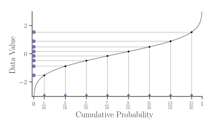
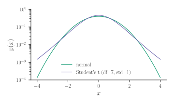
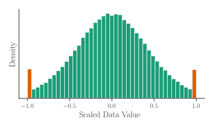
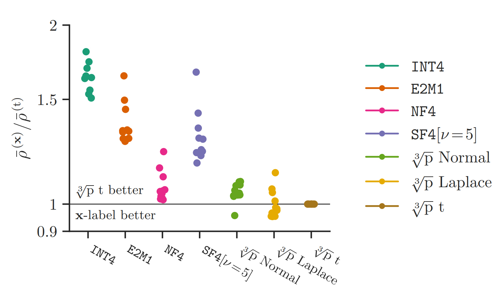

Your boss emails you a point in 128-billion-dimensional space. "Llama 3.1 8B," the message reads. "A not-so-large language model in `bfloat16`. But it's too big. Trim the fat (ASAP)." You open up your toolbox: quantisation, sparsity, distillation.

Quantisation comes first, with two problems. First, you must choose a space smaller than a 128-billion-dimensional binary number for the model to sit in. Second, you need to find a good point in that space. In our recent work on [optimal formats for weight quantisation](https://arxiv.org/abs/2505.12988), we've had a crack at the first question.

<!-- more -->

In this post, we'll learn how to construct optimal formats for known scalar distributions via the "cube root rule". We'll start with a recap of an existing format that claims optimality for the normal distribution. Then we'll explore the cube root rule — a non-intuitive result from the 1950s — and use it to build our own quantisation formats for scaled normal, Laplace and Student's t distributions.

## NormalFloat (NF4)

The NormalFloat quantisation format, introduced in [QLoRA](https://arxiv.org/abs/2305.14314), aims to be information-theoretically optimal for the normal distribution. As a non-linear format, it specifies `n` _centroids_, which are the values exactly represented in the format. To quantise a value, we store the index of the closest centroid in `log2(n)` bits. To dequantise, look up and return the centroid at the stored index.

NormalFloat is based on quantile quantisation, where the quantised indices should be uniformly distributed. To achieve this, we must distribute centroids in a similar way to the incoming data, with more centroids where the density of data is higher, as illustrated below:

{:class="img"}

To distribute the <span style="color: #7570b3; font-weight:bold">purple centroids</span> to match normally distributed data, we map a uniform range by the inverse cdf of the normal distribution (`ppf` in scipy):

```python
n = 8
centroids = scipy.stats.norm.ppf(torch.linspace(1/(2*n), 1 - 1/(2*n), n))
```

Here's an illustration of how this works:

{:class="img"}

By ensuring the cumulative probabilities of the centroids are evenly spaced, roughly the same number of datapoints should fall into each quantisation bin, so the distribution of quantised indices is uniform.

As a final step, since NormalFloat is designed to quantise data which has first been normalised by the absolute maximum over a block of values, it also normalises the centroids to the range [-1, 1].

## Mean Squared Error

While it seems reasonable to aim for a flat distribution after quantisation, it isn't the most obvious optimisation objective. A common choice of metric for quantisation is the _mean squared error_:

```python
error = torch.mean((quantise(x) - x) ** 2)
```

_Note: we motivate the choice of MSE in [our paper](https://arxiv.org/abs/2505.12988) by showing how it predicts the KL divergence between model outputs before and after quantisation._

So, how do we design a non-linear format to minimise MSE? Classical quantisation literature comes to the rescue! Given samples from a distribution, the Lloyd-Max algorithm (k-means) optimises centroids to minimise MSE ([Lloyd (1982)](https://www.stat.cmu.edu/~rnugent/PCMI2016/papers/LloydKMeans.pdf), [Max (1960)](https://cs.nyu.edu/home/people/in_memoriam/roweis/csc2515-2006/readings/max60.pdf)). Alternatively, for a known distribution, [Panter and Dite (1951)](https://ieeexplore.ieee.org/document/1701410) find that **the density of centroids should follow the cube root of the data density**. We'll explore this second approach.

## Cube root density formats

To optimise MSE, the density of our centroids should be proportional to the cube root of the density of the data pdf. (Recall for quantile quantisation (NF4), it was directly proportional, no cube root.)

Taking the cube root of a pdf flattens it out somewhat, making it less "spiky". We can explore this effect if we generalise the rule using an exponent `alpha`, so `centroid_density ∝ pdf ** alpha`. In this plot, we can vary `alpha`, with `1/3` corresponding to the cube root rule and `1` corresponding to quantile quantisation.

<script src="/assets/js/posts/2025-06/cube-root-formats/crd_iplot_alpha.js"></script>
<div id="crd-iplot-alpha" style="width: 32em"></div>

Note that the distribution of quantised values isn't uniform at the optimum (`alpha=1/3`), and the centroids are more spread out than they would be under quantile quantisation (`alpha=1`). At `alpha=1` we would expect the bin counts to be uniform, but the end bin locations are approximate, causing more values to fall into the these bins. We see that the cube root rule (`alpha=1/3`) results in lower MSE for standard normal data.

_Note that this plot uses slightly different code from the above: `ppf(torch.linspace(0, 1, n+2)[1:-1])`, which performs better for the cube root rule, but worse for quantile quantisation, but in both cases, the cube root rule has lower MSE than quantile quantisation._

### Cube root density (known parameters)

Conveniently, for normal, Laplace and Student's t distributions, if we take the cube root of the pdf and normalise it, we obtain another distribution of the same family, but with different parameters.

For example, the cube root of the pdf of `normal(mean=0, std=1)` data is a scaled `normal(mean=0, std=sqrt(3))` pdf. To apply the cube root rule, we have `new_std = old_std * sqrt(3)`. It's a similar story for Laplace and Student's t, with their own rules for updating the parameters:

```python
n = 8
p = torch.linspace(0, 1, n + 2)[1:-1]

centroids_normal = scipy.stats.norm.ppf(p, scale=sqrt(3))
centroids_laplace = scipy.stats.laplace.ppf(p, scale=3/sqrt(2))
df = 7
centroids_t = scipy.stats.t.ppf(p, (df-2)/3, scale=sqrt(3))
```

These centroids come out as:

{:class="img"}

Note that the Laplace and Student's t centroids are more spread out, due to the heavier tails of these distributions (the incoming data has been scaled to have `RMS=1` in all cases).

## Block absmax formats

Although optimal under the given constraints, the formats described above perform poorly for heavy-tailed distributions. By heavy-tailed we mean there's more probability mass at the extremes than there is for a normal distribution, e.g. Student-t with low `df` parameter:

{:class="img"}

When quantising these distributions, there is a difficult tradeoff between a wide range to represent the extreme values (a few examples causing very large MSE) and a tight range to represent the common values (a small MSE accumulated over many examples).

One way to get around this is to use block absmax scaling. Before quantising, first break up the input data into blocks of size `block_size` (e.g. `32`), calculate the absolute maximum of each block, divide each element by this value, and then quantise both the absolute maximum and the scaled values. In code:

```python
block_size = 32
data = data.view(-1, block_size)
scale = data.abs().amax(-1)
data /= scale.unsqueeze(-1)
data = data.flatten(-2)
```

An example of normally distributed samples, after block absmax scaling:

{:class="img"}

This looks like a mixture of a <span style="color: #1b9e77; font-weight:bold">truncated normal distribution</span> and a <span style="color: #d95f02; font-weight:bold">two-point distribution</span> at `(-1, 1)`. While not exact, this is intuitive, since every block will contain a value at `+1` or `-1` (the absolute maximum value) and the rest of the block must be less than this extreme value by definition.

### Cube root density for block absmax formats

Now for the final step in our journey to find MSE-optimal formats for block absmax scaled data.

We want to distribute centroids according to the cube root of the distribution we just plotted ⬆. To do this, we need to know the truncation points of the normal distribution before it is scaled to `[-1, +1]`. This is the expected absolute maximum of `block_size` iid normal values. Fortunately, there are some approximations to this, a simple one is `expected_max = sqrt(2 * log(block_size / pi))`.

That's everything we need for our **recipe for optimal block absmax formats**:

 1. Assume a distribution for the input data (e.g. normal, Laplace, Student's t); we're given `block_size` and `n` centroids.
 2. Calculate an approximate expected absolute maximum of `block_size` iid values. This is the truncation point.
 3. Choose centroids: always include `[-1, +1]`, then choose `n-2` equally spaced values according to the cube root of the truncated-and-scaled pdf (which is also a truncated normal, Laplace or Student's t distribution).

The code is perhaps simpler than the recipe. For the normal distribution:

```python
n, block_size = 8, 64

from scipy.stats import norm

scale = sqrt(3 / (2 * log(block_size/pi)))
c0, c1 = norm.cdf([-1, 1], scale=scale)
centroids_normal = norm.ppf(torch.linspace(c0, c1, n), scale=scale)
```

And for Laplace and Student's t:

```python
from scipy.stats import laplace

scale = 3 / (0.57721566 + log(block_size))
c0, c1 = laplace.cdf([-1, 1], scale=scale)
centroids_laplace = laplace.ppf(torch.linspace(c0, c1, n), scale=scale)

from scipy.stats import t

df = 7
df_ = (df - 2) / 3
scale = ((2 * log(block_size / pi)) ** ((3-df)/(2*df))
            * block_size ** (-1/df)
            * sqrt(3))

c0, c1 = t.cdf([-1, 1], df_, scale=scale)
centroids_t = t.ppf(torch.linspace(c0, c1, n), df_, scale=scale)
```

In our paper (Figure 29), we evaluate these formats for direct-cast quantisation of language models from the Llama, Gemma, Qwen and Phi families:

{:class="img"}

Note that `E2M1` is `FP4` (4-bit floating point). Each dot corresponds to a different model; lower (scaled KL divergence of model outputs) is better; performance is normalised against the performance of that model under the cube root density block absmax quantiser for the Student's t distribution and averaged over bit widths from 3-5 bits. We see that our normal format is on par with NF4, while the Student's t format consistently outperforms it (note that the Student's t format chooses a `df` parameter for each tensor separately, to minimise MSE.)

## Conclusions

Much of what we've covered isn't new — the cube root rule [dates back to the 1950s](https://ieeexplore.ieee.org/document/1701410). But it's somewhat unintuitive, and the journey through optimal quantisers, extreme value theory and inverse cdfs has been a fun one. When it comes to optimal weight quantisation, I hope this has filled in some more of the picture for you, as it did for me.

If you want to learn more, check out [our paper](https://arxiv.org/abs/2505.12988), or get in touch. Thanks for reading!

_Thanks to Paul Balança for the helpful review and suggestions and to my coauthors Luka Ribar and Carlo Luschi._
