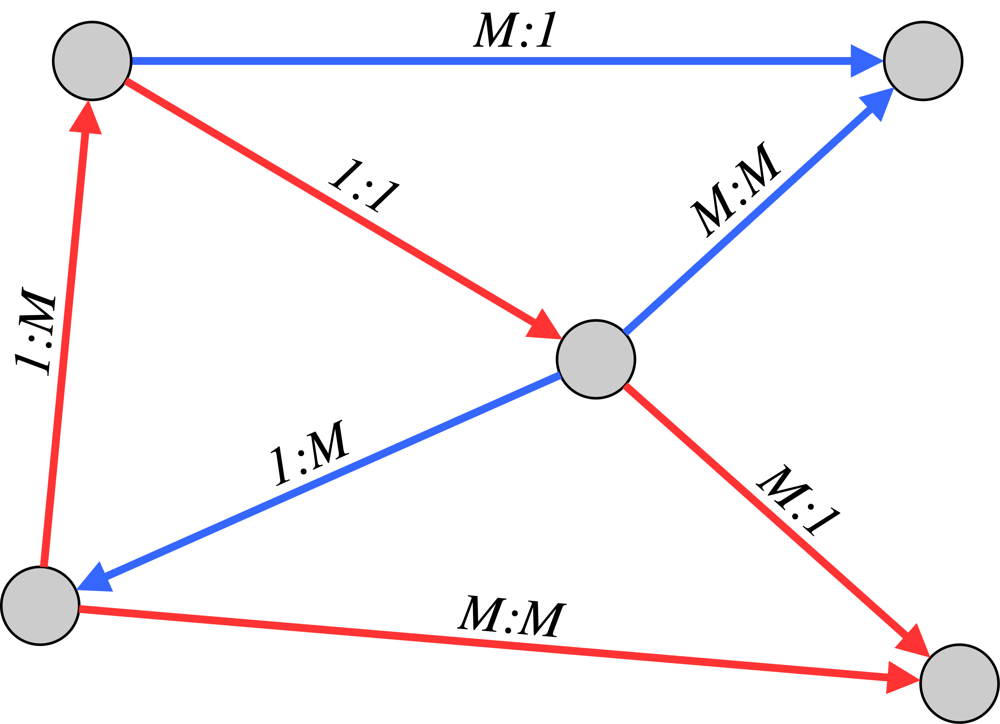
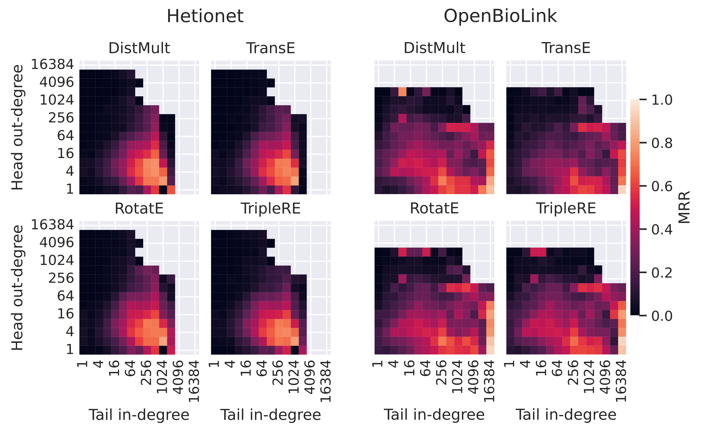
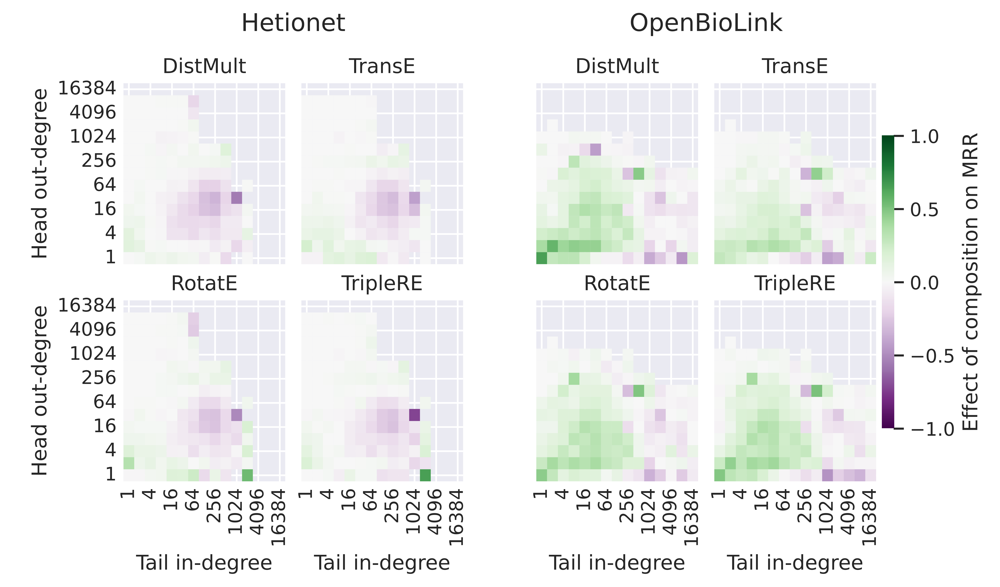

## Knowledge Graphs in Drug Discovery
Repurposing existing drugs to treat diseases beyond what they were originally designed for can be a way to identify new disease treatment opportunities. But how do we identify which drugs might affect a given disease? This and similar questions in drug discovery, which require identifying new links between known entities, can be addressed with the help of **Knowledge Graphs (KGs)**, graph-structured repositories of information that represent facts as *(head, relation, tail)* triples, connecting entities *head* and *tail* with an edge that categorizes their relationship. In the biomedical domain, entities can represent drugs and diseases, but also genes, pathways, side effects, etc. KG edges represent interactions like (disease A, associates, gene B), (gene X, upregulates, gene Y) and many more.

<!-- more -->

**Knowledge Graph Embedding (KGE)** models are among the most popular and effective machine learning methods for predicting missing edges, such as previously unknown *(drug, treats, disease)* triples. These models learn low dimensional representations for all entities and relation types in a graph and combine them through a scoring function. Practitioners often construct new KGs to answer a specific question with the help of KGE models. However, it is unknown *how exactly* these graphs should be designed.
* Which entities and relations should be included, for a specific task?
* Are there topological patterns that practitioners should look for?
* Is using a bigger KG always better?

## Our approach
To answer these questions, we teamed up with researchers from AstraZeneca to study how the topology of biomedical KGs affects the accuracy of KGE models in unprecedented detail. Using our [BESS-KGE](https://github.com/graphcore-research/bess-kge) framework [1] for training a variety of models on some of the most popular biomedical KGs, and a newly developed [toolbox for analysing topological properties of Knowledge Graphs](https://github.com/graphcore-research/kg-topology-toolbox), we produced what is - to the best of our knowledge - the most comprehensive data analysis linking graph topology to KGE models accuracy in the biomedical domain [2].

Beyond basic measures such as the *degree* of entities (the number of incoming and outgoing edges), the new topology toolbox allows us to explore *symmetric*, *inference*, *inverse*, and triangular edge patters known as *compositions*:

{.img-small}

We also analysed how model performance changes with the *cardinality* of edges (one:one, one:many, many:one, many:many) as defined by the number of outgoing edges (*out-degree*) of the head node and the number of incoming edges (*in-degree*) to the tail node, when only considering edges of the same relation type. These definitions are much more easily understood when looking at the following figure:

{.img-tiny}

## Results
We measure model accuracy using the *mean reciprocal rank (MRR)*, the average of the inverse rank of true neighbours of an entity in an ordered list of predicted neighbours. The best possible MRR is 1.

When comparing MRR for link prediction across different datasets (five biomedical KGs and one trivia KG for reference), striking differences can be observed not only between the datasets but also between the effectiveness of different KGE models (*DistMult*, *RotatE*, *TransE*, *TripleRE*, and *ConvE*):

{.img-medium}

To understand these discrepancies, we examined the link between topological properties and model accuracy at the level of individual triples to allow for a fine-grained analysis. A strong effect of the out-degree of the head node and the in-degree of the tail node can be observed:

{:.img-medium}

Building on this analysis, we investigated the effect of the different topological patterns **on top** of degree effects, as shown below for the composition pattern:

{:.img-medium}

In this example, it can be observed that compositions have a net positive effect when the degrees of the head and tail node are small, whereas the picture is much less clear when high-degree nodes are involved. Interestingly, this seems to be independent of the scoring function and holds true even for DistMult, which cannot explicitly model edge compositions.

For brevity, we only show results on the composition pattern on a subset of KGs in this blog post. Additional results, including the effect of inverse, inference, and symmetric edges and the different edge cardinalities across all KGs, can be found in the full paper.

To translate these observations into real-world utility, we focus our attention on edges connecting interesting entity types, such as *Gene-Gene*, *Drug-Gene*, or *Drug-Disease*. In different KGs, these relations come with distinct topological properties:

These differences, in turn, can be linked to different model accuracies on these relation types:

{:.img-large}

Surprisingly, for all these relation types we also observe that training models on smaller, well-curated KGs often yields more accurate predictions than using larger graphs that capture a wider range of biomedical interactions. This counterintuitive insight, we hope, should encourage a wider discussion in the community around the principles guiding the construction of KGs for biomedical tasks.

## Takeaway
The use of Knowledge Graphs in drug discovery remains an evolving field with huge potential. Our main goal with this publication is to showcase the kind of analyses that are enabled with the tools we provide and encourage the field to build upon our methodology to find further interesting links between graph topology and the performance of KGE models. This can help practitioners to construct KGs that allow for even more accurate predictions to accelerate biomedical research.

In this blog post, we have only highlighted a fraction of the results that can be found in the paper, and - more importantly - an even smaller fraction of the results that we hope the community will discover in the future using similar approaches with our open source tools.

For more details see the  [**full paper**](https://arxiv.org/abs/2409.04103) and the [**Knowledge Graph Topology Toolbox**](https://github.com/graphcore-research/kg-topology-toolbox).

## References
[1] Cattaneo, A., Justus, D., Mellor, H., Orr, D., Maloberti, J., Liu, Z., Farnsworth, T., Fitzgibbon, A., Banaszewski, B., Luschi, C. "BESS: balanced entity sampling and sharing for large-scale knowledge graph completion." arXiv preprint arXiv:2211.12281 (2022).

[2] Cattaneo, A., Bonner, S., Martynec, T., Morrissey E., Luschi, C., Barrett, I.P., Justus, D. "The role of graph topology in the performance of biomedical Knowledge Graph Completion models." Bioinformatics, Volume 41, Issue 10, October 2025

*Many thanks to my coauthors Alberto Cattaneo, Stephen Bonner, Thomas Martynec, Edward Morrissey, Carlo Luschi, and Ian Barrett.*
