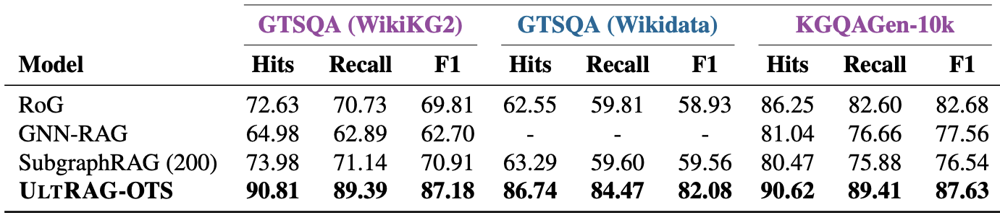
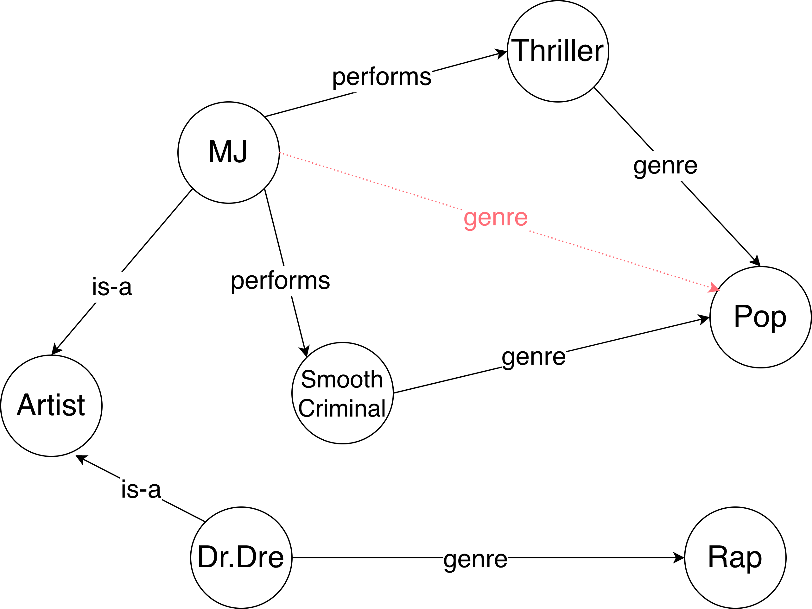
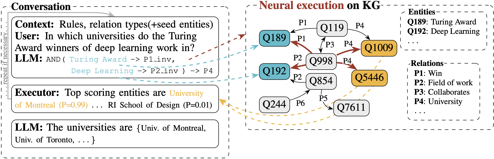
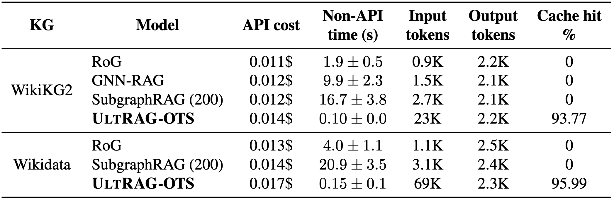
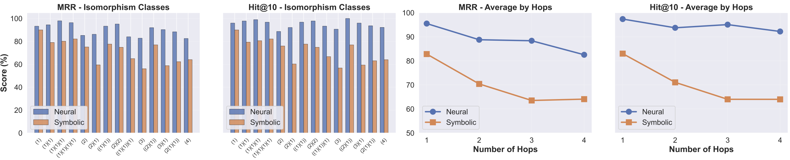

Knowledge graphs are an efficient and easily verifiable repository of factual information and using knowledge graph queries as a tool for LLMs to improve the factuality of their output is a promising direction.
But have you ever wondered how to make query execution work for knowledge graph RAG? "No!"/"Boring!" Let us guess &mdash; queries were flawed, knowledge graphs incomplete, **results were simply suboptimal**. What if we tell you that we have discovered a secret... *recipe*.



<!-- more -->

<!-- <details> -->
<!-- <summary> ... in case you feel rusty on KG RAG ... </summary> -->
<!-- We'll tell you more -->
<!-- </details> -->


<!-- <style> -->
<!-- .hidden-content { display: none; } -->
<!-- #toggle:checked ~ .hidden-content { display: block; } -->
<!-- </style> -->

<!-- <input type="checkbox" id="toggle"> -->
<!-- <label for="toggle">Show/Hide Content</label> -->
<!-- <div class="hidden-content"> -->

<!-- Your hidden content here -->

<!-- </div> -->

??? note "In case you feel rusty on KG RAG (also doubles as a glossary)"

    **The Problem**: LLMs hallucinate &mdash; they generate confident but factually incorrect content. While Retrieval Augmented Generation (RAG) helps by grounding LLMs in external knowledge, it works well for documents but is non-trivial for Knowledge Graphs (KGs).
    
    **Why KGs are Hard**: Unlike documents, relevant facts in KGs are scattered across multiple entities and relations that need to be considered together. KGs like Wikidata contain 116M entities and 1.6B relations stored as (subject, relation, object) triples &mdash; highly efficient but complex to query/parse.
    
    **Existing Approaches**: Prior KG-RAG methods fall into four categories:
    
    - **KG agents**: LLMs trained to reason over KGs by starting from seed entities and iteratively exploring the graph
    - **Path-based**: Extract paths or subgraphs from KG and serialize them as text for the LLM
    - **GNN-based**: Use Graph Neural Networks to encode subgraph representations which are then fed to LLMs
    - **Query-based**: Generate structured queries (e.g., SPARQL) and execute them on the KG. However, as noted by [Mavromatis & Karypis (2024; p.2)](https://arxiv.org/pdf/2405.20139) these approaches lead to non-executable queries due to syntactical or semantic errors
    
    **Glossary**:
    
    - **Entity**: A node in the KG representing a real-world object or concept (e.g., "Michael Jackson", "Pop")
    - **Relation**: An edge in the KG connecting two entities (e.g., the "genre" edge between "Michael Jackson" and "Pop")
    - **Relation type**: The label describing what kind of relationship connects entities (e.g., "genre", "performs", "born_in")
    - **Triplet**: A fact in the KG represented as (subject entity, relation type, object entity), e.g., `(Michael Jackson, genre, Pop)`
    - **Mention**: A reference to an entity in natural language text (e.g., "Michael Jackson" in the question "What genres is Michael Jackson associated with?"). Mentions are not in the KG &mdash; they appear in questions and need to be linked to actual KG entities. We don't know which mentions are in a question upfront, so they also must be extracted first.

## A recipe from two key insights


!!! tip "Key insight #1"
    A successful query executor has to be robust to "LLM+KG noise", hence it should be neural.

**What is LLM noise?** Well, knowledge graphs are imperfect. Sometimes they contain
relations that are somewhat similar to each other &mdash; *within a given KG*,
a relation type labelled `Grandfather` may be used interchangeably with another,
labelled `Ancestor`. If the LLM can only see relation types, it cannot reliably
resolve ambiguities. So should we execute the query (John Quincy Adams, grandfather, ?) or the query (John Quincy Adams, ancestor, ?) to find John Adams?[^1]

**What is KG noise?** *Well, knowledge graphs are imperfect.* 


There could be triplets, such as `(MJ, genre, Pop)` (dashed edge; colored in
red) that are not present in the KG, but the fact that Michael Jackson was a
pop artist can be still inferred. Likewise, there might be cases, such as `(Dr. Dre, genre, Rap)`
where the relation is present, but the evidence is not. There is absolutely no
guarantee that the scenario above will not occur &mdash; [KGs are often generated
automatically](https://arxiv.org/abs/2302.05019), resulting in incompleteness
which is the reason there is a vast literature on KG completion with neural
networks.

When generating a query[^2], without observing the KG structure, our chances of
getting a correct answer are higher if the query executor itself is resilient
to such scenarios. A query executor, parametrised by a neural network, is one
approach to achieve such resilience.

[I wonder what this reminds me of...](https://thegradient.pub/neural-algorithmic-reasoning/) 👀

"_But,_" I hear you say, "_LLMs are **the** AGI, simply pass the above subgraph's triplets to the LLM and I bet it would figure out the answers_".

!!! tip "Key insight #2"
    LLMs are **not** good neural (query) executors.

While it may sound like a bold opinion, this claim is backed by empirical
evidence. Despite their impressive language understanding capabilities,
[representing graphs as text](https://arxiv.org/abs/2310.04560) is
inefficient as LLMs lack the _inductive biases_ needed for effective and
efficient [graph algorithmic reasoning](https://arxiv.org/abs/2406.04229), and
even general [graph reasoning](https://arxiv.org/abs/2602.04768). They
struggle with the kind of structured computation that's natural for graph
neural networks or other specialized architectures designed for algorithmic
reasoning over graph structures.

### The recipe


We bet that if you got that far, this recipe is exactly what you would have thought about and is no longer a secret! Our recipe, <span style="font-variant: small-caps;">UltRAG</span>, is as simple as:

* **Generation:** LLM generates a query from a textual question. In the context we provide *all* (yes, you read that correctly, read on) relation **types** in the KG together with their descriptions.
    * The number of relation types is ≪ total `(subject, relation, object)` count. In
      Wikidata there are billions of triplets, but only a couple of thousand
      relations.
    * Using a simple query language turned out to be vital &mdash; the
      domain-specific language crafted for the purpose of mitigating scenarios
      known to be difficult for LLMs (e.g. counting) were the key to reducing
      syntactic errors nearly to 0 &mdash; see paper for details.
* (optional[^3]) **Entity Linking:** Entity mentions are linked to seed nodes (nodes to start executing the query from).
* **Neural query execution:** Execute the query using your favourite neural KG model.
* **Arbitration:** Feed the answers and their likelihoods back to the LLM and let the AGI do its
  job in figuring out the final set of answers.[^4]
* Repeat if necessary, but we did not need it.

_Et voilà!_ Shall we start cooking? Ingredients? Let's see, we might already have them!

### <span style="font-variant: small-caps;"><span style="font-variant: small-caps;">UltRAG</span>-OTS</span> &mdash; a dish, with only off-the-shelf ingredients.

What if we told you that you don't need to train anything from scratch? <span style="font-variant: small-caps;">UltRAG-OTS</span> (off-the-shelf) is our implementation using readily available components with **zero task-specific training**:

* **for query generation**: your favorite llm. We used gpt-5, but others (deepseek, gpt-5-mini) work too (see paper).
* **for entity linking**:  L2-distance between mention and entities worked well. For efficiency, an approximate nearest neighbours approach can be used.
* **for neural query execution**: [<span style="font-variant: small-caps;">UltraQuery</span>](https://arxiv.org/abs/2404.07198) &mdash; a graph foundational model that:
    * deals with missing links (handles incomplete kgs gracefully).
    * obtains similar embeddings for relations that are used in a similar fashion (the llm does not need to resolve ambiguities up-front).
    * is inductive and generalizes to unseen relation types (no retraining needed for new knowledge graphs).
* **for arbitration**: again gpt-5, but we also found combinations (gpt-5 then gpt-5-mini or vice versa) to work well too!

Even the best recipe needs good ingredients for a perfect dish &mdash; and <span style="font-variant: small-caps;">UltraQuery</span>'s unique capabilities make it the perfect executor for our framework.

## Bon appétit! state-of-the-art results

<span style="font-variant: small-caps;">UltRAG-OTS</span> achieves **zero-shot state-of-the-art** results on various KGQA benchmarks.


Looking at the table from the top of this post, we outperform competing methods &mdash; even those that were specifically fine-tuned on these datasets. On datasets such as [GTSQA](https://huggingface.co/datasets/Graphcore/GTSQA), which test specifically out-of-distribution generalisation (unseen relation types and unseen question types), we are 16/23% better than the competition[^5] both in the transductive (train and test on same KG; **<span style="color: #98479b;">purple</span>**) and inductive (train on one test on another; **<span style="color: #0b6b97;">blue</span>**) setting. Our observations (see paper) persist across various testing regimes and <span style="font-variant: small-caps;">UltRAG-OTS</span> outperforms baselines regardless whether seed nodes or the question subgraph is available or not.

### The bill? Cheaper than a Michelin-starred meal!

You may expect that such good performance would come at a pretty high cost. After all, we provide much larger context (*all* relation types) compared to baselines. Well, in contrast to previous approaches, given a KG, our LLM prompt is *identical*, but for the question being asked. The result? 90+% API cache hit rates. Our two LLM calls (generation + arbitration) also remained affordable, adding at most 30% overhead compared to baselines.

🚀 **The non-API speed, however, was out of this world** 🚀 &mdash; 19x/99x/167x faster than RoG/GNN-RAG/SubgraphRAG

<!-- But here's the kicker: while others struggle to scale beyond toy graphs, <span style="font-variant: small-caps;">UltRAG-OTS</span> works seamlessly on **Wikidata-scale** knowledge graphs (116M entities, 1.6B relations) at comparable or even lower costs. -->

### The secret ingredient: neural (query) execution

We claimed earlier that the combination of neural executors' robustness to KG noise and LLMs' natural language understanding creates a symbiosis. In fact, chronologically speaking, it was our very first experiment to validate this claim. 

The above figure shows that a neural executor achieves massive improvements (~16% MRR on average; taking into account class imbalance) over a symbolic one when used as a tool by LLMs, and all other things are kept identical. This validates our core insight the GNN's ability (<span style="font-variant: small-caps;">UltraQuery</span> in our case) to handle incomplete graphs and ambiguous relations is what enables the LLM to focus on what it does best: *understanding* natural language and reasoning at a high level, not actually *performing* the reasoning.

## Takeaway

We've shown that combining neural query execution with LLMs creates a powerful, scalable approach to knowledge graph RAG. <span style="font-variant: small-caps;">UltRAG</span> achieves state-of-the-art results with off-the-shelf components, no training required, and scales much better than baselines.

But the implications go beyond KG-RAG. Neural execution as a tool for LLMs is a promising direction that could find applications in many domains where structured reasoning over noisy, incomplete data is required.

If you want to find out more you can read our paper [here](/papers/ultrag.pdf). 

<!-- And if you get inspired by our cooking, please take a moment to cite our paper:
```
BIBTEX TO BE ADDED ONCE ARXIV IS OUT
```
-->

<!-- 1. **The LLM** generates structured queries without needing to worry about every edge case in the KG -->
<!-- 2. **The neural executor** handles incomplete knowledge graphs gracefully, filling in the gaps -->
<!-- 3. **Together**, they achieve what neither could do alone -->

<!-- It's the AI equivalent of "the whole is greater than the sum of its parts" &mdash; except this time, it actually scales to real-world problems. -->

[^1]: Providing examples of `(subject, relation, object)` triplets for each relation type does not solve the problem: 1) Input token count may explode; 2) There's no guarantee that no pair of relations have been used interchangeably inside the KG.
[^2]: E.g. the query corresponding to "What genres do the artists in the knowledge graph perform in?".
[^3]: The common assumption when benchmarking KG RAG systems is that seed nodes are known up-front. We show that with our approach you can potentially merge entity linking (connecting mentions with nodes) and query generation. See paper for more details.
[^4]: We never said neural query executors are perfect 🙃.
[^5]: Main baselines: [RoG](https://arxiv.org/abs/2310.01061) (Reasoning on Graphs), [GNN-RAG](https://arxiv.org/abs/2405.20139) (Graph Neural Retrieval for LLM Reasoning), and [SubgraphRAG](https://arxiv.org/abs/2410.20724) (Simple Is Effective: The Roles of Graphs and LLMs in KG-based RAG).
