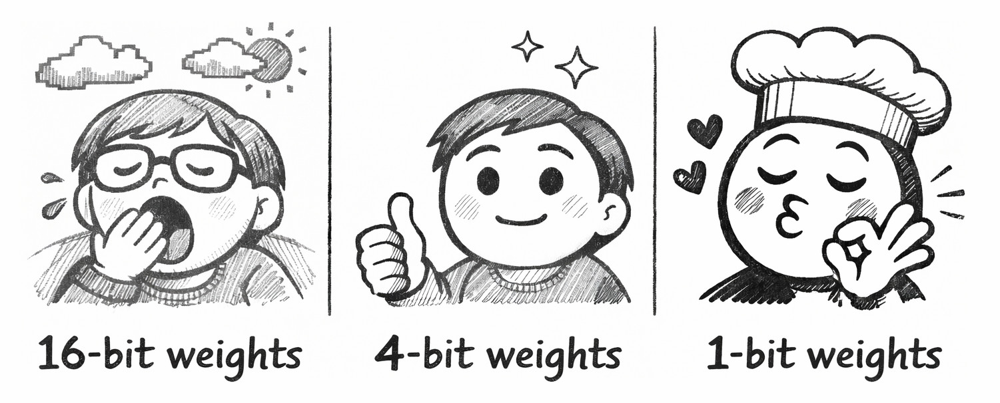
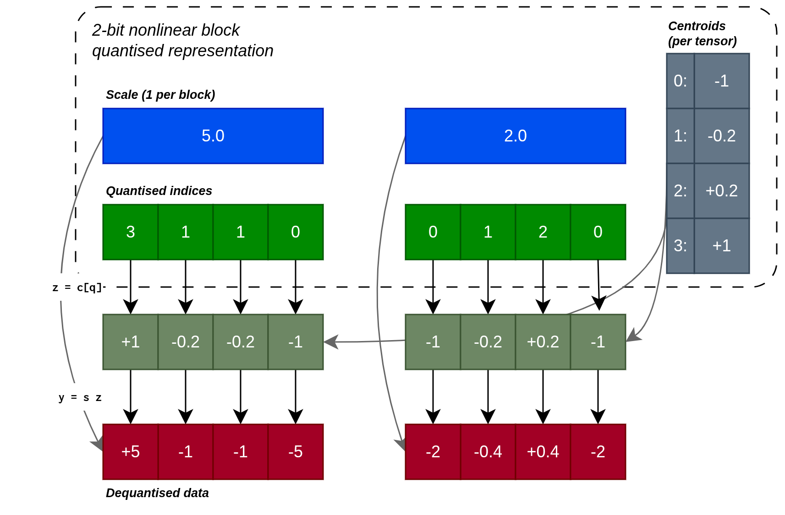
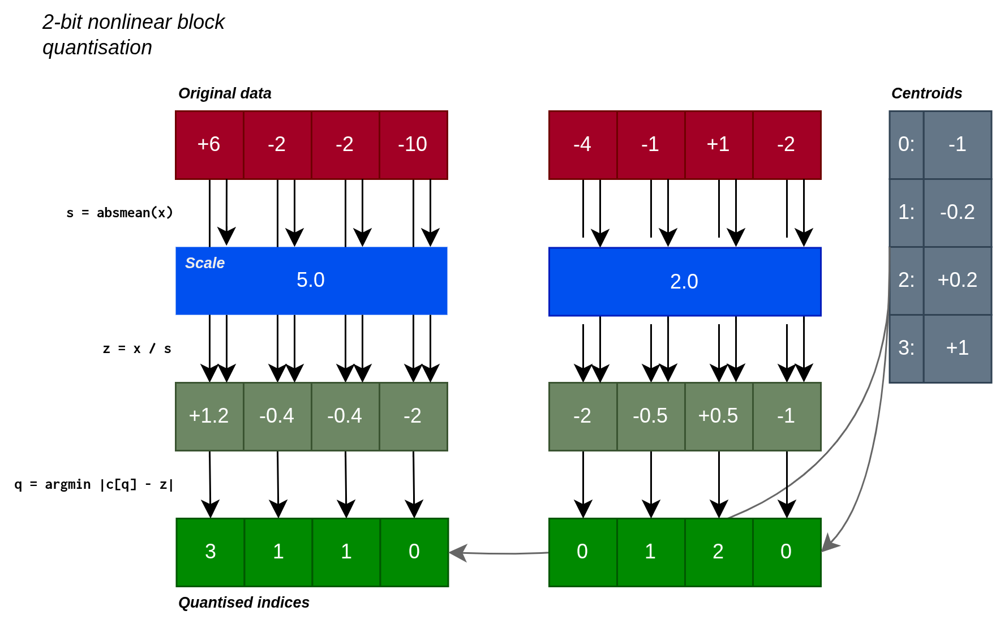
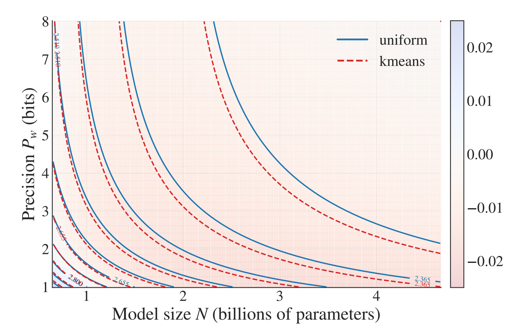
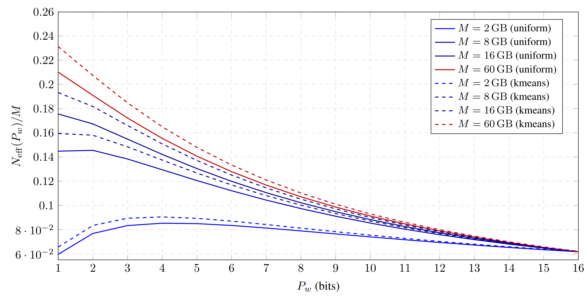
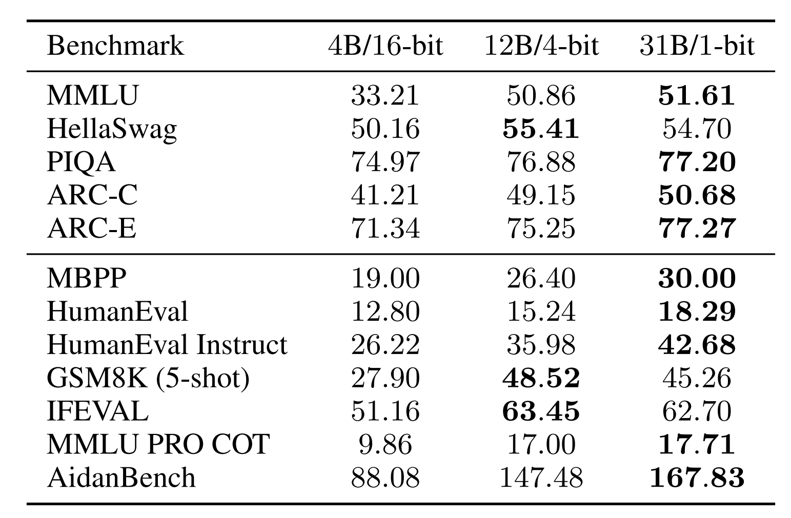

Would you rather use 1 million $\times$ 16-bit weights, 4 million $\times$ 4-bit weights, or even 16 million $\times$ 1-bit weights?

In joint work between Aleph Alpha Research and Graphcore, we asked this question of LLMs — the answer encouraged us to embrace the wonder ✨ of 1-bit weights, which can outperform 4-bit and 16-bit weights on a fixed weight memory budget.

<!-- more -->

Starting from a custom quantisation-aware training recipe, the work proceeds in three parts. First, a scaling laws evaluation prompts us to consider very low-bit formats. Second, scaled-up tests show the power of memory-matched models with 1-bit weights. Finally, kernel benchmarking demonstrates their feasibility for autoregressive inference.

With our [paper](https://arxiv.org/abs/2602.15563){:target="_blank"}, we also release the [code](https://github.com/Aleph-Alpha-Research/1-Bit-Wonder){:target="_blank"}, quantised weights and fused dequantisation kernels. Here's our favourite 1-bit model in action, doing some maths:

<video controls autoplay muted loop preload="metadata" style="border-bottom: 8px solid #161616;">
  <source src="/2026/03-1bitwonder/img/demo.mp4" type="video/mp4">
</video>

## Putting the squeeze on

Let's start with our recipe for low-bit quantisation. We adopt modern block-scaled formats, which use shared scales across blocks of weights in order to capture their full range.

**Dequantisation**

We can think of the format in terms of what is stored and how the data is reconstructed. For a nonlinear block-scaled format, we store a table of centroids for each weight tensor, a scale for each block of weights and small integers as quantised indices for each weight. To reconstruct a given weight, we first lookup the centroid from the stored index, then multiply by the shared block scale.

{:.img-large}

_Quantisation and reconstruction of a 2-bit format with illustrative block size B = 4. Note: our practical formats use B = 64 and store the scale in `bf16` for an overhead of 0.25 bits per element._

**Quantisation**

To quantise the flattened weight tensor $w$:

1. Split $w$ into blocks of $B=64$ elements.
2. For each block, calculate the absolute maximum value (if targeting $n>2$ bits) or absolute mean value (if targeting $n\leq 2$ bits), as the scale. _Note: switching to absmean for low-bit formats is helpful since absmax quantisation would flush most values to zero in this regime._
3. Divide the block elements by the scale and round these to the nearest of the $2^n$ centroids.
4. Store the centroid index ($n$ bits per value) and scale (`bf16`).

{:.img-large}

**QAT**

To train a quantised model from scratch, we use quantisation-aware training (QAT) with the straight-through estimator, which performs an artificial version of the quantisation-dequantisation procedures shown above in the forward pass, but propagates the gradient unchanged to the underlying unquantised weight in the backward pass.

!!! note "Artificial quantisation and the straight-through estimator"
    Artificial quantisation takes a `bf16` input and produces a `bf16` output, quantising the values but not casting them to the compact format, so that the following kernel can use regular `bf16` operations. The straight-through estimator acts as if this is the identity operation, allowing the deep learning training procedure to search for good quantised weights.

**Training Schedule**{#training-schedule}

We perform 1000 steps of regular (non-QAT) training, before quantising the model. At this point, we evaluate two alternatives:

1. Create a uniform (integer) quantisation grid of centroids $\{-(2^{n-1}-1), \ldots, 0, \ldots, (2^{n-1}-1)\}$.
2. Train a nonlinear quantisation grid of $2^n$ centroids by running scalar K-means on the flattened weight tensor.

We then continue training with QAT enabled for the remainder of the training run. Consistent with standard practice, we maintain embedding and final projection weights in high-precision (`bf16`).

---

## Results

Our goal in this work is to identify the best use of a fixed parameter memory budget with quantisation. We also wish to test the efficacy of nonlinear quantisation using K-means versus uniform integer quantisation.

!!! question "Research Question"
    What is the best use of a fixed parameter memory budget: a high-precision model with fewer parameters, or a highly quantised model with more parameters?

### Part 1: Go small or go home

We conduct a scaling law analysis, based on a broad sweep of model size, training budget and weight precision. We test both symmetric integer quantisation and K-means nonlinear quantisation, as [described above](#training-schedule).

_Expand the section below for details, or continue reading for the main conclusions._

Scaling Law Analysis

We sweep model sizes $N$, training token budgets $D$ and average weight precisions $P_w$ (for both uniform and K-means variants). We use these results to fit scaling laws that model the loss as:

$$
\mathcal{L}(N,D,P_w)
\;=\;
A\,N_{\mathrm{eff}}(N,P_w)^{-\alpha}
\;+\;
B\,D^{-\beta}
\;+\;
E,
$$

where $A,B,E,\alpha,\beta>0$ are fitted constants. The effective parameter count $N_{\mathrm{eff}}$ is defined in terms of the average precision $P_w$:

$$
N_{\mathrm{eff}}(N, P_w)
\;=\;
N \left(1-\exp\!\left(-\frac{P_w}{\gamma_w}\right)\right),
$$

with fitted slope $\gamma_w$. We obtain:

| Centroids | $\alpha$ | $\beta$ | $\gamma_w$ |
| --- | --- | --- | --- |
| Uniform | 0.55 | 0.46 | 3.71 |
| K-means | 0.63 | 0.40 | 3.32 |

Importantly, the larger value of $\alpha$ for K-means implies stronger scaling of loss with model size, and smaller $\gamma_w$ means faster saturation of capacity with increasing bit-width. Both of these show K-means to be stronger than uniform quantisation.

We also see this in an isoloss contour plot of our scaling law (each line corresponds to a fixed loss, showing a set of configurations with the same task performance):

{:.img-large}

_Isoloss contours from our scaling laws, where the background colour shows the predicted gap between loss using K-means centroids and that using uniform centroids (red means lower loss for K-means)._

Our scaling law fit for K-means and integers highlights the advantage of K-means quantisation:

!!! tip "Key takeaway 1"
    K-means quantisation achieves uniformly lower loss than uniform integer quantisation across all precision–budget tradeoffs, with the largest improvements in the ultra-low-bit regime.

Given the scaling law, we can now ask our main question "given a memory budget $M$, what precision minimises loss". This yields the exciting conclusion that budgets $\geq 8$ GB would perform better with ultra-low-precision 1-bit weights:

{:.img-large}

_The optimal precision shifts left as memory budget increases. This is because the embedding and final projection, which are maintained in `bf16`, dominate the memory consumption for small memory budgets, so there is less saving to be had in quantising the remainder of the model._

We therefore conclude that:

!!! tip "Key takeaway 2"
    Under fixed memory, the best regime is the lowest stable precision, balanced by scaling up parameters.

### Part 2: Economies of scale

In order to gain confidence in this prediction, we conduct a scaled-up test. We compare a 16-bit `bf16` baseline against 4-bit and 1-bit models using K-means quantisation, setting the number of parameters to 4B, 12B and 31B respectively such that all models consume approximately 7.8 GB of weight storage.

After training on 150B tokens and evaluating on a suite of downstream tasks, we observe strong performance for the 4-bit and especially for the 1-bit model:

{:.img-medium}

_Our scaled-up test highlights the strength of memory-matched (7.8 GB) 1-bit and 4-bit models when compared against a 16-bit baseline. Both outperform the 16-bit model on "log-probability" (top) and "generative" (bottom) downstream tasks, with the 1-bit model performing best across most tasks._

### Part 3: Keeping the pipe full

Our research question assumes a fixed weight memory budget. However, inference speed is also an important practical consideration. If compute is maintained in `bf16`, the relative speed of a fused kernel consuming reduced-precision weights depends on whether the kernel is **compute-bound** or **memory-bound**. In the compute-bound setting (large batch size), the reduced-precision kernel cannot outperform a `bf16` baseline, since they involve approximately the same amount of compute work. In the memory-bound setting (small batch size), the reduced memory bandwidth requirement can yield a speedup.

Benchmarking Analysis

We developed fused dequantise-multiply kernels for the nonlinear block-scaled formats described above, and tested them on an inference GPU. In microbenchmarks, we observe at batch size 1:

| $P_w$ | Time (Speedup) | Effective BW |
| --- | --- | --- |
| $16$ | $175.6$ μs ($1.0\times$) | $764$ GB/s |
| $4$ | $49.5$ μs ($3.7\times$) | $721$ GB/s |
| $1$ | $24.0$ μs ($7.6\times$) | $438$ GB/s |

This shows near-ideal speedups for the 4-bit format (see memory bandwidth), but some overhead for the 1-bit format.

In whole-model token generation benchmarks, also at batch size 1, the 4B 16-bit model achieves 89 tokens/s, the 12B 4-bit model achieves 79 tokens/s and the 31B 1-bit model achieves 61 tokens/s. These figures show that the fixed memory budget does not perfectly transfer into a fixed inference time, even at batch size 1. Nevertheless careful kernel choice and optimisation can deliver a significant fraction of the available speedup. We recommend balancing hardware-specific and practical considerations against the fundamental advantage of very low-bit formats.

!!! tip "Key takeaway 3"
    Weight compression can yield significant inference speedups at small batch size, but good practical formats must balance available hardware capabilities against fundamental advantages of very low-bit formats.

## Conclusion

We were pleased (and somewhat surprised) that the simple recipe we have described was able to effectively train 1-bit weights. With this recipe, we saw the advantage of reducing weight precision in order to increase parameter count on a fixed memory budget. Based on this and our scaling laws, we encourage you to consider QAT, block-scaled formats and, especially, very low-precision weights in your next inference optimisation project!

Thanks for sharing our wonder! Find out more in our full paper: **[1-Bit Wonder: Improving QAT Performance in the Low-Bit Regime through K-Means Quantization](https://arxiv.org/abs/2602.15563)**.

By Sohir Maskey, Constantin Eichenberg, Johannes Messner and Douglas Orr.

