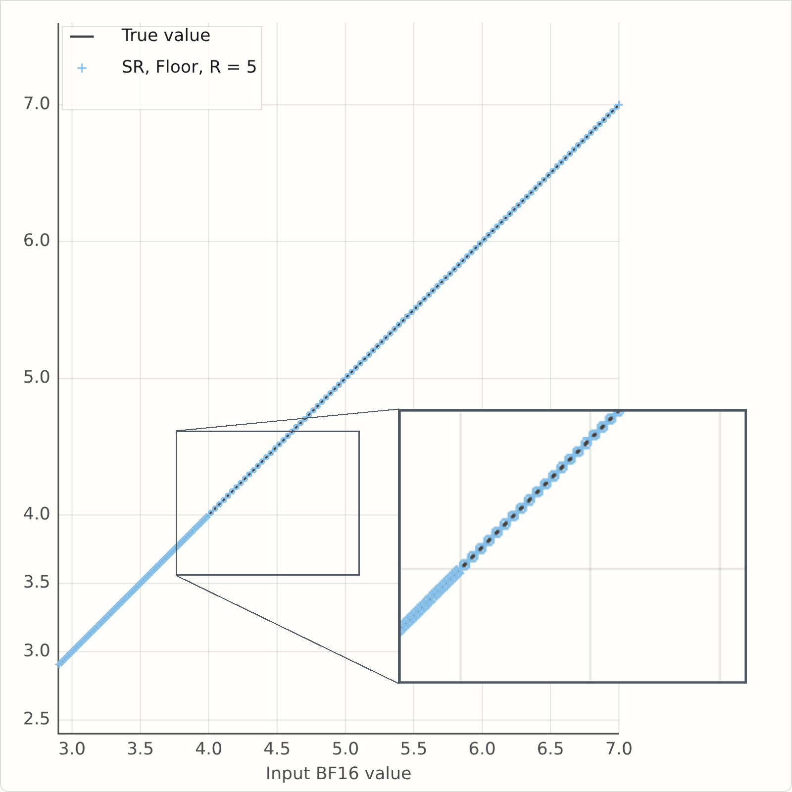
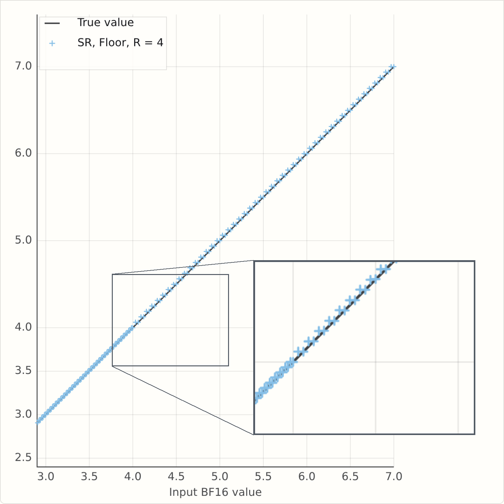
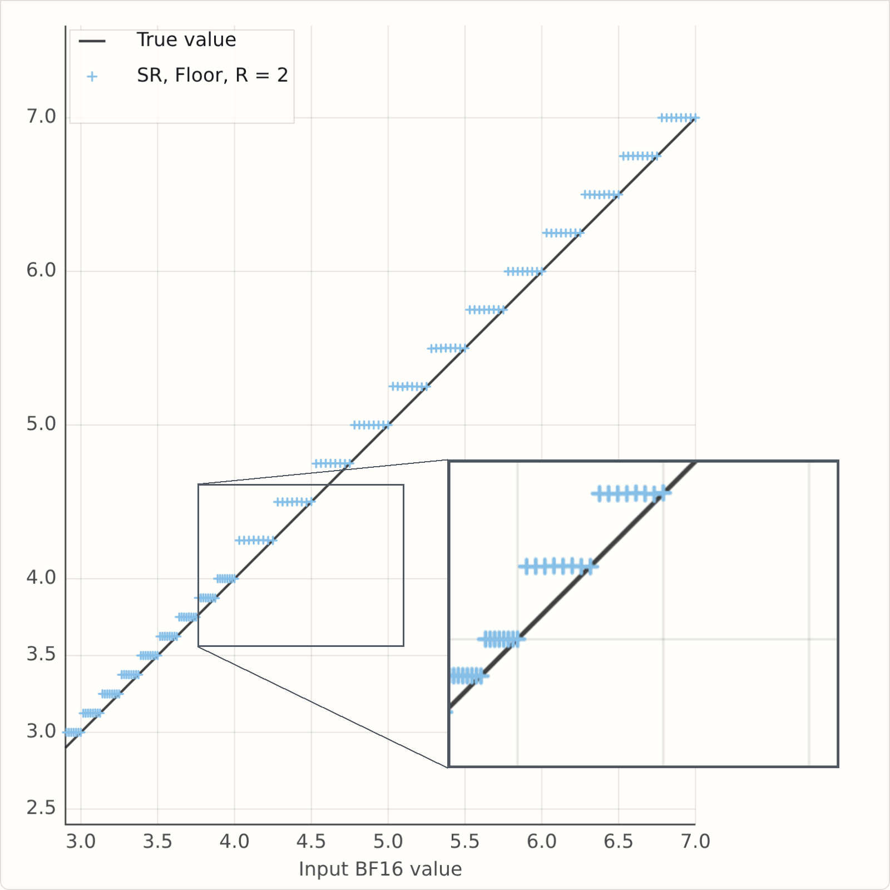
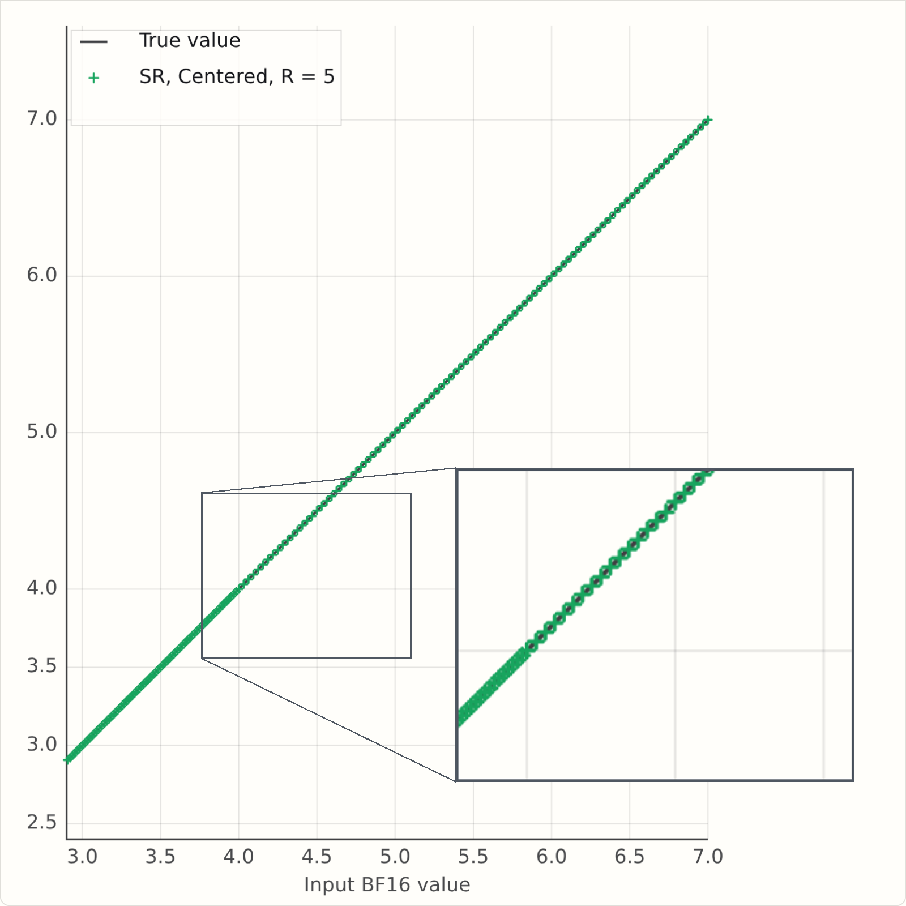
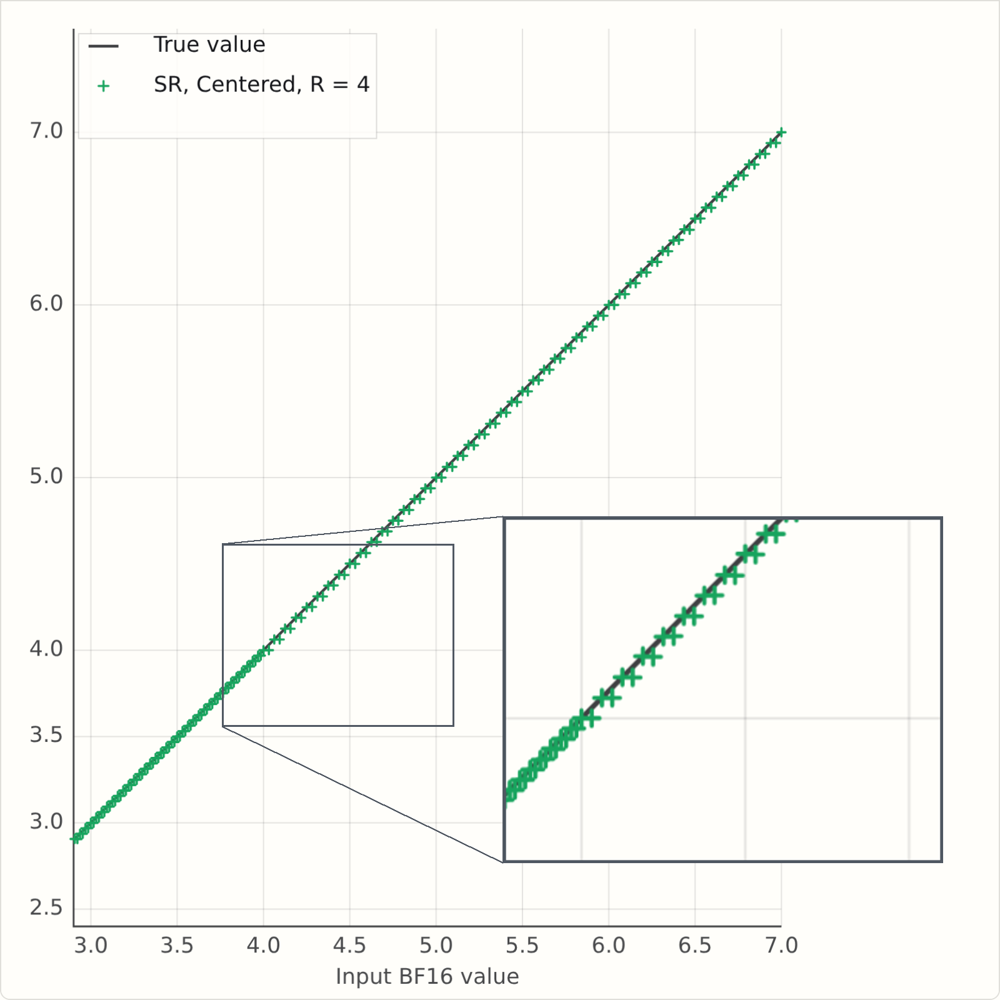
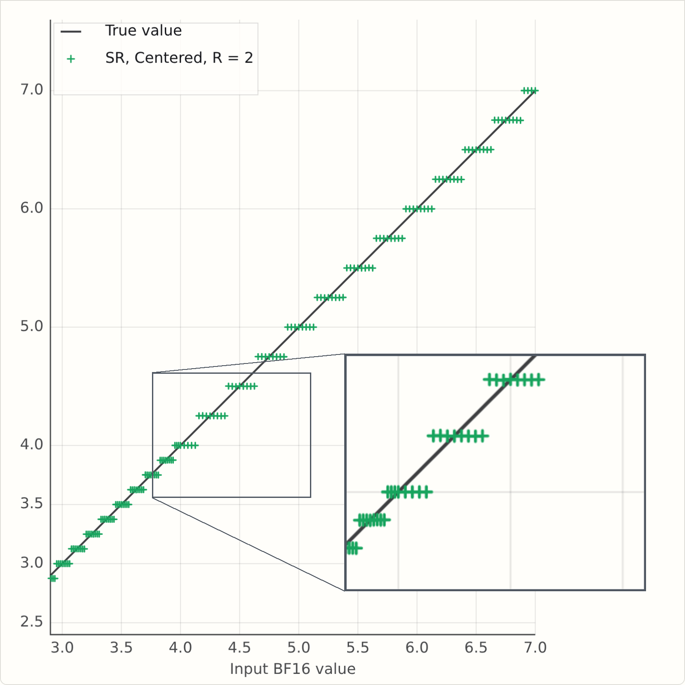

# Stochastic Rounding: How randomness helps us build better models

At Graphcore we love compact numeric formats (see Doug's recent post on [1-bit Wonderful Weights for LLMs](../03-1bitwonder/1bitwonder.md)).  Why? Because they are more efficient, in terms of FLOPs/sec and FLOPs/Joule, and we do hate to inconvenience electrons.

This post is on how stochastic rounding (SR) helps us to do more with fewer bits, how we can make SR more efficient, and some things to be careful of when implementing SR.

<!-- more -->

Today, research on low-precision formats looks at both training and inference.
At the simplest level, AI model training involves a lot of giant matrix multiplication, so if you can take your input matrices, do O(N^2) work to convert them to low precision,
and then do O(N^3) FLOPs, you will save power and train faster.

But we want to do more, keeping more computation natively in low precision, and as inference consumes more and more compute, we would like models with good low-precision weights.  While post-training quantization works surprisingly well, it is always better, if one has the training data, to train natively in the low precision format.

That means that our training loop is something like this (supposing we are training in a format called "FP6", and we'll generically say "FP16" for a wider compute format). Note too that we are not requiring all optimizer calculations to be low precision; the goal here is to find good FP6 weights so that _inference_ is efficient, not to get faster training.

$$
  \def\t{\quad}
  \def\codecomment#1{{\color{blue}{\it \#\ \text{#1}}}}
\begin{aligned}
& W_6 : \mathrm{FP6}\leftarrow \text{initialize weights} \\
& \mathbf{while}\ \text{not done:} \\
& \t \codecomment{Optimizer calculations may be done in mixed precision, with FP16 result}\\
& \t W_{16} : \mathrm{FP16} \leftarrow \text{ToFP16}(W_6)
\\
& \t \Delta W : \mathrm{FP16} \leftarrow \nabla L(W_{16}) \\
& \t \codecomment{Weight update applied in high precision, then rounded to FP6}\\
& \t W_6 \leftarrow \text{RoundToFP6}\left(W_{16} + \Delta W\right).
\end{aligned}
$$

We can read this loop as: start with random weights which are known to be representable in low precision, and then repeat:

  - compute an update in high precision
  - and then round the new weights back to the representable lattice.

So how well does that work?  Let's try it out on a classic optimization problem, scaled to FP6.

----

This is the Rosenbrock function, and we first show minimization with FP32 parameters, and 200 steps of Adam.  Feel free to fiddle with the learning rate and momentum parameters, and hit "Run" for a cutesy little animation.

<figure class="visual-shell">
  

    FP32
    0.0002
    <button id="run-full" type="button">Run</button>
    

      <label class="control control-inline">
        LR: <strong id="full-lr-value">2.3</strong>
        <input id="full-lr-slider" type="range" min="1.0" max="3.0" step="0.1" value="2.3">
      </label>
      <label class="control control-inline">
        BETA1: <strong id="full-beta1-value">0.90</strong>
        <input id="full-beta1-slider" type="range" min="0.50" max="0.98" step="0.01" value="0.90">
      </label>
      <label class="control control-inline">
        BETA2: <strong id="full-beta2-value">0.90</strong>
        <input id="full-beta2-slider" type="range" min="0.70" max="0.98" step="0.01" value="0.90">
      </label>
    

  

  

    <canvas id="full-canvas"></canvas>
    

      

        <strong>JavaScript has not started.</strong>
        Use a browser or preview that allows JavaScript to render the Canvas figures.
      

    

  

</figure>

---

Next, here is the function on the FP6 lattice. Notice that the minimum has moved: the white star is the best point available on the FP6 grid. Our goal is unchanged: find the minimum.  Press Run to see how Adam works with round-to-nearest-even coordinates.

<figure class="visual-shell">
  

    FP6 lattice
    ready
    <button id="run-rn" type="button">Run</button>
    

      <label class="control control-inline">
        LR: <strong id="lr-value">2.3</strong>
        <input id="lr-slider" type="range" min="1.0" max="3.0" step="0.1" value="2.3">
      </label>
      <label class="control control-inline">
        BETA1: <strong id="beta1-value">0.90</strong>
        <input id="beta1-slider" type="range" min="0.50" max="0.98" step="0.01" value="0.90">
      </label>
      <label class="control control-inline">
        BETA2: <strong id="beta2-value">0.90</strong>
        <input id="beta2-slider" type="range" min="0.70" max="0.98" step="0.01" value="0.90">
      </label>
    

  

  

    <canvas id="fp6-canvas"></canvas>
    

      

        <strong>JavaScript has not started.</strong>
        Use a browser or preview that allows JavaScript to render the Canvas figures.
      

    

  

</figure>

There are some settings of learning rate and betas that pass through the optimum, but generally we see the same thing: after a while, optimization updates just do nothing, and training flatlines, or there's an oscillation between two similar points.

When training an LLM on millions of parameters, the effect is not so stark, but we still get a deviation from BF16 when training with FP6 master weights.
Here's a nanochat d12 run where we quantise the MLP weights to FP6 (this is just per-tensor scaling, no MX formats):

<figure class="visual-shell">
  

    

      <fieldset class="mlp-plot-mode" aria-label="MLP metric">
        <legend class="sr-only">MLP metric</legend>
        <label><input type="radio" name="mlp-plot-metric-1" value="val" checked> Validation BPB</label>
        <label><input type="radio" name="mlp-plot-metric-1" value="train"> Training loss</label>
      </fieldset>
    

    

    
Loading MLP FP6 plot...

  

</figure>

As we can see, the FP6 curve tracks the BF16 early on, but starts to drift away as optimization proceeds, ending up .1 bpb adrift.

## Getting unstuck with stochastic rounding

This post is about a key tool in our toolbox that helps low precision to retain accuracy: stochastic rounding.
Stochastic rounding has been around almost as long as digital computers, certainly since the 1950s.
The core idea: when rounding a value $x$, round down or up randomly, with probability given by the distance from $x$ to the two neighbouring values.

I like to put it concretely.  We can just look at the case of rounding to an integer.
"High school" rounding says (ignoring the subtlety of ties-to-even for now)

\[
    \text{RoundToNearest}(x : \mathbb R) : \mathbb Z = \lfloor x + 0.5 \rfloor
\]

And stochastic rounding says

\[
    \text{RoundStochastic}(x : \mathbb R) : \mathbb Z = \lfloor x + \text{Random}() \rfloor
\]

where $\text{Random}$ returns a random number between zero and 1.
You can probably already intuit that if you repeat this many times,
it might average out to be similar to $\lfloor x + 0.5 \rfloor$.
It's obviously true that the average of $\text{Random}()$ over lots of samples will approach $0.5$.
But what we'll find is that it doesn't turn out to be similar to $\lfloor x + 0.5 \rfloor$, it turns out to be similar to $x$...

To do so, let's take what looks like a detour.
You may know that there are lots of subtleties in implementing a good random number function, and that there are questions of seeding and repeatability.
So let's punt all of those questions to the user of our rounding function, and require them to supply us with the random number,
drawn from the uniform distribution $U[0,1]$

\[
    \text{RoundStochastic}(x : \mathbb R, r : \mathbb R) : \mathbb Z = \lfloor x + r \rfloor
\]

## Unbiased in expectation

This formulation also helps us to show a key property of SR: if you round the same number many times, you will, in expectation, get the number you started with.  To put that more mathematically, we say

\[
    \mathbb{E}_{r \sim U[0,1]}[\text{RoundStochastic}(x, r)] = x
\]

and it is quite easy to show:

\[
    \begin{aligned}
    E_r[\text{RoundStochastic}(x, r)]
    & = \int_0^1 \left\lfloor x + r \right\rfloor\,dr\\
    & \text{and letting } f = x - \left\lfloor x \right\rfloor \in [0, 1),\\
    & = \int_0^1 \left(\left\lfloor x \right\rfloor + \mathbf{1}[f + r \geq 1]\right)\,dr\\
    & = \left\lfloor x \right\rfloor + \int_0^1 \mathbf{1}[r \geq 1 - f]\,dr\\
    & = \left\lfloor x \right\rfloor + \int_{1-f}^1 1\,dr\\
    & = \left\lfloor x \right\rfloor + f\\
    & = x.
    \end{aligned}
\]

In the context of our training loop above, it is applied when we add our $\Delta W$ to the current $W$, and we hope that over hundreds of learning steps, we will on average get to the high-precision result.

## Real-world SR with a fixed number of random bits

But let's first explore SR before jumping to the optimization problem.

The first thing to fix is that we don't have infinite-precision random numbers, as we used above.  Our real rounding function takes as argument an $R$-bit random integer:

\[
    \text{RoundStochastic}(x : \mathbb R, r : \mathbb N) = \left\lfloor x + \frac{r}{2^R} \right\rfloor
\]

It's now a little more fiddly to derive the expectation, so let's just run a simple simulation to build our intuition.

For bfloat16 values between 3 and 7, we round them to an FP6 format, E3M2 to be precise.

For round to nearest, we see a pink line, with open or closed points illustrating how ties are broken.
The "SR" button shows stochastic rounding for each of those values, rounding up or down randomly for each input value.  We also show as a cross the average of the SR-rounded values at each input point, and "Play" shows how the averages approach the Y=X line as we perform SR multiple times.

<figure class="sr-rounding-demo" aria-label="Integer rounding comparison" data-hide-mode="true" data-hide-rbits="true" data-hide-status="true" data-center-plot="true">
  

    

      <button data-role="sr-rounding-rtn" type="button" aria-pressed="true">RTN</button>
      <button data-role="sr-rounding-sample" type="button">SR</button>
      <button data-role="sr-rounding-play" type="button">Play</button>
      <button data-role="sr-rounding-pause" type="button">Pause</button>
      <button data-role="sr-rounding-ffwd" type="button">Ffwd</button>
      <button data-role="sr-rounding-reset" type="button">Reset</button>
    

    <fieldset class="sr-rounding-mode">
      <legend>SR Mode:</legend>
      <label>
        <input data-role="sr-rounding-mode-floor" type="radio" value="floor" checked />
        F
      </label>
      <label>
        <input data-role="sr-rounding-mode-centered" type="radio" value="centered" />
        C
      </label>
    </fieldset>
    <label class="sr-rounding-param">
      R
      <input data-role="sr-rounding-rbits" type="number" min="0" max="24" step="1" value="16" inputmode="numeric" />
    </label>
    no SR yet
  

  

    <canvas data-role="sr-rounding-canvas"></canvas>
    

      JavaScript has not started.
    

  

</figure>

If you let it run for a few hundred samples, you may be inclined to believe that repeated application of SR looks like it might simulate higher precision (like FP6 simulating a noisy BF16 in this case).

So does it?  Well, here's the Rosenbrock optimization canvas again, but with stochastic rounding instead of round to nearest.  Click the "SR" button a few times, and see what you think?

<figure class="visual-shell">
  

    FP6 lattice + SR
    ready
    <button id="run-sr-rn" type="button">RTNE</button>
    <button id="run-sr" type="button">SR</button>
    <button id="run-sr-ensemble" type="button">SR ensemble</button>
    

      <label class="control control-inline">
        LR: <strong id="sr-lr-value">2.3</strong>
        <input id="sr-lr-slider" type="range" min="1.0" max="3.0" step="0.1" value="2.3">
      </label>
      <label class="control control-inline">
        BETA1: <strong id="sr-beta1-value">0.90</strong>
        <input id="sr-beta1-slider" type="range" min="0.50" max="0.98" step="0.01" value="0.90">
      </label>
      <label class="control control-inline">
        BETA2: <strong id="sr-beta2-value">0.90</strong>
        <input id="sr-beta2-slider" type="range" min="0.70" max="0.98" step="0.01" value="0.90">
      </label>
    

  

  

    <canvas id="fp6-sr-canvas"></canvas>
    

      

        <strong>JavaScript has not started.</strong>
        Use a browser or preview that allows JavaScript to render the Canvas figures.
      

    

  

</figure>

So yes, run with SR generally gets you closer to the minimum, and on LLM training, it can regain essentially all the losses from FP16, viz the following plot.
Here, we are training the same d12 nanochat, but with `RoundToFP6` using stochastic rounding (SR) rather than RTNE.

<figure class="visual-shell">
  

    

      <fieldset class="mlp-plot-mode" aria-label="MLP metric">
        <legend class="sr-only">MLP metric</legend>
        <label><input type="radio" name="mlp-plot-metric-2" value="val" checked> Validation BPB</label>
        <label><input type="radio" name="mlp-plot-metric-2" value="train"> Training loss</label>
      </fieldset>
    

    

    
Loading MLP FP6 plot...

  

</figure>

RTNE wasn't spectacularly wrong, but this is clearly better: SR follows the BF16 curve much more closely, and recall that the weights we are getting are in exactly the same space - pure FP6 with tensor scaling - but we find better weights with SR.

---

## The finite-randomness case in theory

So, are we done?  Well, maybe not.  The experiment above used oodles of randomness, that is, $R = \text{oodles}$, where, to be precise, $\text{oodles}$ was effectively 16 bits.
Now, we know how to make good random numbers in silicon [1], to the tune of 128 bits per clock cycle per core;
but we are adding a lot more than four numbers per cycle.
It would be a lot nicer to use 8 bits per add, or even fewer if possible.

Before we cut to the chase and just run an experiment, I think it's interesting to see how far we can get in theory...

The expectation calculation is similar to the continuous case, but there's a floor in the result.

\[
    \begin{aligned}
    E_r[\text{RoundStochastic}(x, r)] =  \left\lfloor x \right\rfloor + 2^{-R}\left\lfloor 2^R f \right\rfloor.
    \end{aligned}
\]

Derivation, finite-precision randomness

\[
    \begin{aligned}
    E_r[\text{RoundStochastic}(x, r)]
    & =  \sum_{r=0}^{2^R-1} \text{RoundStochastic}(x, r) p(r)\\
    & =  \sum_{r=0}^{2^R-1} \left\lfloor x + \frac{r}{2^R} \right\rfloor 2^{-R} \\
    & \text{and letting } f = x - \left\lfloor x \right\rfloor \in [0, 1),\\
    & =  \left\lfloor x \right\rfloor + 2^{-R} \sum_{r=0}^{2^R-1}
    \mathbf{1}\left[f + \frac{r}{2^R} \geq 1\right]\\
    & =  \left\lfloor x \right\rfloor + 2^{-R} \sum_{r=0}^{2^R-1}
    \mathbf{1}\left[r \geq 2^R(1 - f)\right]\\
    & =  \left\lfloor x \right\rfloor + 2^{-R} \sum_{r=0}^{2^R-1}
    \mathbf{1}\left[r \geq \left\lceil 2^R(1 - f)\right\rceil\right]\\
    & =  \left\lfloor x \right\rfloor + 2^{-R} \sum_{r=\left\lceil 2^R(1 - f)\right\rceil}^{2^R-1} 1\\
    & =  \left\lfloor x \right\rfloor + 2^{-R}\left(2^R - \left\lceil 2^R(1 - f)\right\rceil\right)\\
    & =  \left\lfloor x \right\rfloor + 2^{-R}\left(2^R - \left(2^R - \left\lfloor 2^R f \right\rfloor\right)\right)\\
    & =  \left\lfloor x \right\rfloor + 2^{-R}\left\lfloor 2^R f \right\rfloor.
    \end{aligned}
\]

So what does this say? Well, if $2^R f$ is an integer, then the floor disappears and we have $\lfloor x \rfloor + f = x$.

When is $2^R f$ an integer?  Well, if $x$ is a general real, almost never.

But in practice $x$ isn't a general real: it came from some other calculation on this computer, so it's a floating point number.
And that means it is of the form $s \times 2^{-P} \times 2^e$ for some integers $s, e, P$.
Here $s$ is the floating point _significand_, with $P$ bits of _precision_, and $e$ is the _exponent_.  The precision is one more than the number of _mantissa_ bits, which is the number after $\text{M}$ in the typical float naming convention $\text{E}_E\text{M}_M$.
For bfloat16, which we might name E8M7, the precision is 8, and the exponent ranges from $-126$ to $127$, or roughly $\pm 2^7$.

That's maybe a little bit worrying - the smallest magnitude bfloat16 can be $2^{-7} \times 2^{-126}$, 
and the smallest value in our FP6 format is $2^{-4}$, so if you wanted to be sure of unbiased rounding of all bfloat16s to E3M2, you would need a 129-bit (7+126-4) random number.

But as mentioned above random numbers are relatively expensive; ideally we would use as few as possible.
So let's see what's the worst that could happen.
The simulation above used 16 bits for each sample, but it only looked at a narrow input range, from 3 to 7.
If we just focus on the values from 4 to 7, the BF16 spacing in that range
is $2^{-5}$, and the E3M2 spacing is one - in that range we really are rounding to integers, so, going back to $2^{-R}\left\lfloor 2^R f \right\rfloor$, this tells us that R=5 should show no issues on this range.
In the range from 3 to 4, the BF16 spacing is $2^{-6}$, but the E3M2 spacing is a half, $2^{-1}$, so again $R=5$ is enough bits.

So what happens when $R$ is less than 5?
This version of the simulator has a field for $R$, which is initially set to $2$.
Run it and see what happens...

<figure class="sr-rounding-demo" aria-label="Integer rounding comparison" data-hide-mode="true">
  

    

      <button data-role="sr-rounding-rtn" type="button" aria-pressed="true">RTN</button>
      <button data-role="sr-rounding-sample" type="button">SR</button>
      <button data-role="sr-rounding-play" type="button">Play</button>
      <button data-role="sr-rounding-pause" type="button">Pause</button>
      <button data-role="sr-rounding-ffwd" type="button">Ffwd</button>
      <button data-role="sr-rounding-reset" type="button">Reset</button>
    

    <fieldset class="sr-rounding-mode">
      <legend>SR Mode:</legend>
      <label>
        <input data-role="sr-rounding-mode-floor" type="radio" value="floor" checked />
        F
      </label>
      <label>
        <input data-role="sr-rounding-mode-centered" type="radio" value="centered" />
        C
      </label>
    </fieldset>
    <label class="sr-rounding-param">
      R
      <input data-role="sr-rounding-rbits" type="number" min="0" max="24" step="1" value="2" inputmode="numeric" />
    </label>
    no SR yet
  

  

    <canvas data-role="sr-rounding-canvas"></canvas>
    

      JavaScript has not started.
    

  

</figure>

If you've run it, you will see a problem - the rounded values are averaging
above the $Y=X$ line.  Here's a snapshot for some values of $R$.
It's clearly bad for $R=2$, but it's also bad for $R=4$,
and there is no bias at $R=5$ as we predicted.

There are two correct fixes for this, both described in Fitzgibbon and Felix [2], but for this post, let's just look at the simpler one.

And it is pretty simple: instead of writing

\[
    \text{RoundStochastic}(x : \mathbb R, r : \mathbb N) = \left\lfloor x + \frac{r}{2^R} \right\rfloor
\]

we write

\[
    \text{RoundStochastic}(x : \mathbb R, r : \mathbb N) = \left\lfloor x + \frac{r + \frac12}{2^R} \right\rfloor
\]

This uses the same random bits, takes a few extra transistors on chip, and corrects the bias.
You could think of it as taking your $R$ random bits, and jamming a "1" on at the end to make an $R+1$ bit odd number.  That is $(r + \frac12)/2^R$ becomes $(2r+1)/2^{R+1}$.

This version of the simulator has a button for SR Mode: "F" is the simple floor or "fast" version; "C" is the "centred" or "corrected" version.

<figure class="sr-rounding-demo" aria-label="Integer rounding comparison">
  

    

      <button data-role="sr-rounding-rtn" type="button" aria-pressed="true">RTN</button>
      <button data-role="sr-rounding-sample" type="button">SR</button>
      <button data-role="sr-rounding-play" type="button">Play</button>
      <button data-role="sr-rounding-pause" type="button">Pause</button>
      <button data-role="sr-rounding-ffwd" type="button">Ffwd</button>
      <button data-role="sr-rounding-reset" type="button">Reset</button>
    

    <fieldset class="sr-rounding-mode">
      <legend>SR Mode:</legend>
      <label>
        <input data-role="sr-rounding-mode-floor" type="radio" value="floor" />
        F
      </label>
      <label>
        <input data-role="sr-rounding-mode-centered" type="radio" value="centered" checked />
        C
      </label>
    </fieldset>
    <label class="sr-rounding-param">
      R
      <input data-role="sr-rounding-rbits" type="number" min="0" max="24" step="1" value="2" inputmode="numeric" />
    </label>
    no SR yet
  

  

    <canvas data-role="sr-rounding-canvas"></canvas>
    

      JavaScript has not started.
    

  

</figure>

Here are some static plots generated from the simulators, and now we see that at R=2, the mean rounded values are more symmetric around the Y=X line:

## And finite randomness in practice

So let's put it all together.  We will train a d12 nanochat, with MLP weights in tensor-scaled FP6, and $R=4$ bits of randomness for stochastic rounding.

It looks like the bias mattered, at least here.  FP6 SR4 floor trains badly, FP6 SR4 centered trains well.

<figure class="visual-shell">
  

    

      <fieldset class="mlp-plot-mode" aria-label="Limited-randomness MLP metric">
        <legend class="sr-only">Limited-randomness MLP metric</legend>
        <label><input type="radio" name="mlp-plot-metric-3" value="val" checked> Validation BPB</label>
        <label><input type="radio" name="mlp-plot-metric-3" value="train"> Training loss</label>
      </fieldset>
    

    

    
Loading limited-randomness training curves...

  

</figure>

## Conclusion

So what have we learned?
Stochastic rounding really helps if you want to do optimization on low-precision lattices.
But it is relatively expensive to implement "gold standard" SR,
which might need lots of random bits,
so one might naturally say "can we use fewer".
The key from this post, I think, is that one might have tried 4 bits of randomness using the natural "F" mode, and concluded that 4 bits doesn't work (it really is very bad on those training curves).
But in fact a tiny change, adding a half, makes it work almost as well as the expensive version with 16 bits.

To explore more, we have a reasonably performant Python implementation of lots of low-precision float stuff in [`gfloat`](https://github.com/graphcore-research/gfloat), which allows experimentation with these ideas; and take a look at our paper [2], which goes in to a lot more detail on the nitty gritty of the derivations.

## References

[1] Stephen Felix and Godfrey Da Costa. _Generating randomness in neural networks_. US Patent 10,613,833 B2, Apr. 7, 2020. <https://patents.google.com/patent/US10613833B2/en>

[2] Andrew W. Fitzgibbon and Stephen Felix. _On Stochastic Rounding with Few Random Bits_. In _2025 IEEE 32nd Symposium on Computer Arithmetic (ARITH)_, pp. 133-140, 2025. DOI: <https://doi.org/10.1109/ARITH64983.2025.00029>. PDF: <https://arxiv.org/pdf/2504.20634>
