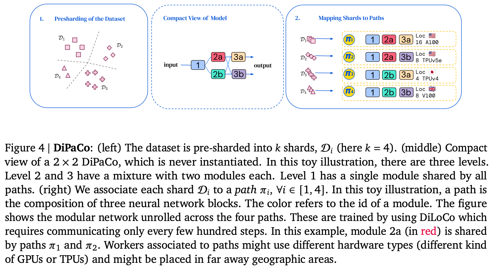

---
tags:
- distributed-training
- local-updates
- mixture-of-experts
potm_order: 3
paper_title: 'DiPaCo: Distributed Path Composition'
paper_authors: Arthur Douillard, Qixuan Feng, Andrei A. Rusu, et al.
paper_orgs: Google DeepMind
paper_link: https://arxiv.org/abs/2403.10616
review_authors:
- lukep
---

### The key idea

If the bottleneck to scaling training is communication rather than FLOPs, a recipe that blends together mixture-of-experts models and local optimisation to create a more modular model sort of works.

{:.img-medium}
<figcaption>A modular network distributed across many regions, where each path is optimised for different tasks or modalities. Shared components between paths are synchronised infrequently.</figcaption>

### Background

In the near-ish future, we may saturate the number of FLOPs a single datacentre can churn out   largely due to energy requirements to power a datacentre.

If model training requires scaling beyond this saturation point across multiple datacentres, developers will meet a cliff in the bandwidth supported for communicating between datacentres.

In this scenario, the key bottleneck to scaling throughput is no longer FLOPs, but communication volume across this low-bandwidth channel between datacentres.

This paper introduces a recipe for training models under this constraint.

### Their method

1. Shard dataset across workers ahead-of-time using k-means cluster assignments of embeddings from first 32 tokens of the sequence.
2. Initialise and shard a base model into modules width- and depth-wise (modules and levels respectively)
3. Assign end-to-end path through modules to each worker. Ideally all paths should be assigned, but this is unrealistic with large number of shards as $\textrm{\#paths} = \prod_i^{\textrm{\#levels}}\textrm{\#modules}_i$. This results in some modules being assigned to multiple paths.
4. Locally optimise each path for a $\tau$ training steps.
5. Average module updates across paths to estimate global gradient and globally optimise
6. Repeat 4. and 5 for $T$ steps.

### Results
Across experiments, the authors consider models with paths comprising of 150M parameters, with each path comprised of two levels and choosing one of up to 16 modules. They argue that this results in two fair baselines to compare to:

1. A 150M parameter dense model (parameter-equivalent per path)
2. A 1.3B parameter dense model, since the base sharded models comprises up to 16 * 150M / 2 = 1.2B parameters

Trying a bunch of different configurations, DiPaCo lies somewhere between these two extremes. Crucially it looks as if dense training is needed early in training and that additional expressivity is needed, so some modules appear in only a single path.

They argue that the remaining performance gap can be closed by re-sharding the dataset across workers every 64 tokens during inference. This would surely mean KV caches would need to be recomputed for each re-shard, so this is unlikely to be workable in practice.

{.img-small}

### Takeaways

An interesting proof-of-concept for how large-scale distributed training may look in future based on the assumption that the cost of communication outweighs the cost of compute. However, this approach may be somewhat premature given advances in long distance networking lowering the cost of communication sufficiently that dense training at large enough scales is feasible.
