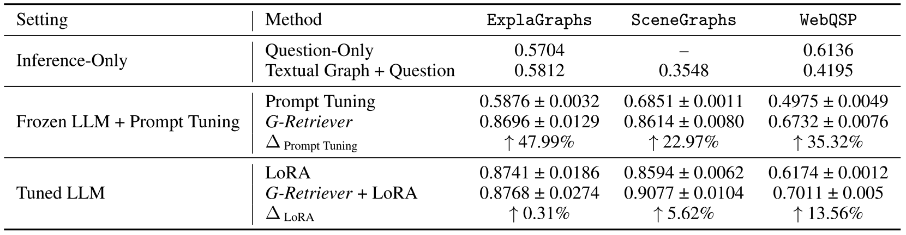

---
tags:
- LLMs
- GNNs
- retrieval-augmented-generation
- fine-tuning
potm_order: 5
paper_title: 'G-Retriever: Retrieval-Augmented Generation for Textual Graph Understanding
  and Question Answering'
paper_authors: Xiaoxin He, et al.
paper_orgs: National University of Singapore
paper_link: https://arxiv.org/abs/2402.07630
review_authors:
- danielj
---

### The key idea

From business transactions to knowledge graphs, vast amounts of real-world data possess a graph structure. As large language models arise as a major way for humans to interact with data it is of critical importance to enhance their capabilities of understanding graphs.

G-Retriever extends the concept of [retrieval augmented generation (RAG)](https://arxiv.org/abs/2005.11401) to textual graphs and enables LLM users to ask questions about a graph.

<figcaption><i>Examples of G-Retriever responding to different graph-related queries.</i></figcaption>

### Background

RAG has firmly established itself as key method for LLMs to retrieve information from a corpus of documents and thereby improve factual correctness and interpretability. Similar to traditional RAG, the first step for retrieving information from graphs is to identify relevant bits within the graph. In a second step, the retrieved data has to be made digestible by the LLM. For both steps, a range of methods has been employed over the last years, so far with no clear winner.

### Their method

<figcaption><i>Overview of the steps G-Retriever uses for performing RAG over a graph.</i></figcaption>

The authors propose a four-step method for performing RAG over a graph $G = (V,E)$ with vertices $V$ and edges $E$:

**1. Indexing** of all nodes and edges in $G$ using embedding vectors generated by a frozen language model $\textrm{LM}$.

**2. Retrieval** of most relevant nodes and edges for a give query by performing a k-nearest neighbour search between the query embedding as generated by $\textrm{LM}$ and the stored node and edge embeddings.

**3. Subgraph Construction** to identify a subgraph of $G$ that maximises the relevant information content while filtering out nodes and edges that have no value for the given query. The authors formulate this as a variant of the **Prize Collection Steiner Tree (PCST)** problem that, given a graph with a value assigned to nodes and a cost assigned to edges, aims at finding a subgraph that maximizes profit.

By adding a prize for edges the information carried by relevant edges is considered as well:

$$
    \mathop{\operatorname{argmax}}_{S \subseteq G \textrm{ connected}} \sum_{n\in V_S}\underbrace{\textrm{prize}(n)}_\textrm{node value} + \sum_{e\in E_S}\underbrace{(\textrm{prize}(e) - c)}_{\substack{\textrm{edge value less a}\\ \textrm{constant edge cost}}}
$$

where

$$
    prize(x) =
    \begin{cases}
        k - i, &\textrm{if x is the i-th of top-k nodes (edges)}\\
        0, &\textrm{else}
    \end{cases}
$$

is the value of the top-k nodes and edges based on their ranking.

**4. Text Generation** that uses both, a representation of the subgraph as plain text which is concatenated to the query and a learned embedding of the graph generated by a GNN which is concatenated to the embedded sequence.

### Results

The authors use the pretrained 7 billion parameter LLama2 as LLM to compare three model configurations across different datasets:
* Prompting a frozen LLM with the textual representation of the subgraph ("Inference-Only").
* Comparing task-specific [prompt tuning](https://arxiv.org/abs/2104.08691) to prompting with the learned graph embedding. In both cases the LLM receives the plain text representation of the subgraph.
* Fine-tuning the LLM to the specific tasks using [Low Rank Adaptation (LoRA)](https://arxiv.org/abs/2106.09685) with and without using the subgraph embeddings.

{:.img-large}

The results show that with a frozen LLM, G-Retriever achieves results comparable to the fine-tuned models and significantly outperforms the prompt tuning case.

Finally, an ablation study demonstrates the importance of both, the textualised and the embedded subgraph.

{.img-small}

### Takeaways
G-Retriever shows strong results for retrieving information from graphs to augment LLMs. In particular, the interpretation of the subgraph generation as PCST problem and the simultaneous use of textual and GNN-embedded graph attributes appear to benefit model accuracy.

It is, however, hard to compare these results to other approaches that integrate LLMs with GNNs as the field still lacks widely accepted benchmarks for comparing graph retrieval methods. Moreover, it can be expected that the impact of these methods on inference throughput and latency will become increasingly important.