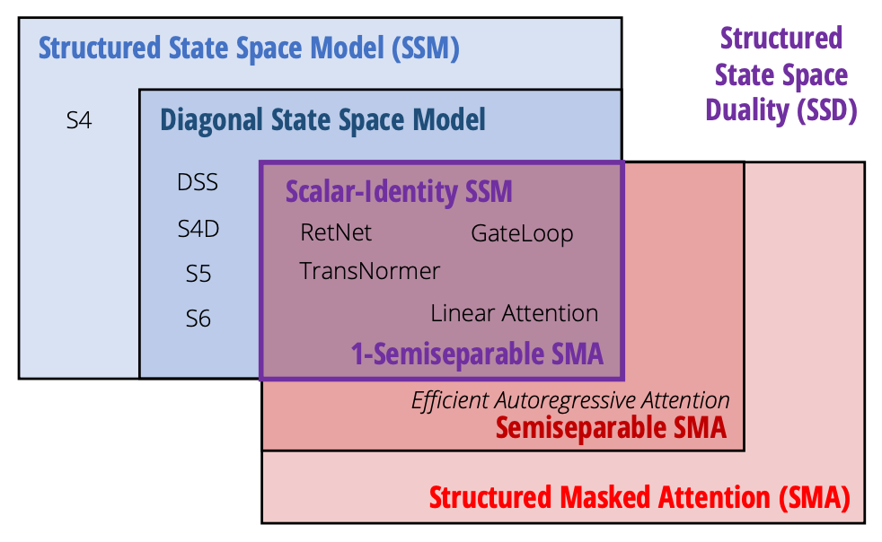
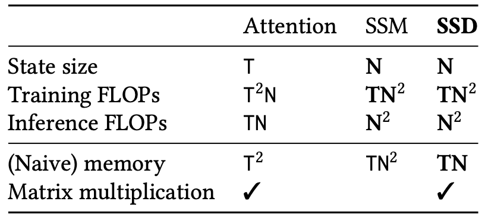

---
tags:
- state-space-models
- not-transformers
- efficient-training
- efficient-inference
potm_order: 1
paper_title: 'Transformers are SSMs: Generalized Models and Efficient Algorithms Through
  Structured State Space Duality'
paper_authors: Tri Dao and Albert Gu
paper_orgs: Princeton University and Carnegie Mellon University
paper_link: https://arxiv.org/abs/2405.21060
review_authors:
- lukep
---

### The key idea

If you stare for a while at the mapping from SSM inputs to outputs, it looks a lot like a more expressive form of causal linear attention. If you simplify this general form, you get a new SSM building block for Mamba-2 that scales across devices better than the original, while improving performance on associative recall tasks and maintaining language modelling performance comparable to Transformers up to 2.7B parameters.

{:class="constrained_img_small"}
<figcaption>The authors demonstrate equivalence between linear attention and state space models under specific conditions for attention masking structure and state-space rank.</figcaption>

### Background

State-space models have been used for decades to model continuous-time signals. In their simplest form, they are just a linear time-invariant system mapping some hidden variable $h_t$ that to an observed variable $y_t$, where $h_t$ acts as a filter over some input signal $x_t$, i.e.,

$h_t = A h_{t-1} + B x_t$

$y_t = C^\top h_t$

Where $A, B, C$, are matrices parameterising the system in question.

Structured state-space models of sequences in deep learning, e.g. Mamba, make  $A, B, C$ matrices change over time and depend on the input.

The authors note that by induction

$y_t = \sum_{s=0}^t C^\top_t \left[\prod_{r=s+1}^t A_r \right]B_s x_s$

Which can be vectorised and written as a matrix multiplication $y = Mx$ mapping sequence $y$ to sequence $x$ via matrix $M$ where

$M_{ji} = C^\top_j \left[\prod_{k=i+1}^j A_k \right]B_i$.

This makes $M$ a *semiseparable matrix*.

They also show that masked linear attention can also be written in this form, i.e., $y = (L \circ QK^\top)v = Mv$, and that for a choice of structure for $L$ (to make $M$ semiseparable), and A, these can be made equivalent. In particular, when $A$ is of the scalar-diagonal form $aI$, it is equivalent to a weighted cumulative sum where weights are the product of $a$ over time, and when $L$ is a multiplicative causal mask with a relative positional encoding.

Using these insights, the authors propose the fundamental building block of Mamba-2: the State-Space Dual (SSD) layer, connecting state-space models to linear attention.

### Their method

By restricting A to be in scalar-diagonal form, the general SSM layer of Mamba can be drastically simplified, permitting a more straightforward implementation that targets GPU tensor cores (improving throughput) via batched matrix multiplications rather than scan operations.

This also reduces space complexity to be linear (rather than quadratic) in hidden size.

{:class="constrained_img_small"}

They also add a normalisation layer before the final output projection as Mamba was found to be unstable with larger state sizes, and permit B and C to be shared across heads, analogous to multi-/grouped-***value*** attention.

By allowing convolution blocks and normalisation to be grouped within devices, this block can be parallelised more easily, requiring only an all-reduce for the final output projection. SSD states may also be passed sequentially between devices to allow sequences to be split across devices.

### Results

The authors demonstrate improved associative recall on synthetic tasks due to larger state size permitted by improved space complexity. Mamba-2 could still hit a wall when model state capacity is saturated over longer sequence lengths however, while attention should be more robust.

It's faster than flash attention at 2k sequence length (Mamba only at 16k), and remains faster with larger state sizes due to memory requirements linear with state size (quadratic with Mamba).

Scaling laws look comparable to Llama-like transformers (Transformer++) up to 1.3B. It is possibly worse at 2.7B as they appear to have trained up to this size but only compare to Pythia rather than Transformer++. Extrapolating from the scaling laws figure, it looks as though there might be a crossover soon after 1.3B.

The authors also explore hybrid models blending SSD layers with attention and MLPs, demonstrating that 10% attention layers works well. [Another paper](https://arxiv.org/abs/2406.07887) released a few weeks after this one conducts a more thorough investigation.

### Takeaways

The release of the original Mamba paper sparked a wave of exploration into applying Mamba to various domains and tweaking the architecture to improve performance, enabled in particular by open-sourcing optimised kernels for the scan operation at the heart. By removing the need for this more sophisticated scan operation entirely and instead being able to rely on batched matrix multiplications for acceleration, we can also speed up the cycle of experimentation. We might expect to see further improvements to this architecture at increasing scale.
