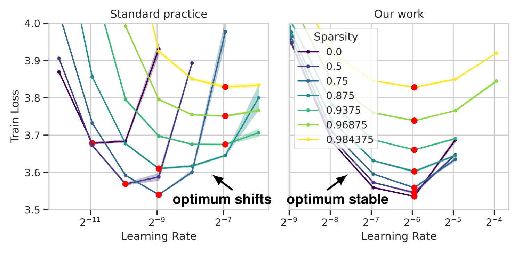
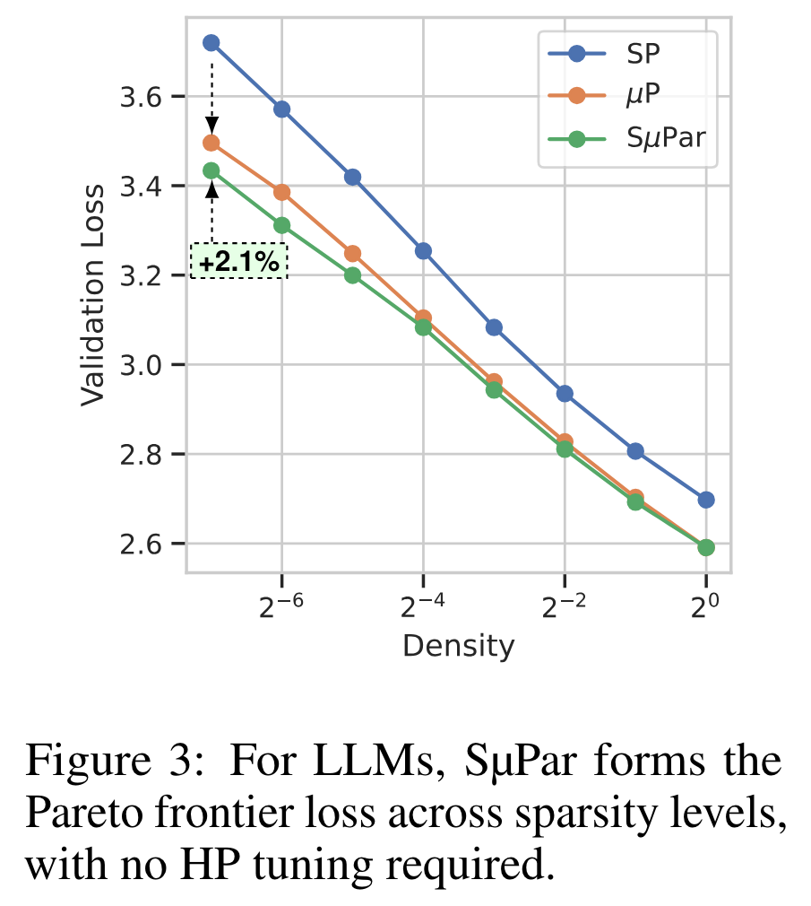

---
tags:
- sparsity
- training-dynamics
- mup
potm_order: 2
paper_title: 'Sparse maximal update parameterization: A holistic approach to sparse
  training dynamics'
paper_authors: Nolan Dey, Shane Bergsma, Joel Hestness
paper_orgs: Cerebras Systems
paper_link: https://arxiv.org/abs/2405.15743
review_authors:
- charlieb
---

### The key idea

Introducing sparsity into a model causes its learning dynamics to change, meaning that the optimal hyperparameters (especially learning rate) may be altered. Many previous studies have failed to account for this effect. By applying the principles of µP we can create sparse models with stable hyperparameters.

### Background

[Recent work](https://arxiv.org/abs/2202.02643) has suggested that a simple and quite effective approach to sparsity is to prune a random selection of weight elements at initialisation. This kind of sparsity is known to affect learning dynamics, yet the community has largely persisted with fixing the dense LR across different sparsity levels, largely due to the expense of re-sweeping it with every sparsity change.

Recently µP has emerged as a method for ensuring consistent learning dynamics across models of different widths. This works by adjusting multipliers in the model, initialisation and learning rate such that activations and updates are invariant to changes in width.

### Their method

Applying sparsity to a matrix multiplication is comparable to a matrix multiplication of reduced width. The authors leverage this to come up with a version of µP for sparsity, named SµPar ('soo-pahr'). Where $m_d$ is the model width and $m_\rho$ the model density (1 - sparsity), their rules are:

The paper contains some mathematical justification for this, which can make the method seem quite complex, but in reality the above table reflects the simplicity of the method: use µP with your sparse model as though it had its "effective width" of $m_d \cdot m_\rho$ for the sparse layers.

Their aim is that

meaning they can scale with width and sparsity. In this way, they can make their models both wider and sparser at once and still keep the same learning dynamics.

### Results

Based on the fact they can scale width and sparsity simultaneously, they show the effect under this sparsity setup of keeping the number of non-sparse parameters fixed, and scaling the number of total parameters in combination with sparsity:

This is a neat result. The LR is much more stable, and there are clear gains to be had from increased sparsity (with a constant memory footprint).

The only negative here really is that the benefit is not particularly substantial. They plot the final validation loss for their full LLM training runs at different densities and even for the aggressive 1/128 sparsity the gain is relatively modest:

{:class="constrained_img_small"}

### Takeaways

Nevertheless, this approach to stable sparsity is principled and worth adopting. One can see it being particularly useful for more extreme or unusual forms of sparsity, where the hyperparameters may shift further.
It also has a lot of overlap with the recent [Compute Better Spent](https://arxiv.org/abs/2406.06248) paper, which also uses µP-style rules for different kinds of structured matrices.
In general, the idea of controlling for learning dynamics when testing new ideas seems like it could become standard in years ahead.