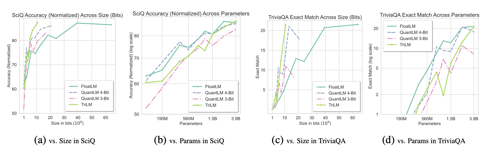

---
tags:
- LLMs
- efficient-training
- quantisation
potm_order: 1
paper_title: 'Spectra: A Comprehensive Study of Ternary, Quantized, and FP16 Language
  Models'
paper_authors: Ayush Kaushal, et al.
paper_orgs: Nolano AI, UC Riverside
paper_link: https://arxiv.org/abs/2407.12327
review_authors:
- lukar
---

### The key idea

An open-source [LLM suite](https://github.com/NolanoOrg/SpectraSuite) comparing models trained in 16-bit precision, post-training quantised models, and pretrained *ternary* models. The suite consists of models in the 99M - 3.9B parameter range trained on 300B tokens.

<figcaption>Figure 1. Commonsense & Reasoning tasks performance.</figcaption>

### Background

Recent work on pretrained [ternary models](https://arxiv.org/abs/2402.17764) (see our [March post](https://graphcore-research.github.io/papers-of-the-month/low-rank-galore-and-1_58-bit-weights/#the-era-of-1-bit-llms-all-large-language-models-are-in-158-bits)!) has offered an exciting avenue for models trained in extremely low precision that can almost fully retain the accuracy of their higher-precision counterparts when trained from scratch. This is in contrast to the commonly-used quantisation techniques that take models trained in higher precision and compress them for inference. However, the trade-offs between the techniques have not been fully studied and understood.

### Their method

In the Spectra suite, the authors train/quantise 54 models that are either:

* FloatLM: Llama-style standard transformer architecture trained in half-precision.
* QuantLM: Post-training quantised FloatLM using GPTQ (quantised to 3/4/6/8 bits).
* TriLM: Ternary model (values either -1, 0, or 1) similar to the BitNet b1.58  LM architecture.

#### TriLM

TriLM (similarly to the BitNet b1.58 architecture) uses ternary {-1, 0, 1} values for linear layer weights, with an additional floating point scale per weight tensor. Full floating-point representations of the values are kept during training and quantised during each forward pass: the scale is computed as the absolute mean of the tensor, and the value is quantised to the nearest ternary state after scaling. Additionally, when using weight sharding across devices, each device computes a scale for its own shard to avoid additional communication.

### Results

The models were evaluated on commonly-used benchmarks covering commonsense and reasoning, as well as knowledge-based tasks. It was generally observed that TriLM outperforms the other models on per-bit performance, while the gap between TriLM and FloatLM/QuantLM on per-parameter performance decreases as the model size is increased.

<figcaption>Figure 9. Knowledge-based tasks performance.</figcaption>

<figcaption>Figure 10. MMLU performance.</figcaption>

### Takeaways

The original BitNet b1.58 paper showcased very promising results on training highly-quantised models without a significant performance degradation, which is why having open-source suites reproducing the results and comparing different architectures such as Spectra is invaluable for researchers looking into analysing and developing low-precision models.
