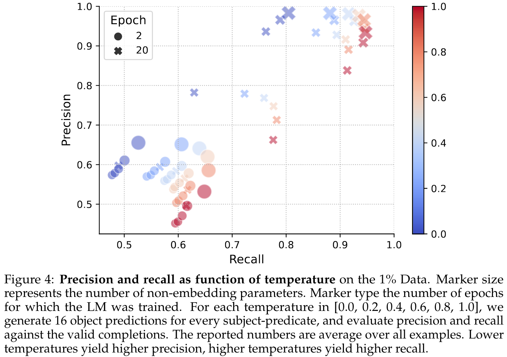
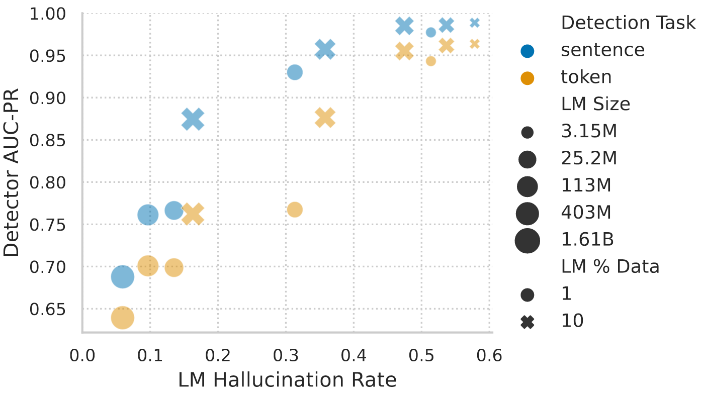

---
tags:
- LLMs
- hallucinations
potm_order: 3
paper_title: 'Training Language Models on the Knowledge Graph: Insights on Hallucinations
  and Their Detectability'
paper_authors: Jiri Hron, et al.
paper_orgs: Google DeepMind
paper_link: https://arxiv.org/abs/2408.07852
review_authors:
- danielj
---

### The key idea

One of the key challenges for large language models (LLMs) is the reliability of the model output. By strictly controlling the training data the authors investigate how hallucinations and the performance of hallucination detectors change with the size of the model and the dataset.

### Background

Since LLMs are typically trained on vast amounts of data with unclear information content, and since natural language can be ambiguous, it is hard to decide which LLM output counts as hallucination. Knowledge graphs capture relational information in the form of (subject, predicate, object) triples, where subject and object are represented by nodes of the graph, and predicates correspond to directed edges.

### Their method

To have full control over the information that the language model digests during training, the authors train decoder-only Transformers of different sizes to predict the object of triples of a knowledge graph. This approach guarantees that a model prediction can unequivocally be identified as correct or hallucination, depending on whether the prediction is indeed an object of (subject, predicate, ?) in the knowledge graph.

{:class="constrained_img_large"}

In this constrained setting, the occurrence of hallucinations can be analysed for different model scales, dataset fractions, and training durations. Furthermore, the performance of hallucination detectors can be measured for two different detection tasks:
* sentence: Given the original (subject, predicate) pair and the predicted object, the detector judges if the object is hallucinated.
* token: Given the embedding of a token from the LM, the detector judges whether it is hallucinated.

### Results

#### Scaling behaviour of the hallucination rate

The proposed task relies heavily on the memorisation of facts during training, therefore the model performance on unseen data is generally quite weak and increasing the model size or the training duration hardly impacts the rate of hallucinations, with some signs of overfitting in the case of large models/many training epochs. In contrast, when testing on facts seen during training, a better memorisation performance can be achieved with larger models and a longer training duration resulting in a lower hallucination rate. Since, in contrast to typical datasets for LLM training, the KG dataset contains no repeated information, several (~20) training epochs are required for a low hallucination rate.

{:class="constrained_img_large"}
<figcaption><i>Hallucination rate on examples seen (top) and unseen (bottom) during training plotted against training FLOPs.</i></figcaption>

Furthermore, a tradeoff between precision ($1 - \text{hallucination rate}$) and recall (the proportion of objects that are generated at least once when multiple objects exist for a (subject, predicate) pair) can be observed when varying the sampling temperature: A low temperature reduces the rate of hallucinations but prevents the generation of some facts.

{:class="constrained_img_large"}

#### Hallucination detectors

When finetuning the pretrained LMs for hallucination detection, it can be observed that low hallucination rates impede the detectability of hallucinations. In particular, the detection of the remaining hallucinations of larger, longer trained models becomes increasingly hard.

{:class="constrained_img_large"}
<figcaption><i>Area under the precision-recall curve for hallucination detectors applied to the output generated by LMs of different sizes, trained for 100 (20) epochs on 1% (10%) of the data.</i></figcaption>

### Takeaways

A better understanding and detection of hallucinations will certainly remain a key challenge for research on LMs. The strict control of the training data enables the authors to perform a rigorous investigation of the memorisation capability of language models and its dependency on model scale and training duration, thereby yielding interesting insights into the hallucination rate and detectability. However, it remains an open question how well these results translate into the traditional setting of training LMs on more messy datasets.
