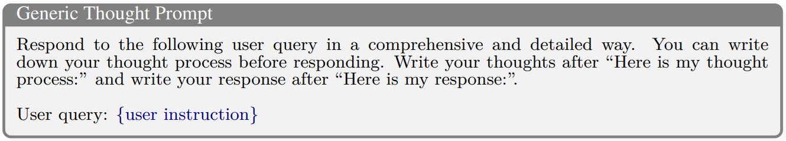
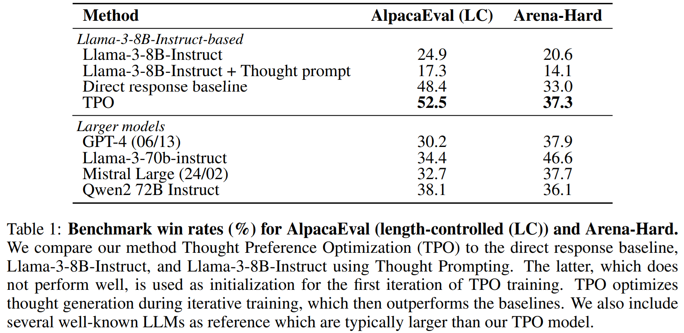

---
tags:
- LLMs
- self-correction
- reasoning
potm_order: 3
paper_title: 'Thinking LLMs: General Instruction Following with Thought Generation'
paper_authors: Tianhao Wu, et al.
paper_orgs: Meta FAIR, UC Berkeley, NYU
paper_link: https://arxiv.org/abs/2410.10630
review_authors:
- albertoc
---

### The key idea

There has been a growing trend in allowing LLMs to use more inference-time compute to generate answers to harder questions. The [Chain-of-Thought](https://arxiv.org/abs/2201.11903) approach, which pushes the model to self-correct and iteratively revise its answer, has shown significant promise, particularly for tasks involving maths and logic. However, in principle, taking the time to think should be helpful for a broad range of tasks. The authors propose a method to equip existing LLMs with the ability to think and plan before outputting a response through a custom post-training procedure called Thought Process Optimization (TPO). The technique does not require any additional human data, instead leveraging Reinforcement Learning from AI Feedback (RLAIF).

{:class="constrained_img_large"}

### Their method

The LLM's output is divided into two parts: the thought process (which, differently from CoT, will not be shown to the user) and the actual response. In order to achieve this separation, the user query is prepended with a generic *thought prompt*, of the form:

Simply doing this will actually degrade the performance of the model, as instruction-tuned LLMs have been heavily optimized to provide direct responses. The model needs therefore to be fine-tuned to produce useful thoughts. Crucially, no instructions on how to think are provided: the LLM is incentivised to generate its own thoughts, using only the quality of the response as the steering metric. This approach has the advantage of not requiring any additional training data on human thoughts, relying entirely on RLAIF.

Thought Process Optimization training is performed over several iterations. During an iteration, for each training instruction (concatenated to the thought prompt), multiple outputs are sampled in parallel. A judge model scores the outputs by only looking at the response part, ignoring the thought process. The best- and worst-scoring samples (now including the thought process) are then taken to construct a preference pair, which will be used as training data for the next iteration using a [Direct Preference Optimization](https://arxiv.org/abs/2305.18290) loss. By doing so, the model is able to learn which thoughts lead to a better response.

### Results

The authors use Llama-3-8B-Instruct as the seed model. On both the AlpacaEval and Arena-Hard benchmarks, the LLM with Thought Process Optimization significantly outperforms the seed model, approaching (or even surpassing) the performance of much larger models. Interestingly enough, the fine-tuning procedure shows great benefits even when the model is asked to produce direct responses without any thinking ("Direct response baseline" in the table).

Improvements over the seed model are shown to consistently increase with the number of TPO fine-tuning iterations. When looking at individual categories of instructions, it is surprising to notice that - while mathematical and analytic tasks benefit from thinking - the categories with the larger improvements are actually non-reasoning ones, like language translation and writing, or marketing.

### Takeaways

This work highlights how the reasoning abilities of an LLM at test time can be improved through RLAIF by letting the model learn on its own how to generate useful thoughts, unlike previous techniques (like self-correction and self-refinement) that relied on supervised fine-tuning. The promising results, especially in areas that have been typically believed not to require much reasoning skills, will surely spark future research on the benefits of spending more compute at inference time.
