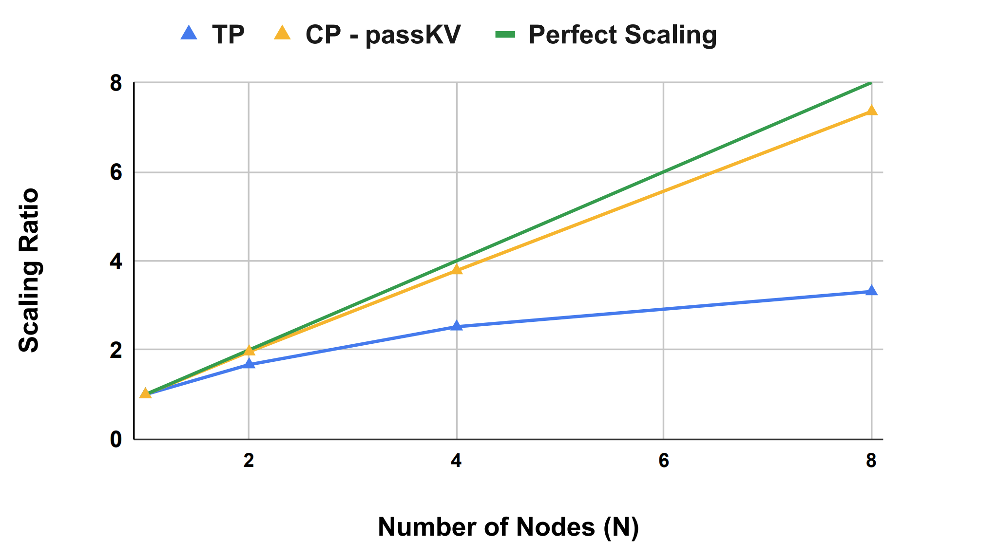

---
tags:
- efficient-inference
- long-context
potm_order: 2
paper_title: 'Context Parallelism for Scalable Million-Token Inference '
paper_authors: Amy (Jie) Yang, et al.
paper_orgs: Meta
paper_link: https://arxiv.org/abs/2411.01783v2
review_authors:
- ariannas
---

### The key idea

One area where modern LLMs must compete is their ability to handle increasingly long context lengths. Longer context lengths allow the models to handle larger inputs and, in inference, give the user a better experience (with, for example, multi-turn conversations), but can put a strain on both compute and memory capacity. 

In this paper the authors focus on the use of context parallelism and of adaptive algorithms for optimisation to improve latency and scalability performance when serving LLM inference with context lengths of up to a million tokens. 

Context parallelism proves beneficial for reducing latency in multi-node inference with respect to other parallelism strategies as it involves less communication traffic than e.g. tensor parallelism. On the other hand, the main intuition behind adaptively switching between different variations of the ring attention heuristic is that inference presents different KV cache hit rates according to user behaviour and the phase of the serving process. This variability can be exploited to optimise performance for each stage of inference.

{:class="constrained_img"}
<figcaption>Figure 1a. Graph showing that near-linear scaling is achieved with Context Parallel with an increasing number of nodes, and that this is not achieved with Tensor Parallel.</figcaption>

{:class="constrained_img"}
<figcaption>Figure 1b. Graph showing that Time To First Token (TTFT) is halved when moving from 8 CP ranks to 16.</figcaption>

### Background

Serving LLMs with longer context lengths uses more memory. In particular, the size of the Key and Value (KV) cache increases linearly with context length. If the memory required exceeds that of a single processor, it must either be split across multiple processors or quantised to a lower precision number format. This paper focuses on the Context Parallelism (CP) paradigm which splits the inputs and all activations along the sequence dimension. Then the processors exchange QKV tensors to compute attention. 

This paper builds on Ring Attention, a technique devised by researchers at UC Berkeley: the main idea is to perform a block-wise computation of self-attention and feedforward to distribute the long context length across multiple devices while fully overlapping the communication of KV blocks with the computation of attention.

### Their method

The authors consider two ring attention variants: pass-KV, where the KV tensors are exchanged between processors, and pass-Q, where the Q tensors are exchanged between processors. During the different phases of the inference process, different variants are used to minimise the communication costs. There are three phases to consider:

- Full prefill, where the entire prompt is processed. No prior KV cache is present, so passing the full KV tensors here makes sense, and communication can be reliably overlapped with computation.
- Partial prefill, where the user provides a follow-up prompt. Heuristics guide whether to use pass-KV or pass-Q dynamically, depending on the cache hit rate and the relative size of the new and cached tokens.
- Decode, where the model processes and generates one token at a time auto-regressively. In this case communicating the Q tensors incurs a smaller communication overhead. 

In addition, the authors fix Tensor Parallel (TP) to (typically) 8 processors, then pair it with CP to scale out to more nodes. CP has less communication traffic than TP: LLMs have more linear layers than attention layers and CP might communicate KV tensors instead of Q tensors, which leads to less communication in models which use Grouped Query Attention (GQA). Hence CP improves latency for multi-node inference.

### Results
The authors benchmark their heuristics on H100 GPUs (up to 128 GPUs: 16 nodes of H100s, 8xGPUs in each node). CP is applied over the 1-16 nodes and test all three phases of inference (full prefill, partial prefill and decode). Within each node the model is partitioned with TP8 over 8 GPUs. They use the Llama 3 405B model with weights quantised to FP8.

The most promising results, as illustrated in Figure 1a and 1b above, are that: 

- For the full prefill phase with long enough context length they obtain a reduction in the latency proportional to the number of CP nodes (so latency is halved when the number of CP nodes is doubled). This result was compared with TP performance, which is performs less well as it consumes more compute resources: the latency difference between CP2 and TP16 increases from 15% on 2 nodes to 100% on 8 nodes. (see Figure 1b)
- In another prefill experiment the context length is increased up to 1M (see Figure 1a) and they achieve 77s latency for this length, compared to 3.8s for 128k. 

They obtain their best results for the prefill phase, which is the inference phase that benefits the most from the adopted CP recipe.

