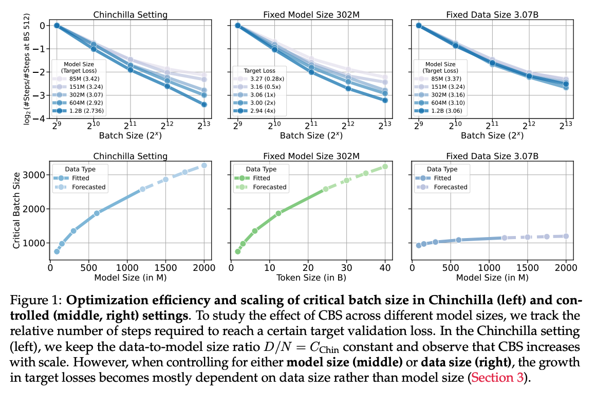

---
tags:
- batch-size
- training-dynamics
- efficient-training
- scaling-laws
- LLMs
potm_order: 4
paper_title: How Does Critical Batch Size Scale in Pre-training?
paper_authors: Hanlin Zhang, et al.
paper_orgs: Harvard University, University of California Berkeley, University of Hong
  Kong, Amazon
paper_link: https://arxiv.org/abs/2410.21676
review_authors:
- charlieb
---

### The key idea

The critical batch size (CBS) is the largest batch size at which an LLM can be trained without requiring more data to reach the same loss. The key contribution in this paper is an analysis of how CBS _scales_ with respect to data and model size in a modern training setup. They find a key and perhaps surprising result: CBS is largely determined by the amount of training data, and is almost invariant to model size.

### Background

Each step of the standard ML training procedure has two phases: the accumulation of gradients, and the update of parameters based on those gradients. Accumulation takes place in three places: within a local mini-batch on each device, across devices (using a data parallel all-reduce operation), and across sequential mini-batches (i.e. gradient accumulation).

For the sake of computational efficiency, we wish to use large local mini-batches to ameliorate the cost of loading weights, and as many data parallel devices as we have available to maximise compute. This means we want to use a large global batch size. When the global batch size is lower than the CBS it makes no difference to the final loss how large or small the batch size is (i.e. how much we accumulate before we update the parameters) - we always reach the same loss with the same amount of data. Another way to view this is to say that below the CBS, a doubling of the batch size halves the number of updates required - hence the term "linear scaling".

The CBS is the point at which linear scaling ceases to hold. This concept was first introduced in [a 2018 paper on large-batch training by OpenAI](https://arxiv.org/abs/1812.06162), which shows that gradient noise can be used to predict the critical batch size. However, that paper and its successors have not shown how the CBS relates to model size and number of tokens trained on, particularly in the context of LLM training. Understanding this is the purpose of this paper.

### Their method

The authors define the CBS as the batch size at which >=20% more steps are needed to reach the target loss than would be predicted were the linear scaling at small batch sizes to continue (see the paper for a mathematical formulation of this statement). This is an arbitrary threshold, but the line has to be drawn somewhere.

=20%." class="constrained_img_large">
<figcaption>Plot showing scaling of steps needed to reach the target loss with respect to batch size (blue). The critical batch size (red) is the point at which this curve intersects the line given my multiplying the linear projection of this curve by 1.2 (green).</figcaption>

Instead of setting a target number of tokens and looking at the degradation in loss as batch size increases, they instead choose to set a target loss and look at the increase in steps required to reach it. This seems sensible, as it is a more interpretable metric than the increase in loss, but it does make some things harder. For instance, they have to use a slightly non-standard (though well-validated) loss schedule for which the number of steps does not need to be known ahead of time.

### Results

They then train three sets of models, where each set contains models trained with a range of batch sizes and total compute allocations. The sets differ in how this scaled-up compute is allocated between increased model size and increased token count. The three procedures are:

1. Allocate using the compute-optimal ratio between the two, as determined by [the Chinchilla paper](https://arxiv.org/abs/2203.15556)
2. Fix the model size and only increase token count
3. Fix the token count and only increase model size

They then use this to fit scaling laws for the number of steps taken as a function of the batch size. This results in the following:

The scaling laws are used to compute the forecasts in the bottom row. The most interesting feature of these plots is the shape of the bottom right curve, showing that the CBS depends little on model size. Their scaling law says the the critical batch size $B^* $ relates to the model size $N$ as $B^* \propto N^{0.087}$ - so a $100 \times$ increase in parameters would entail an increase of only $100^{0.087} \approx 1.5\times$ in the CBS!

### Takeaways

This is a very useful paper, with a nice clear central result (something like: "only worry about scaling batch size with model size (alone) if you have a ~100-1000x increase in parameters"). It's made more robust by the careful control of hyperparameters (e.g. using µP to scale the learning rate). Practitioners will be able to use this analysis to determine their own critical batch size for large training runs.

The only thing really lacking is a good intuition for _why_ longer training runs should have a larger CBS. One possibility here is that later in training larger batch sizes are more helpful, as the model improves and more data is required to derive an effective update (i.e. the loss landscape is harder to descend). This opens up the question of whether the CBS increases during training (which may well explain their finding), and if so how might one set a batch size schedule. We look forward to seeing future papers investigate this question!
