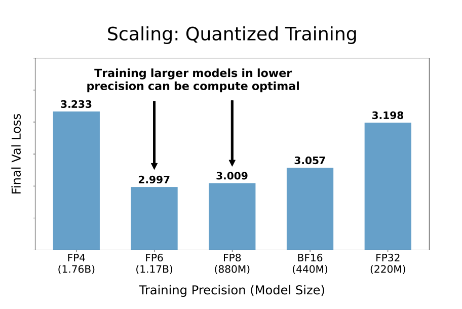
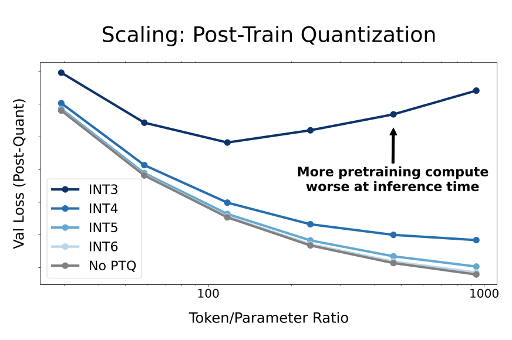

---
tags:
- efficient-inference
- efficient-training
- training-dynamics
- quantisation
- number-formats
potm_order: 3
paper_title: Scaling Laws for Precision
paper_authors: Tanishq Kumar, et al.
paper_orgs: Harvard University, Stanford University, MIT, Databricks, Carnegie Mellon
  University
paper_link: https://arxiv.org/abs/2411.04330
review_authors:
- sylvainv
---

### The key idea

Current scaling laws describe how models perform in terms of their size and the amount of data used to train them. This paper goes further by incorporating the effects of reduced precision on training and inference in language models, allowing practitioners to better balance performance and computational efficiency. While reduced precision can lower costs, it risks degrading model quality. The authors focus on two scenarios: (1) low-precision training, where weights, activations, and attention are quantised, and (2) post-training quantisation, where only weights are typically quantised for inference.

{:.img-large}
<figcaption>Functional form of the authors' scaling law.</figcaption>

### Their method

To establish these scaling laws, the authors conducted over 465 pretraining runs and fit a scaling law on those runs conducted in integer precision. They compare the resulting predictions to empirical results for floating-point precision, and find them to be a good fit. Fitting a scaling law on runs conducted in floating-point precision would require fitting on both the number of mantissa and exponent bits, which the authors leave to future work.

### Results

There are two main findings in this paper:

- Optimal precision balance: The optimal precision for training lies around 7-8 bits, challenging both current practices of 16-bit training as well as the push toward ultra-low precision formats like FP4. More generally, training larger models in lower precision can be compute-optimal.

{:.img-large}
<figcaption>Empirical results for language models trained in floating point. The number of parameters of each model is such that the memory used for weights is constant across models.</figcaption>

- Post-training quantisation risks for overtrained models: More pretraining data makes models increasingly sensitive to post-training quantisation.

{:.img-large}
<figcaption>Graph of post-quantisation validation loss vs. token/parameter ratio, showing that increasing the amount of pretraining data can make models very sensitive to post-training quantisation</figcaption>

### Takeaways

This paper invites further empirical validation to confirm these laws under broader setups. Additionally, new formats like micro-exponent floating-point (MXFP) or NormalFloat are not covered. Lastly, the experimentation only considers language modelling loss and not downstream evaluation results.

In conclusion, this study offers strong guidelines for optimising model precision across training and inference. However, there is still work to be done to extend their work to all possible floating-point types.