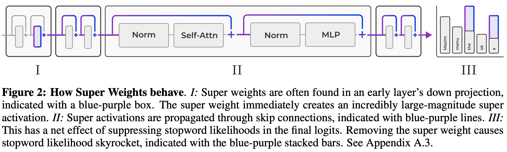
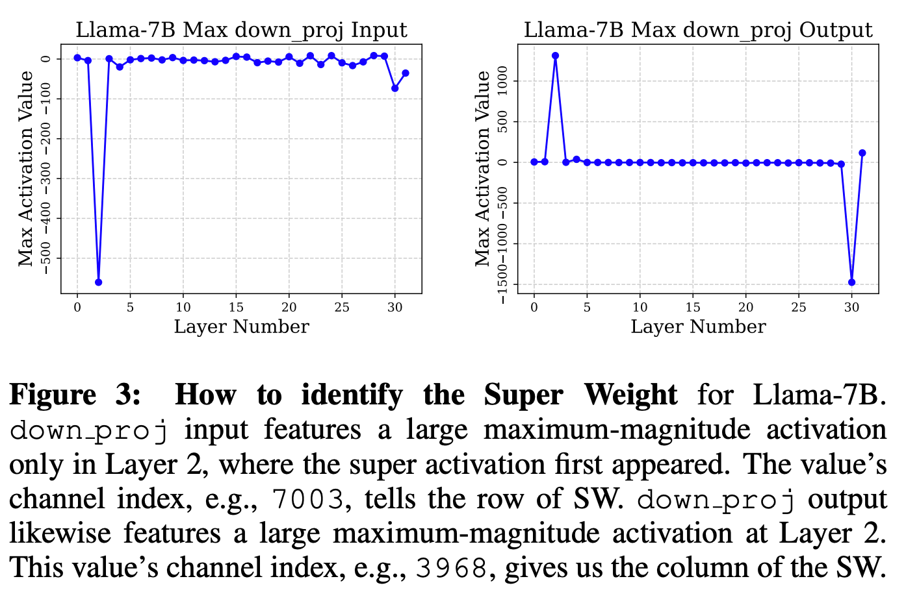
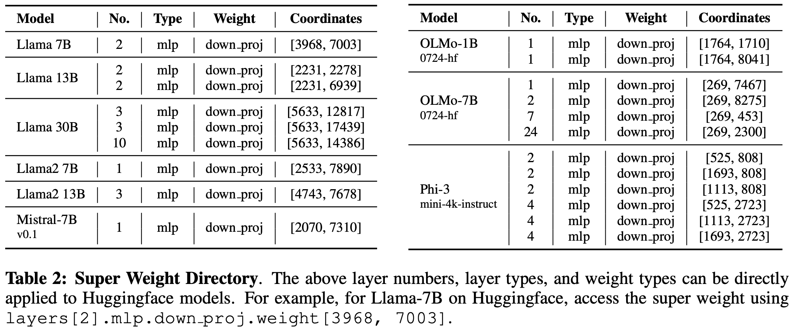
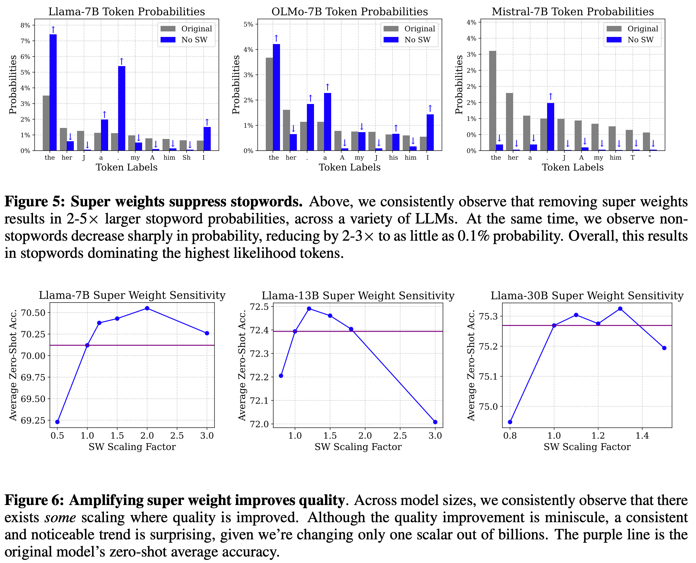

---
tags:
- quantisation
- LLMs
potm_order: 1
paper_title: The Super Weight in Large Language Models
paper_authors: Mengxia Yu, et al.
paper_orgs: University of Notre Dame, Apple
paper_link: https://arxiv.org/abs/2411.07191
review_authors:
- lukep
---

### The key idea

In an LLM, a small number of MLP down projection weights appear to be critical for enabling the construction of complete sentences. These weights suppress the probabilities of generating "stopwords" (e.g., `the`, `and`, `.`). Quarantining and preserving these weights drastically improves data-free round-to-nearest quantisation.

{:.img-large}

### Their method

The authors start by asking the question of how "massive activations" as observed by [Sun et al. (2024)](https://arxiv.org/abs/2402.17762) (see [our summary in a previous month](https://graphcore-research.github.io/papers-of-the-month/low-rank-galore-and-1_58-bit-weights/#massive-activations-in-large-language-models)) are created. These massive activations appear independent of token position in every layer, and appear regardless of input prompt.

The authors demonstrate that these activations appear to be created by (in most cases) a multiplication of a single element in each of the weight matrix and the preceding activation that dominates the dot product. That is, for a massive activation $Y_{ij}$ we have

$Y_{ij} = \sum_k X_{ik}W_{jk} \approx X_{im}W_{jm}$

where the forward pass of the feed-forward layer is calculated as $Y = XW^T$.

These super weights are not always the largest by magnitude in the weight matrix. The authors demonstrate that super weights can be found simply by feeding in an arbitrary prompt, locating the massive activation in the output, then iteratively pruning weights until the massive activation is diminished. In most cases, only a single weight needs to be removed.

{:.img-large}

The authors provide a super useful table so that you can go and look up these super weights for yourself for a range of open models.

{:.img-large}

### Results

The most striking result is that individual weights can be critical for an LLM to be able to generate coherent sentences. In the open LLMs that the authors tested, removing these super weights often reduced QA task performance to near chance level and severely impacted language model perplexity.

{:.img-large}

They conduct a series of ablations to try to understand the effect of removing super weights. They demonstrate that:

1. Restoring super activations despite pruning super weights recovers some loss of performance but not all, indicating that super weights have other unknown effects on performance via contributions to other activations.
2. Examining output token probability averaged over 500 input prompts demonstrates that stopword probability is drastically increased after super weight removal. Sadly, the authors don't fully unpick this phenomenon.
3. Increasing the super weight's magnitude by a factor of 1-2x can usually improve model performance on downstream tasks. Performance worsens outside this range.

{:.img-large}

Finally, the authors offer a simple quantisation strategy for preserving super weights and minimising precision loss of regular weights. They use a simple clipping strategy (which requires tuning a hyperparameter) to reduce the effective range for round-to-nearest quantisation, then restore super weights post-quantisation.

The authors compare this to naive quantisation, where they find a big improvement, and block quantisation, where they find an improvement for larger block sizes. This makes it useful as a cheap and easy strategy before trying out methods that require data for post-training quantisation.

{:.img-large}

### Takeaways

The numerics underlying LLM performance are still something of a mystery. There are many unexplained phenomena, some of which we just try to deal with for a fixed LLM (as in this paper) and some of which we try to deal with for future pretrained LLMs, e.g., by creating attention bias terms or stabilising Gated Linear Units. While the authors don't attempt to uncover deep reasons why this might be a useful feature of LLMs that we should capture in a more numerically stable way, the results are striking and the solutions are cheap.
