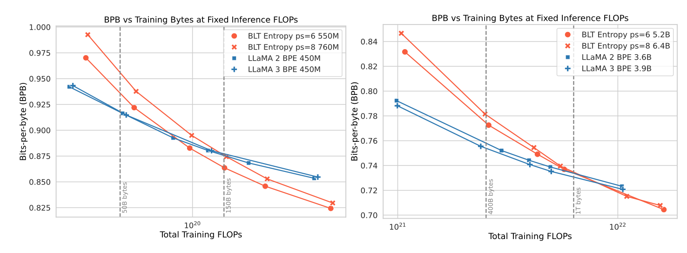
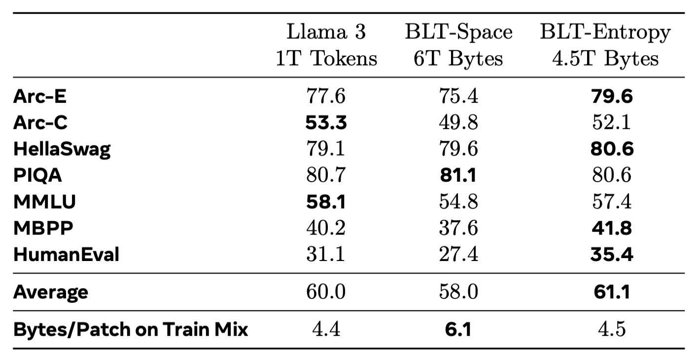

---
tags:
- LLMs
- byte-level
potm_order: 1
paper_title: 'Byte Latent Transformer: Patches Scale Better Than Tokens'
paper_authors: Artidoro Pagnoni, et al.
paper_orgs: Meta
paper_link: https://arxiv.org/abs/2412.09871
review_authors:
- lukar
---

### The key idea

Tokenization is an essential preprocessing step of modern language models; however, it requires independent training and inference stages and can often lead to unexpected and undesired behaviors (see for example [comment by Karpathy](https://x.com/karpathy/status/1657949234535211009)). On the other hand, training directly on characters (bytes) is inefficient and leads to processing exceedingly long sequence lengths.

In this paper, the authors present a new transformer-based architecture called "Byte Latent Transformer" that operates directly on bytes, but avoids the issues associated with a naive byte-level model implementation. Their experiments scale-up the architecture to 8B parameters and show promising results when compared to the standard transformer with tokenization.

{:.img-large}
<figcaption>Figure 1. Byte Latent Transformer architecture.</figcaption>

### Background

The first stage of processing a string of text with a language model is *tokenization*: sentences are split into sub-words using previously learned rules (e.g. [byte pair encoding](https://en.wikipedia.org/wiki/Byte_pair_encoding)), and the model generates the output one token at a time. However, using sub-words as elementary units can lead to surprising behaviors, such as susceptibility to spelling errors and difficulties operating with numbers. Byte-level models avoid this by operating directly on characters, however this can be highly inefficient as the full model needs to be run for every generated character.

A closely-related previous paper [MegaByte](https://arxiv.org/abs/2305.07185) tries to find a balance between the two worlds through a hierarchical approach: use a "big" transformer to predict groups of bytes (*patches*) together with a "small" transformer that generates the individual bytes using the big model's prediction. Byte Latent Transformer builds upon similar ideas and aims to extend this approach, by allowing *dynamic* patch sizes, as well as scaling-up the architecture.

### Their method

The architecture of the Byte Latent Transformer follows a hierarchical approach (Figure 1): the initial local byte-level encoder encodes groups of bytes (patches), feeding these patch embeddings into a large latent transformer. The latent transformer predicts the next *patch*, and these next-patch embeddings are finally fed into a local decoder which generates the next-byte predictions. Let's now take a look at the individual stages in more depth.

**Patching**

<figcaption>Figure 2. Different byte-patching schemes (entropy-based applied here).</figcaption>

The first stage is grouping bytes into patches that will be individually processed by the large transformer. In MegaByte, the authors chose a fixed pre-defined number of bytes to group (e.g. 4 or 8). Ideally, however, patches should be equally "information-dense" and bytes should be grouped so that they can be effectively predicted together by the latent transformer.

<figcaption>Figure 3. Entropy-based patching.</figcaption>

In order to do this dynamically, the authors chose to train a separate small character-level LLM that estimates the probability distribution over the next character. Then, the patch boundary is chosen as the point where the next-character entropy jumps, i.e., we separate patches as soon as the next character is "hard enough" to predict. This is done by either setting a global entropy threshold that needs to be exceeded, or when the entropy change between the steps is sufficiently large.

**Local encoder**

<figcaption>Figure 4. Local encoder and decoder architectures.</figcaption>

The job of the local encoder (Figure 4, left) is to take the input byte sequence and output the sequence of patch embeddings to be processed by the latent transformer. The byte sequence is passed through a set of standard transformer layers (self-attention with a local window + feed-forward network); after each transformer layer, a cross-attention layer is added whose role is to pool the byte-representations into the patch representations (i.e., patch representations are the queries, and byte representations are the keys/values). Each patch representation only cross-attends to the bytes within its patch boundaries.

**Latent transformer**

Latent transformer takes the patch embedding sequence generated by the local encoder, and outputs "next-patch" embeddings. This is the standard transformer architecture that consumes the bulk of the model FLOPs, with the main difference being that its output is a patch embedding vector, instead of a probability distribution over the next token.

**Local decoder**

Finally, the local decoder (Figure 4, right) takes both the final byte encoder hidden states, and the patch embeddings output by the latent transformer, and generates the next byte one-by-one.

Its architecture is very similar to the local encoder with a combination of the standard transformer layers and cross-attention layers, but the roles are inverted: the byte sequence now act as queries, and the key/value pairs are projected from the final latent transformer patch embeddings. The byte sequence embeddings thus pass through a sequence of cross-attention layers, followed by standard self-attention transformer layers.

### Results

<figcaption>Figure 5. Scaling results for a fixed inference budget.</figcaption>

Figure 5 shows the scaling trends for a fixed *inference* budget — note that as patch sizes can be larger than the average token size, the BLT models can have more parameters than an equivalent standard transformer architecture (as the bulk of the parameters is in the latent transformer that is called per-patch). This also means that the number of parameters can be increased by increasing the average patch size while fixing the total FLOPs consumed. The scaling curves show that, while at the "Chinchilla compute-optimal" point (left vertical line) the standard Llama architecture beats BLT, further training leads to a crossover point where BLT yields a lower loss.

<figcaption>Figure 6. Scaling results at compute-optimal ratio.</figcaption>

Figure 6 shows further results at the compute-optimal training tokens/model size ratio, where for BLT models this corresponds to the latent transformer size. The results notably show that both "space-patching" (i.e. dividing patches at whitespaces) and entropy-based patching beat the MegaByte approach, while the entropy-based patching performs the best with the average patch size of four bytes.

{.img-small}

Finally, extending the training over the compute-optimal point and comparing the results on standard downstream tasks, BLT shows an overall favorable performance compared to the standard Llama 3 architecture. Additional character-level tasks included in the paper also indicate much strong performance in settings where sub-word understanding is required.

Overall, Byte Latent Transformer shows that a tokenizer-free hierarchical approach could be a promising direction for future language models as the authors show strong performance compared to the standard transformer-based Llama architecture.
