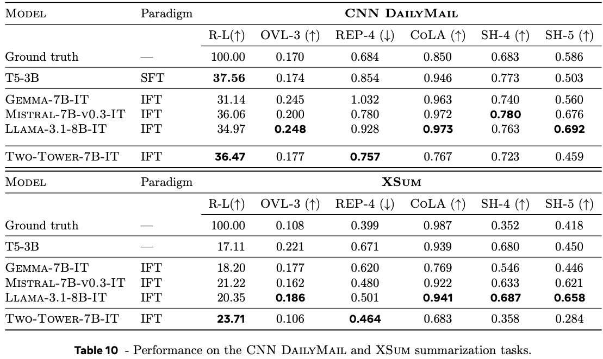
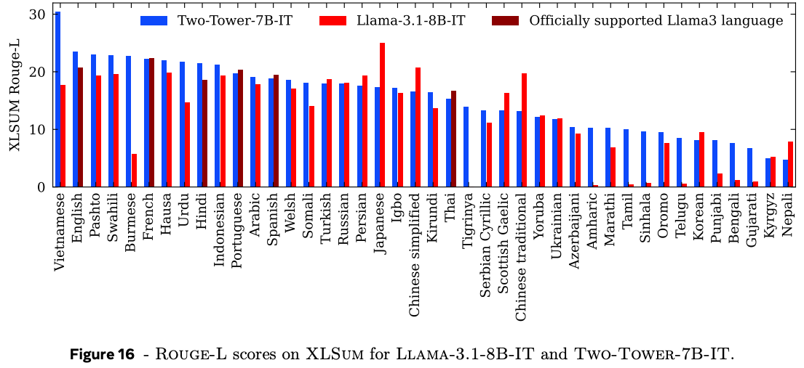

---
tags:
- language-models
- generative-models
- embedding-models
- diffusion
potm_order: 2
paper_title: 'Large Concept Models: Language Modeling in a Sentence Representation
  Space'
paper_authors: Loic Barrault, Paul-Ambroise Duquenne, Maha Elbayad, Artyom Kozhevnikov
  et al.
paper_orgs: FAIR at Meta
paper_link: https://arxiv.org/abs/2412.08821
review_authors:
- lukep
---

### The key idea

Language models get the [Joint Embedding Predictive Architecture (JEPA)](https://openreview.net/pdf?id=BZ5a1r-kVsf) treatment (gets JEPA-dised?)! The authors develop a proof-of-concept model that tries to break a document into a set of concepts based on sentence structure. Using a predictive encoder-decoder model, they train the model to predict the embedding of the next concept in the sequence. They show promising signs of a model that can efficiently produce coherent summaries of long documents without the need for autoregressive token generation.

### Background

The core intuition motivating the design of this model is that tokens are not the best representation to learn high-level structure in natural language data. In particular, they argue that since the typical generating process for documents is that a human sits down to write a bullet point plan of the points they want to make, then expands upon each of these points to provide additional context and fluency, then refines until they are happy with the result. They point out that this generative process appears to start from something closer to an abstract concept space (bullet point plan), then fills details in token space. If they could capture this process in a generative model this should also improve language model efficiency, since we would not need to use a wasteful auto-regressive process to generate text, but could reduce the number of auto-regressive steps by at least an order of magnitude by sampling sequentially in a more compact latent concept space instead.

### Their method

There is an inherent challenge in both defining a concept space and a generative process that maps concepts to tokens. The authors address each of these challenges in turn.

Starting with the concept space, the authors use a sentence-level encoder-decoder transformer model trained as on a variety of tasks (machine translation, denoising, text-to-speech). They reason that concepts are better represented by phrases or sentences (10 - 20 tokens each), and that each of these tasks would be able to distil phrases into a common vector space that can represent concepts and be decoded back into semantically similar text.

For simplicity, we'll only provide a detailed outline of the concept predictor the authors use for large scale experiments as the authors played around with a number of different variants. They settled on a "Two-Tower" architecture comprised of a *contextualiser* and a *denoiser*. The *contextualiser* is a decoder-only transformer model that takes a sequence of concept vectors and encodes them into the last hidden state by a causal mask in self-attention layers. The output of the *contextualiser* is fed to the *denoiser* via a cross-attention in each transformer block, which is used to transform noise into a clean prediction of the next concept via diffusion.

### Results

The authors evaluate the model on summarisation tasks and compare with similarly sizes large language models with 7-8B parameters. Summarisation quality is a notoriously tricky capability to evaluate, so a mixture of n-gram based metrics and model-based metrics are used. In general the authors find that their large concept model performs similarly to large language models, although notably take a hit on fluency metrics (CoLA) for short-form summaries, and model-based source attribution metrics (SH-4). This is somewhat difficult to draw conclusions about since fluency is a core competency of large language models and model-based source attribution metrics are highly sensitive to data leakage. 

{:class="constrained_img_large"}

{:class="constrained_img_large"}

The authors also demonstrate that they can exploit the multi-lingual encoder model to perform zero-shot summarisation in many more languages than Llama 3.1, trained on a much smaller set of languages, demonstrating useful generalisation properties.

### Takeaways

I can believe that this is a step in the right direction for incorporating useful notions of hierarchy into generative language models. This was an interesting proof-of-concept study (I wish there was a different phrase in this case) of large concept models. There is clearly a lot of room for improvement, from stronger capturing of "concept" vectors via improved encoders, to more believable benchmarks of summarisation quality, extensions to other natural language tasks (e.g., reasoning, long-form question answering), and hyperparameter stability and quality of the generation process. 
