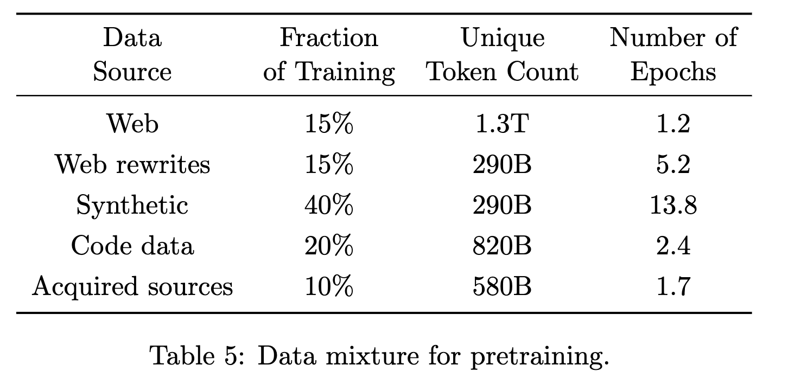
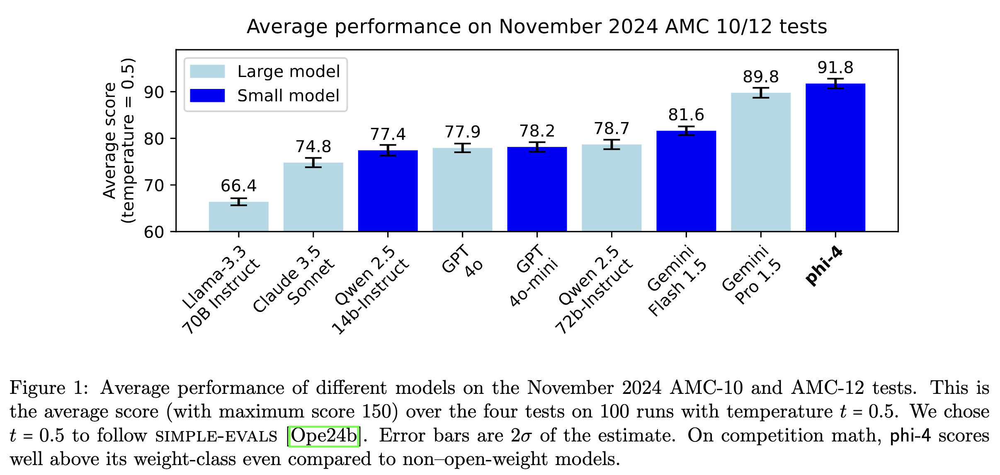
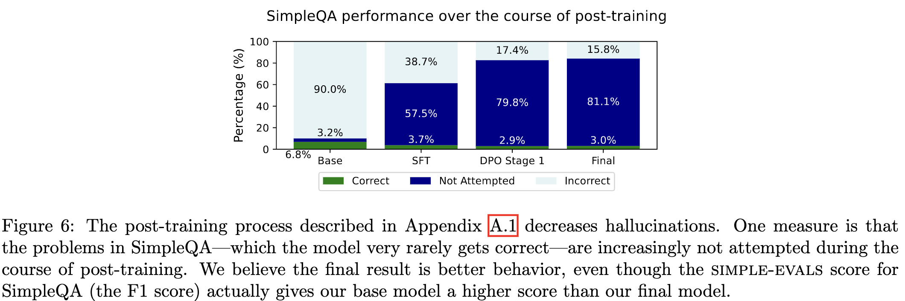

---
tags:
- LLMs
- training
- synthetic data
- reasoning
potm_order: 4
paper_title: Phi-4 Technical Report
paper_authors: Marah Abdin et al.
paper_orgs: Microsoft Research
paper_link: https://arxiv.org/abs/2412.08905
review_authors:
- alexp
---

### The key idea

Can a small model be trained using synthetic data and exceed performance of its teacher model?

The authors present a data generation recipe that allows them to train a state of the art 14B parameter model. They combine "organic" seed text, prompting, and a teacher model (GPT-4o), to train a model which outperforms its teacher on 3 reasoning benchmarks. Synthetic data is not a "cheap" substitute for organic data but offers:

- structured and gradual learning, better suited to the auto-regressive nature of the model ("organic" text is not written linearly).
- better alignment with inference contexts during pretraining.

### Their method

"Phi" is a family of small models developed by Microsoft Research. The focus for these models is to maximise reasoning performance through the selection of an "optimal data mixture".
Phi-3, the previous model in the family, was found to have very good (in class) performance up to a size of 7B but did not compare favourably at higher model sizes.
That model was already trained on synthetic data, but only during the latter parts of pretraining, in contrast Phi-4 uses synthetic data from the very beginning of the pretraining process.

To train Phi-4, the authors created 50 broad types of datasets for approximately 400B tokens of synthetic data.
Synthetic data is not created out of thin air by prompting the teacher model: the authors use chunks of "organic" text and use those to "seed" multi-turn LLM based workflows that generate the synthetic data used to train Phi-4. The authors describe their approach to find high-quality seed texts:

- Identify web and code-based seeds, which are chunked and filtered for factual and reasoning content
- Collect question datasets from forums and websites: questions are filtered by difficulty by generating answers and assessing how consistent responses are across multiple generations, very easy and very hard questions are dropped

Once identified, "organic" seeds are processed by pipelines which:

1. augment them by rewriting the content into exercises, discussions or structured reasoning tasks
2. iterates with self-revision to improve the answers provided in those exercises
3. checks code and other scientific data through execution loops and tests

Specifically the authors describe pipelines that:

- create question and answer pairs from other text forms by identifying logical progressions in the text
- and generate instructions from code snippets in a process they call "instruction reversal"

The authors emphasize the importance of clean and correct organic text to act as seeds for synthetic data. As a consequence they invested in:

- Targeted acquisition of reasoning dense documents (arXiv, PubMed, GitHub, books)
- Filtered web dumps with non-LLM classifiers trained on 1M LLM generated annotations
- Created multi-lingual datasets with the same classifiers
- and custom extraction and cleaning pipelines to ensure uniformity between heterogeneous data sources

To select their data mixture, the authors varied the proportion of each type of data used to train a 7B model with 1 trillion tokens. The final data mixture is shown in Table 5, reproduced below.

{:class="constrained_img"}

The other interesting contribution of this report targets post-training: they introduce "Pivotal Token Search" (PTS). The authors' insight is that the generation of correct answers is dependent on the generation of a few key tokens. If those tokens can be identified from samples generated by the pretrained model, they can be used during DPO to provide token-level preference information. This method requires the generation of many alternative answers from the pretrained model to get an accurate assessment of the probability. While the reader is referred to the paper for a detailed description of the algorithm, Figure 3, reproduced below, plots the change in the probability of a correct answer during the answer to a math question.

### Results

The training pipeline described in the report leads to a 14B parameter model with surprising performance on GPQA and MATH benchmarks, and the November 2024 AMC 10/12 test (a math competition held after the model was trained).
Phi-4's score of 91.8 is higher than all other non-reasoning models, including its teacher model, GPT-4o.
However, long chain-of-thought models, like OpenAI-o1, score above 120 (out of 150) in the AMC benchmark, but at a much greater inference cost, suggesting a trade-off between the two approaches.

Beyond the final model, comparison with Phi-3 and the ablations of the data mixture show that relying on more than 50% of synthetic data in the early phases of pretraining lead to significant improvements on reasoning heavy benchmarks. The table below selects a few columns of tables 2 and 3 from the paper which compare performance of models at the end of pretraining to the previous generation phi-3-medium (pretrained only).

| Model                          | MMLU pro | MBPP (Code) | MATH | TQA (Knowledge) |
| ------------------------------ | -------- | ----------- | ---- | --------------- |
| phi-4 (4k)                     | +10.3    | +6.8        | +8.9 | -0.7            |
| phi-4 (16k)                    | +8.9     | +9.6        | +8.4 | -1.5            |
| Synthetic (13B)                | +4.0     | +5.0        | +4.9 | -14.8           |
| Synthetic + Web Rewrites (13B) | +4.1     | +7.6        | +8.1 | -7.7            |

The results table highlights the effectiveness of synthetic data on language understanding, code and math benchmarks: models pretrained mostly on synthetic data are several points above Phi-3 which saw much more web data. Meanwhile web data remains necessary for performance on general knowledge tests.

Finally the authors observe that their post-training technique of chat SFT, pivotal token DPO, and judge guided DPO create a model which refuses to answer in many situations where it would have been wrong. Figure 6 from the report shows that PTS (labelled DPO Stage 1) reduces the rate of hallucination on the SimpleQA benchmark from 38.7% to 17.4%.

### Takeaways

Far from triggering model collapse [[Shumailov et al.](https://www.nature.com/articles/s41586-024-07566-y)] the Phi team manages to improve the performance of their model family.
The authors present a comprehensive case for _carefully curated_ synthetic data.
They demonstrate that it can be used to train a model at scale, close to SOTA performance on reasoning benchmarks.
The claim that Phi-4 is surpassing its GPT4o teacher is exciting but less convincing: the evaluations on which it outperforms the teacher are fairly constrained benchmarks where the emphasis of Q&A in the training mix might give it an unfair advantage.
