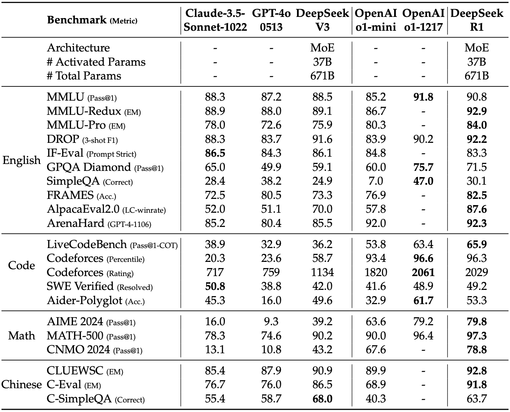
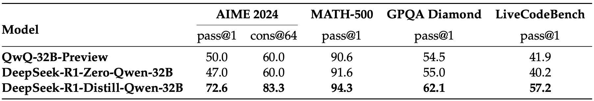

---
tags:
- efficient-inference
- quantisation
- reinforcement learning
- reasoning
- LLMs
potm_order: 4
paper_title: DeepSeek-V3 & DeepSeek-R1 Technical Reports
paper_authors: DeepSeek-AI
paper_orgs: DeepSeek-AI
paper_link: https://github.com/deepseek-ai/DeepSeek-V3
review_authors:
- alexp
---

With their V3 and R1 models, DeepSeek sets a new state-of-the-art in open-weight models and trades benchmark to benchmark with the best models from Anthropic, Google and OpenAI.
The technical reports give detailed accounts of the architecture of the model, the trade-offs that led to it, and the efficient implementation that enabled their final training run to take a headline-grabbing $5.5M of GPU hours.

### The key idea

DeepSeek's success comes from improvements along three complementary axes: FLOP efficiency of the model, curation of training data, and (re-)discovery of effective reinforcement learning for LLMs.

DeepSeek's efficiency is the result of excellent engineering and incremental improvements to their fine-grained mixture of expert (MoE) architecture. Their innovations are geared towards making that architecture run efficiently on their hardware and learn effectively.

R1 aims to tackle the reasoning problem through a different lens than most other research in the space; they consider
reinforcement learning as the primary strategy of learning how to reason, where the thought tokens are simply an environment
for the algorithm to learn how to navigate to get to the correct answer.

While the reports are thorough, some elements are notable by their absence: the team does not share scaling laws (as done in the ["Llama 3 herd of models" report](https://arxiv.org/abs/2407.21783)), and is unspecific about the dataset curation (as in the [Phi-4 technical report](https://arxiv.org/abs/2412.08905)).

### V3 method
In the table below we cover the architectural innovations, implementation optimisations, and the ablations that are in the DeepSeek-V3 technical report.
V3 is a 671 billion parameter "fine-grained" Mixture of Expert (MoE); it uses 8 routed experts per token out of 256 available, with 1 shared expert, it uses multi-head latent attention (MLA) with 128 heads. It was trained on 2048 Nvidia H800 GPUs in about 2 months.

<table>
  <thead>
    <tr>
      <th>Name</th>
      <th>Description</th>
      <th>Impact on Efficiency</th>
      <th>Impact on Model</th>
    </tr>
  </thead>
  <tbody>
    <tr>
      <td>
      <b>Mixed precision FP8 micro-scaled training</b>
      </td>
      <td>
      Does matrix multiplication with FP8 tensors scaled in blocks (Nc × Nc) or vectors (Nc), very similar to the micro-scaling (MX) formats available in Blackwell GPUs. The "trick" is to accumulate inside the blocks of 128 in FP8 and apply the scale and accumulate between blocks in FP32. The authors share a huge amount of interesting detail on this topic!
      </td>
      <td>
      Theoretically: 2x FLOPs available, 1/2 communication, 1/2 memory usage (capacity and BW).
      If memory was the limit, this might be what enabled them to train such a big model.
      </td>
      <td>
      Remarkably, None. Loss curves in the Appendix show it, but it took a lot of work to get there.
      </td>
    </tr>
    <tr>
      <td>
      <b>Multi-token Prediction</b>
      </td>
      <td>
      The MTP module is made of a transformer block combined with the main model's embeddings and output layers. It is trained with the main model to predict an extra token from the last transformer layer's output and the input sequence shifted one to the right.
      </td>
      <td>
      In training: ~2% increase in compute. In inference: x1.8 increase in throughput using the module as a speculative decoder
      (predicts 1 extra token per forward pass with 85% accuracy).
      </td>
      <td>
      Ablations show an average 2% improvement across benchmarks (extremes: -1%, +8%).
      </td>
    </tr>
    <tr>
      <td>
      <b>DualPipe</b>
      </td>
      <td>
      A pipeline parallel scheduling scheme with duplicated shards which has a very small pipeline bubble and allows perfect overlapping of communication and compute.
      </td>
      <td>
      Perfect computation/communication overlap... at the cost of
      15% of the GPU's compute used for communication (20/134 SMs).
      </td>
      <td>
      None
      </td>
    </tr>
    <tr>
      <td>
      <b>Loss free load balancing of experts</b>
      </td>
      <td>
      In the top-K operation used to select experts, add a bias which reflects the load of that expert in the previous batches. This bias term evolves during training but is not trained by the optimiser and does not go into the calculation of the expert output.
      </td>
      <td>
      Keeps even loads across experts and makes expert parallelism efficient. DeepSeek uses 64-way expert parallelism.
      </td>
      <td>
      Ablations show ~1.5% benchmark improvement, experts specialise more on discernible topics.
      </td>
    </tr>
  </tbody>
</table>

<!--
Removed will be for the deep-dive.
- name: DeepSeekMoE
- **description:** A "fine-grained" mixture of expert: for each token v3 chooses 8 experts among 256, and adds 1 shared expert through which all tokens are processed. These MoE layers replace the Feed-Forward Networks in all but the first 3 layers.
- **impact on efficiency:** 1/10 th FLOPs per token.
- impact on model performance: unknown - would need an ablation on the same dataset with a dense transformer.
-->

The improvements described here do not amount to the "order of magnitude performance improvement" that caused a stock market panic. So where is this performance coming from? Is it hidden or fake?

No! It's the natural consequence of successfully scaling up DeepSeek's "fine-grained" Mixture of Expert and Multi-head Latent Attention (MLA) that the DeepSeek-LLM and DeepSeek-V2 papers shared in early and mid-2024.
We will unpack how all those innovations work and stack up against the other heavyweight of open models, Llama 3-405B, in a follow-up blog post.

### R1 method

The [DeepSeek-R1 paper](https://arxiv.org/abs/2501.12948) introduces several different models based on different training regimes,
but the two we will primarily focus on are DeepSeek-R1-Zero and DeepSeek-R1.

With R1-Zero, the authors began with a pre-trained DeepSeek-V3-Base model, and used *Group Relative Policy Optimization* as the
reinforcement learning algorithm. The RL algorithm is trained to maximise accuracy and
generate in a suitable format.
By training in this fashion, DeepSeek were able to train a reasoning model without requiring any supervised fine-tuning (SFT). Without
requiring supervised datasets that feature reasoning steps, this approach is potentially much more scalable than other common SFT
approaches.

One potential drawback the authors found with R1-Zero is that the model's thoughts would suffer from poor readability and language
mixing. They address this in R1 by initially doing a small about of SFT with "cold-start" data, which helps to encourage the model
to generate interpreatable reasoning steps. They then training using RL like with R1-Zero, before then creating a new SFT dataset
upon this RL-trained checkpoint. This dataset can then be used to do further fine-tuning.

{:.img-large}
<figcaption>Comparison between DeepSeek-R1 and other representative models.</figcaption>

The authors also compared how RL training a smaller model compares with distilling from a larger RL-trained model, and
found that distillation can yield far better results (although this does require having a larger, more capable reasoning
model to distill from).

{:.img-large}
<figcaption>Comparison of distilled and RL Models on Reasoning-Related Benchmarks.</figcaption>

### Takeaways

This success does not come out of nowhere!
It is the logical continuation of the work that DeepSeek has published throughout 2024. They have been vying with Meta's Llama family of models for the best open weight model for a year.
The efficiency of the training pipeline is a superb achievement of engineering, and it is fantastic to have another organisation publish what works at scale and what is needed to push the frontier.