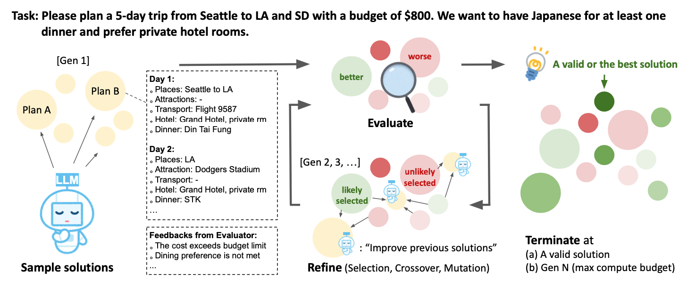
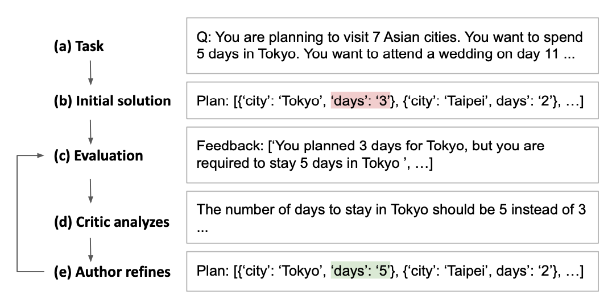
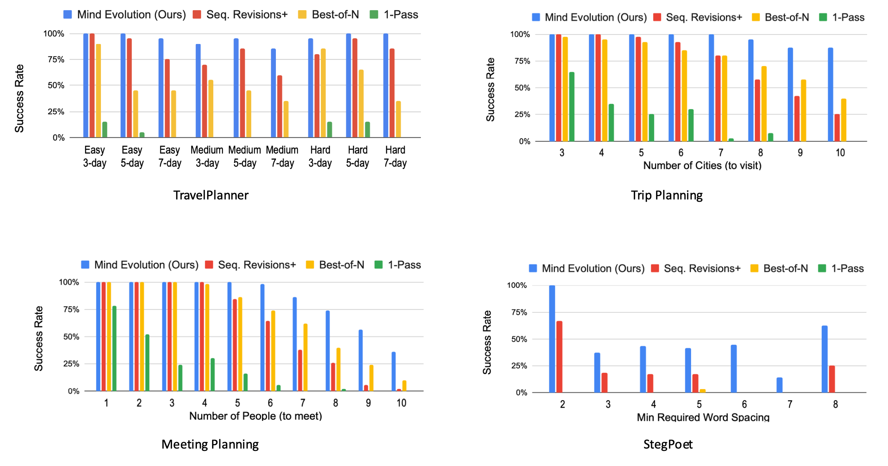

---
tags:
- LLMs
- reasoning
potm_order: 2
paper_title: Evolving Deeper LLM Thinking
paper_authors: Kuang-Huei Lee, et al.
paper_orgs: Google DeepMind
paper_link: https://arxiv.org/abs/2501.09891
review_authors:
- lukar
---

### The key idea

Large language models are becoming increasingly more capable; however, they can still struggle to tackle tasks requiring reasoning, even with additional chain-of-thought and few-shot prompting. Scaling inference-time compute in order to enable language models to robustly solve more complex tasks has thus become a very active topic of research. In this paper, the authors utilize an evolutionary algorithm approach to search for the best model response. They show how this approach performs favorably against other commonly used inference strategies, such as "best-of-N" and sequential revision.

<figcaption>Figure 1. The "Mind Evolution" approach to finding the best model response.</figcaption>

### Their method

**Evolutionary search**

Their method follows the basic principles of a genetic algorithm search — an initial random population of candidates is evolved into a higher-quality population through the following steps:

1) **Fitness** of each candidate is evaluated based on task performance.

2) **Selection**: Candidates are stochastically chosen for reproduction, informed by their fitness.

3) **Crossover**: Chosen "parent" candidates are combined in order to find the best combinations of useful features.

4) **Mutation**: Candidates are randomly modified in order to induce exploration.

As the candidates with higher fitness are more likely to be selected, the average fitness tends to increase after each generation. In addition, the total population can be divided into smaller sub-populations (**islands**) which evolve independently, until either a *migration* event (members are stochastically moved between islands), or a *reset* event happens (low-fitness islands are substituted with a strong selection from other islands).

**Mind Evolution**

{:.img-large}
<figcaption>Figure 2. Refinement through Critical Conversation.</figcaption>

Figure 1 shows their proposed "Mind Evolution" approach, following the evolutionary search principles:
* The initial population is created by generating the $N_{covs}$ model responses in parallel. In addition, each response is sequentially revised $N_{seq} - 1$ times, giving in total $N_{covs} \times N_{seq}$ initial solutions forming the starting population.
* In order to generate a fitness score for each solution, the task needs to have an associated evaluation function, so that each response is parsed and scored. Additionally, a textual feedback based on the evaluation is also generated which the LLM can then use to improve its subsequent answer. This is done through the "Refinement through Critical Conversation" (Figure 2): after the output of the evaluation, the LLM first takes the role of a "critic" that processes the feedback and gives new instructions, and then the "author", refining the initial answer based on the feedback.
* Selection is performed by randomly sampling parents from a probability distribution over all candidate solutions. The distribution is generated by applying a softmax transformation to the fitness scores, so that good solutions are selected with higher probability.
* Finally, crossover and mutation are performed by passing the combined parent solutions and their scores to the "critic", and letting the LLM generate a new answer using the combined prompt. This answer can then be further sequentially revised as well. Note that the process of selection and crossover follows the "island" model, where several subpopulations evolve independently (with occasional mixing through migrations and resets).

### Results

<figcaption>Figure 3. Results for Travel Planner, Natural Plan, and StegPoet tasks.</figcaption>

The method was evaluated on the Gemini 1.5 Flash model, comparing the "Mind Evolution" approach to the following baselines:
* 1-pass: Solution is generated using a single forward pass through the model.
* Best-of-N: Independent solutions are generated in parallel.
* Sequential revision: Several (10 here) initial solutions are generated in parallel, and then sequentially revised independently.

All of the methods are run until either the correct solution is found, or until a maximum of turns is hit. The methods are evaluated on different planning tasks: TravelPlanner, Natural Plan (Trip Planning) and Natural Plan (Meeting Planning). In addition, the authors added a new task (StegPoet) where a "hidden message" needs to be encoded within the model response.

Overall, their approach outperforms the baselines, showing particular effectiveness at higher task difficulties. Based on the API costs of running Gemini, it has comparable requirements to the "best-of-N" approach, and significantly lower costs to the sequential revision method.

### Takeaways

As more efforts are being put into scaling inference-time compute in order to improve the reasoning capabilities of LLMs, this paper shows that applying evolutionary search principles to optimize the model response can lead to significant performance boosts. The current approach is however limited to tasks where solutions can be programmatically evaluated and scored, and further results on a wider variety tasks (such as mathematical reasoning) could provide more insight into the capabilities of the approach.
