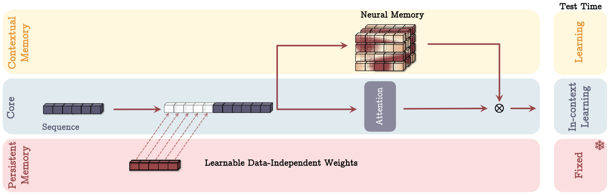
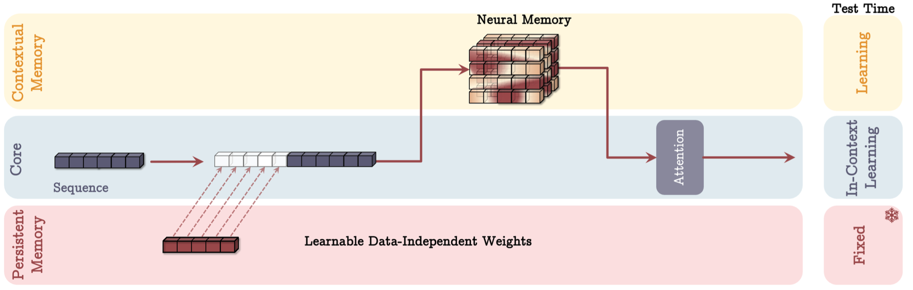
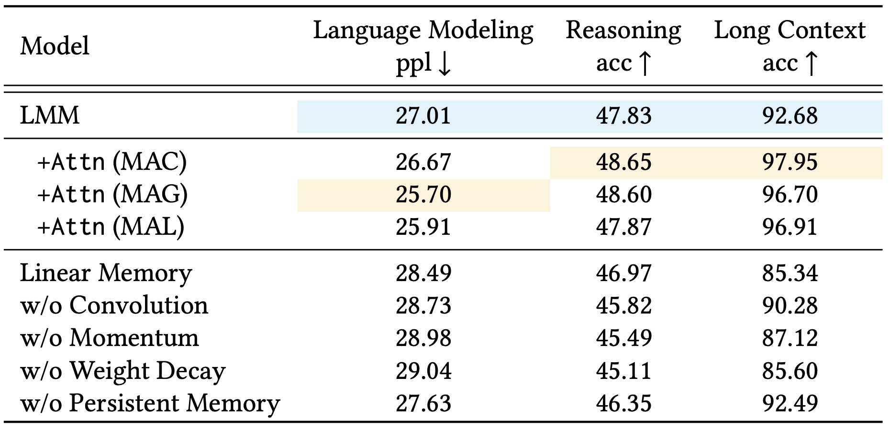

---
tags:
- LLMs
- long-context
- memory
potm_order: 1
paper_title: 'Titans: Learning to Memorize at Test Time'
paper_authors: Ali Behrouz, Peilin Zhong and Vahab Mirrokni
paper_orgs: Google Research
paper_link: https://arxiv.org/abs/2501.00663
review_authors:
- alexc
---

### The key idea

Traditional sequence models, such as Transformers and recurrent neural networks (RNNs), struggle with effectively handling long-term dependencies. Transformers face computational inefficiencies due to their quadratic complexity in attention mechanisms, while RNNs compress historical data into fixed-size states, often leading to information loss. These limitations hinder models from retaining and utilising past information efficiently, especially in tasks requiring long-range memory.

The authors of Titans: Learning to Memorize at Test Time aim to address this challenge by developing a novel memory-augmented architecture that dynamically learns what to store and forget during inference, enhancing both scalability and accuracy in long-sequence tasks. The long-term memory module can be integrated with attention in three different variants proposed in the paper.

{:class="constrained_img_large"}
<figcaption>Figure 1. Titans Memory As Context variant.</figcaption>

{:class="constrained_img_large"}
<figcaption>Figure 2. Titans Memory As Gate variant.</figcaption>

{:class="constrained_img_large"}
<figcaption>Figure 3. Titans Memory As Layer variant.</figcaption>

To evaluate their approach, the authors conducted experiments across diverse tasks, including language modeling, common-sense reasoning, genomics, and time series analysis.Titans outperformed traditional Transformers and modern recurrent models, particularly in scenarios requiring long-term memory. Notably, in 'needle in a haystack' tasks where models must retrieve specific information from long sequences, Titans demonstrated superior accuracy, even with context windows exceeding 2 million tokens. The results highlight the model’s ability to dynamically store and recall relevant information, making it a promising advancement in sequence modeling.

### Background

The authors focus on kernel based linear attention where the softmax in standard attention implementations is replaced by a kernel function such that $\phi(x, y) = \phi(x)\phi(y)$, which allows linear attention to be written as:

$$
y_i = \sum_{j=1}^i \frac{\phi(Q_{i}^T K_j)}{\sum_{l=1}^i \phi(Q_{i}^T K_l)}V_j = \sum_{j=1}^i \frac{\phi(Q_i)^T \phi(K_j)}{\sum_{l=1}^i \phi(Q_{i})^T \phi(K_l)}V_j = \frac{\phi(Q_i)^T \sum_{j=1}^i\phi(K_j)V_j}{\phi(Q_{i})^T \sum_{l=1}^i \phi(K_l)}
$$

Choosing the kernel as the identity function, linear attention can be seen in a recurrent format that resembles a write operation $f(M_{t-1}, x_t)$ followed by a read operation $g(M_t, x_t)$ to retrieve information from the updated memory module:

$$
M_t = M_{t-1} + K_t^T V_t = f(M_{t-1}, x_t) \\
y_t = Q_t M_t = g(M_t, x_t)
$$

### Their method

This work draws inspiration from human memory systems, introducing a long-term memory module that enables the model to retain and retrieve information over extended sequences. Instead of treating memory as a static component, the approach dynamically updates it based on the importance of new information, ensuring that relevant details are stored while less useful ones fade over time. The memory architecture itself is implemented using simple MLPs, making it computationally efficient while still allowing for flexible and expressive updates.

 - **Surprise-based updates**: Memory is updated based on surprise, measured as the gradient of the loss function with respect to the input. This ensures that unexpected or highly informative inputs are prioritised for storage.
 - **Past surprise**: To better capture important information that comes after a surprising moment, a momentum term incorporates past surprise, allowing updates to reflect longer-term patterns rather than just momentary novelty.
 - **Forgetting mechanism**: A gating mechanism controls how information is forgotten, gradually removing less relevant or outdated details while preserving crucial knowledge.
 - **Persistent memory**: In addition to long-term memory, the model includes persistent memory, which stores task-specific knowledge that remains relatively static over time, ensuring that important information is retained across different sequences and tasks.

Beyond the development of the Long-term Memory Module (LMM) above, the paper introduces a persistent memory in the form of a set of learnable but input-independent parameters that capture task-related information. The persistent memory is concatenated to an input sequence.

Titans approach concludes by presenting three different variants to incorporate the above with attention:

- **Memory As Context (MAC)**: where the memory is used to enhance the input sequence to attention. The output of attention is also used to update the memory.
- **Memory As Gate (MAG)**: where memory is used as a gating mechanism to the output of attention. Memory is update only with the input sequence.
- **Memory As Layer (MAL)**: where memory is used to compress the input sequence, before attention is applied.

The above approaches can be visualised in Figure 1-3.

### Results

The authors tested their model on tasks like language modeling, common-sense reasoning, genomics, and time series analysis. In these experiments, Titans outperformed traditional Transformers and RNNs, particularly in tasks that require long-term memory. For example, it handled long-context sequences better, retaining crucial information over extended periods.

Titans also excelled in "needle-in-haystack" tasks, retrieving rare information from long sequences with context windows larger than 2 million tokens. These results highlight the model’s ability to scale efficiently and manage memory dynamically for complex tasks. For detailed results in each of these experiments, we encourage readers to refer to the paper.

Instead we highlight the ablation study of the paper. Starting with the Long-term Memory Module (LMM) as the base model, they evaluated the effect of removing or modifying key elements one component at a time. The results demonstrated that each component made a substantial contribution to the model’s effectiveness. Notably, the largest improvements came from incorporating weight decay, the momentum term, and convolution operations, while persistent memory also played a significant role. These findings underscore the importance of these mechanisms in enabling the model to effectively manage long-range dependencies.

The authors also compared the three architectural variants of Titans—MAC, MAG, and MAL—across language modeling, common-sense reasoning, and long-context needle in a haystack tasks. MAC and MAG showed comparable performance in language modeling and common-sense reasoning tasks. However, MAC outperformed the others significantly on the long-context NIAH task. Both MAC and MAG also surpassed MAL in all tasks.

{:class="constrained_img"}
<figcaption>Figure 4. Titans ablation study results.</figcaption>

To conclude, the authors mention that the Titans code, implemented in PyTorch and JAX, will be released soon, which is an exciting prospect for the research community eager to explore and build upon their work.
