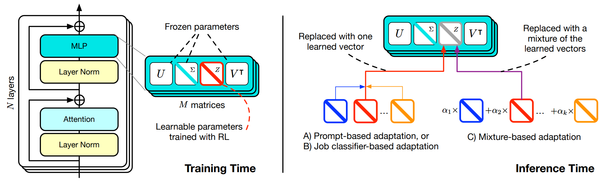

---
tags:
- fine-tuning
- LLMs
- efficient-training
- inference
potm_order: 3
paper_title: 'Transformer-Squared: Self-Adaptive LLMs'
paper_authors: Qi Sun, Edoardo Cetin, Yujin Tang
paper_orgs: Sakana AI
paper_link: https://arxiv.org/abs/2501.06252
review_authors:
- paulb
---

### The key idea

The Transformer² paper introduces a new approach to making large language models (LLMs) more self-adaptive, adjusting singular values of weight matrices depending on the task. For that purpose, a two-pass mechanism is used: it first classifies the task, and then applies a specialized "expert" vector in the SVD decomposition of weights. This approach achieves better accuracy compared to classic LoRA fine-tuning, will using significantly fewer parameters.

### Background

Traditional adaptative LLMs methods such as LoRA (low rank adaptation) and MoEs (mixture of experts) have shown how LLMs can adapt to very diverse tasks. Nevertheless, these two approaches have major drawbacks: MoEs have a dynamic task routing system, but usually require to be incorporated in the model architecture from pre-training, hence leading to costly training. LoRAs can be fine-tuned on top of an existing pre-trained model, but lack the self-adaptive aspect. Additionally, the number of parameters used in LoRA quickly increases with the number of tasks, as each requires a completely new adapter.

### Method

{:.img-large}

The main innovation introduced by Transformer² is Singular Value Fine-tuning (SVF): fine-tuning models in the singular values space of weight matrices. Compared to LoRA, this approach dramatically reduces the additional parameter count, while enabling composability between expert vectors (in LoRA multiple adaptors are not sharing the same linear space). Additionally, the low-dimensionality of this approach allows to directly used reinforcement learning instead of supervised fine-tuning.

### Results

{:.img-large}

In Transformer², inference is done in two passes: first an analysis for the task at the end, leading to the selection of an expert vector (or a linear combination of them), and the a second classic inference pass using the selected vector. In this work, the authors implement and evaluate three different adaptation strategies, trading off simplicity and task performance: a direct prompt-based selection, a selection based on a classification expert vector, and finally a few-shot adaptation strategy using a linear combination of all expert vectors.

As presented in the result table above, Transformer² achieves similar or improved accuracy on unseen tasks (especially Humaneval and ARC-challenge), showing improved adaptability compared to LoRA fine-tuning.
