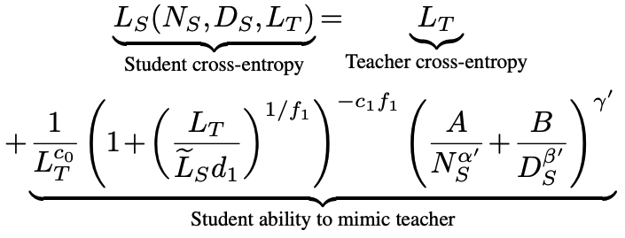
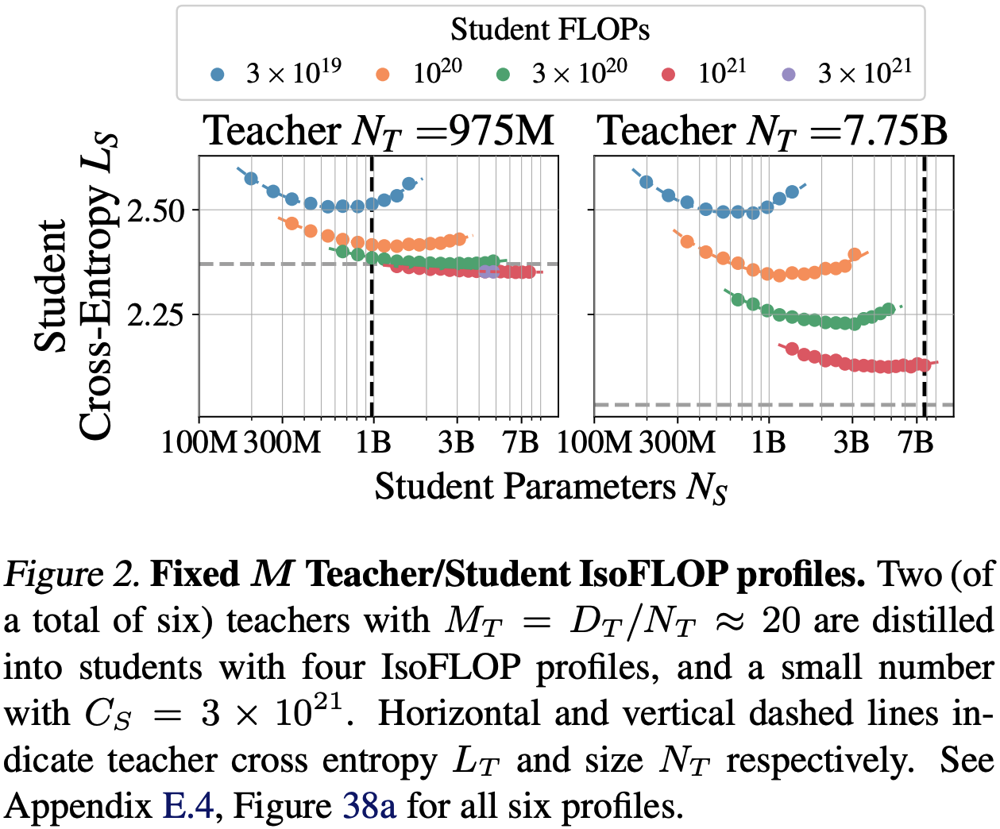
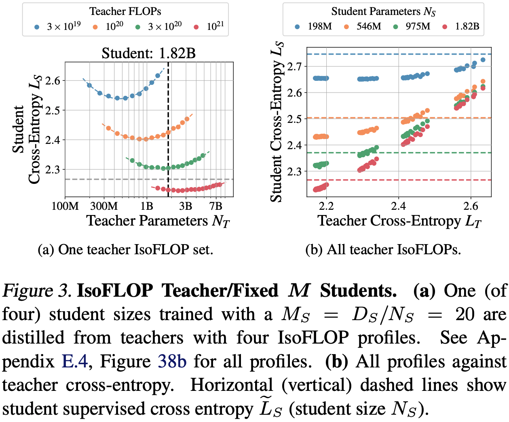
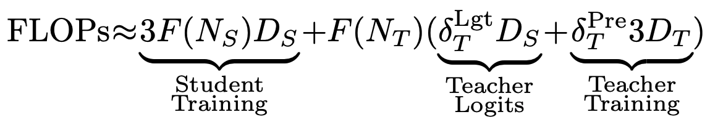
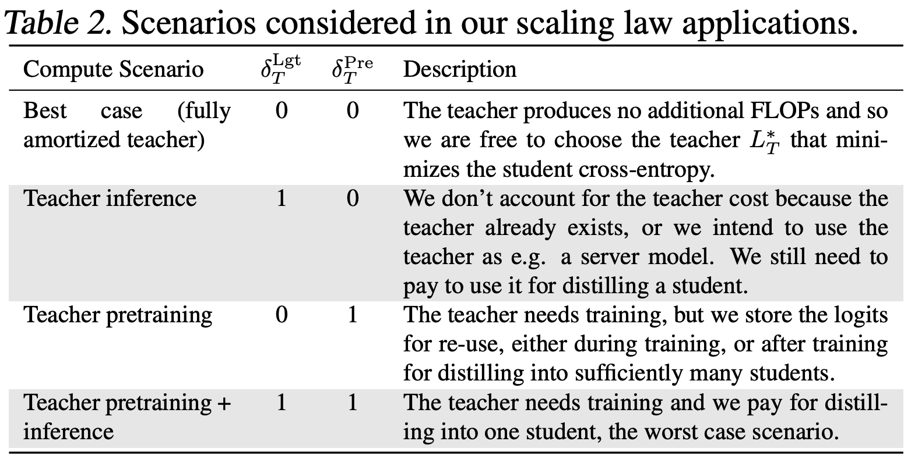
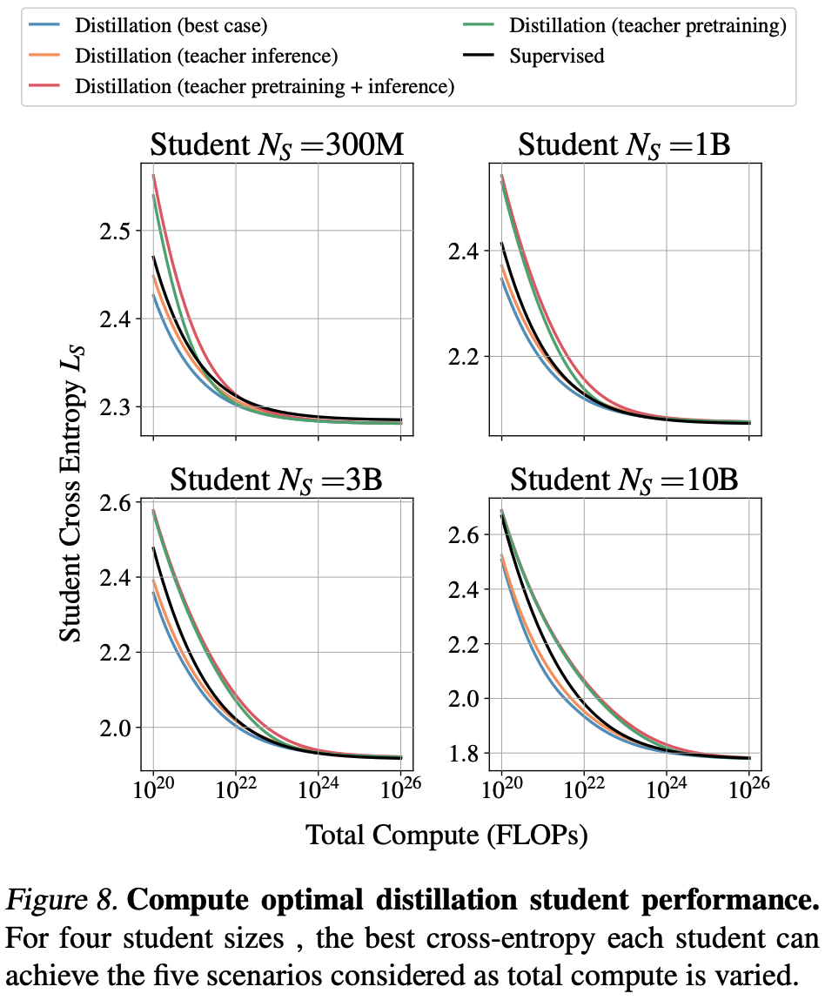
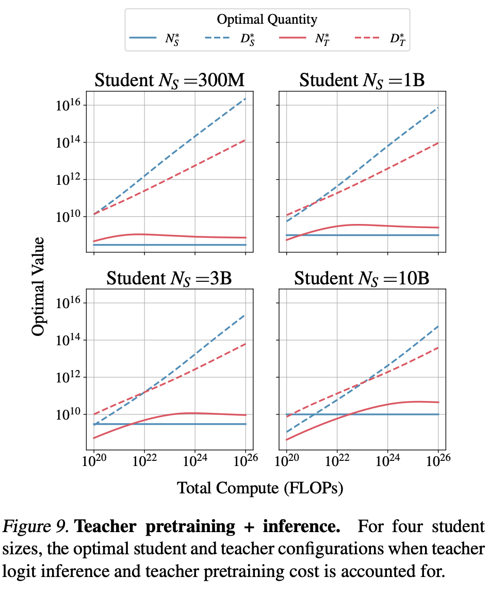
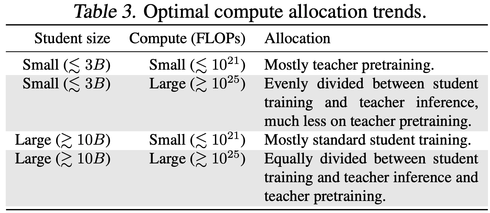

---
tags:
- LLMs
- scaling-laws
- efficient-inference
potm_order: 1
paper_title: Distillation Scaling Laws
paper_authors: Dan Busbridge et al.
paper_orgs: Apple
paper_link: https://arxiv.org/abs/2502.08606
review_authors:
- lukep
---

### The key idea

When should you distil a small model from a larger one? Is compute better used to train a small model from scratch? The authors demonstrate that distillation is a better use of compute if a teacher model can be reused multiple times (e.g., for distilling many models, or for long term inference deployment) AND student compute budget is sufficiently limited.

### Background

Chasing ever more capable language models by parameter scaling is a double edged sword as the cost of compute-optimal training and deployment of models scales quadratically with parameter count. When accounting for inference costs, deep learning practitioners often choose to pre-train a smaller model for longer, although this produces diminishing capability returns in the limit of large datasets.

A well-known alternative is to attempt to distil the capabilities of a larger "teacher" model into a smaller "student" model. A standard technique for doing so is to minimise the KL-divergence between the teacher and student predicted token distributions. Despite being a well known technique, a compute-efficient distillation strategy has not been characterised yet. This is possibly due to some counter-intuitive relationships in capabilities of teacher and student models. One such relationship is that highly capable teacher models can distil worse student models compared to weaker teachers, a phenomenon known as the "capacity gap", depicted in the following figure (where $M = D/N$ is the tokens-per-parameter ratio)

{:.img-large}

As such, the authors propose a scaling law for distillation that accounts for the capacity gap. They use this scaling law to analyse and derive an optimal distillation strategy under different assumed use cases for teacher models with different student training budgets.

{:.img-medium}

### Their method

Given the dependence of the authors' scaling law on teacher parameter count $N_T$, teacher training tokens $D_T$, student parameter count $N_S$ and student training tokens $D_S$, the authors design two experiments to estimate parameters of their scaling law by isolating the contribution of teacher scaling and student scaling.

First they fix the ratio between teacher parameters and training tokens ($D_T$/$N_T$ = 20) according to Chinchilla-optimal pre-training, then vary student parameters and training tokens for a given set of compute budgets.

{:.img-large}

The second set of experiments do the reverse: fix the ratio of student parameters and tokens (examining many ratios >= 20) and vary teacher parameters and training tokens for a given set of compute budgets.

{:.img-large}

### Results

The authors model the total compute cost of distillation and examine the optimal distillation strategy under different assumptions about the relative costs of teacher training and inference using their derived scaling law.

{:.img-large}

First, when there is sufficient data or compute available for training a student, pre-training outperforms distillation. However, as student models get larger, the crossover point where student pre-training becomes preferable requires increasingly more compute. This finding holds only when the cost of pre-training the teacher model can be amortised. Second, when pre-training teacher models can not be amortised, pre-training is always preferable to distillation.

{:.img-large}
{:.img-large}
{:.img-large}

### Takeaways

This is a useful reference for designing recipes that produce efficient model families. It is clear that distillation can be useful under compute-constrained settings, but still requires pre-training highly capable large models where we expect to get a clear return in pre-training investment. This somewhat begs the question of how to incentivise pre-training of large models for the model distilleries of the world to benefit from it! The third-axis of compute-optimal test-time scaling muddies the waters even further. It will be important to understand to what extent small distilled models benefit from additional inference compute through chain-of-thought/retrieval.
