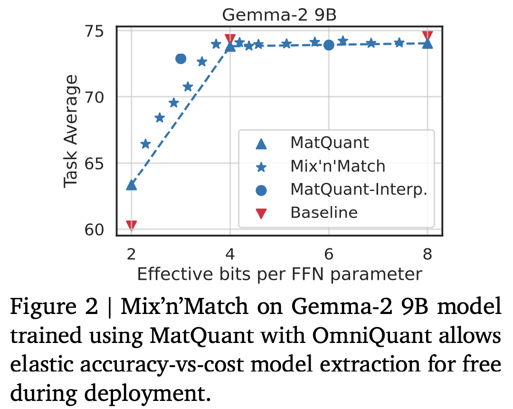

---
tags:
- efficient-inference
- quantisation
potm_order: 2
paper_title: Matryoshka Quantization
paper_authors: Pranav Nair, et al.
paper_orgs: Google DeepMind
paper_link: https://arxiv.org/abs/2502.06786
review_authors:
- lukar
---

### The key idea

The authors showcase a method for training a *single* quantised model (from a pre-trained checkpoint) that can be used at *different* precision levels. They achieve this by simultaneously training the model to work at `int8`, `int4`, and `int2` precisions, by optimising (at the same time) the eight, four, and two most significant bits of the integer representation, respectively. They show that this approach can be used in conjunction with learning-based quantisation methods, leading to minimal degradation at 8-bit and 4-bit precision levels (compared to optimising for a single precision level), and significantly improving the `int2` baseline.

### Background

Quantisation methods are broadly classified into two categories: *learning-free* and *learning-based*. Learning-free methods independently quantise the model's layers by minimising each layer's output error on a small calibration dataset, and generally do not involve backpropagation. Due to this, they are computationally cheaper, but tend to perform worse at very low-bit quantisation. Learning-based methods tend to perform better at low-bit precision, at the cost of the more computationally expensive learning through backpropagation.

The authors focus on two gradient descent-based methods that they show can be used with their Matryoshka Quantisation (MatQuant) approach: quantisation-aware training (QAT) and OmniQuant.

**Quantisation-Aware Training (QAT)**

QAT learns the quantised weights by minimising the end-to-end cross-entropy loss through gradient descent. The loss can be defined either in terms of the next-token prediction on a training dataset, or minimising the output differences between the original and the quantised models.

As the parameter quantisation function is non-differentiable, training is usually conducted by applying a straight-through estimator for the quantised parameters, i.e., the quantisation function is regarded as an identity function during the backwards pass calculation.

**OmniQuant**

Like the "learning-free" methods, [OmniQuant](https://arxiv.org/abs/2308.13137) finds the quantised weights by minimising the output difference (between the original and the quantised model) of each layer independently; however, this is done by introducing additional scaling and shifting parameters that are optimised through backpropagation. As such, it is a computationally cheaper approach compared to QAT, as it only optimises over these additional parameters.

### Their method

Quantisation methods discussed previously optimise a model at a single predefined precision. On the other hand, the proposed technique, MatQuant leads to an integer-quantised model, that can be used at different precision levels during inference. This is done by adding individual loss functions for each of the 8/4/2 most-significant bits of the integer representation, which can be used in conjunction with the standard learning-based methods. To obtain an $r$-bit representation from the full $c$-bit one, the numbers are first *right-shifted* by $c-r$ bits, followed by a *left-shift* of the same order (with appropriate rounding). The individual-bit losses can then be summed up with additional scaling factors controlling the relative magnitude of each term in the loss.

This scheme changes the obtained quantised weight distribution compared to the baseline techniques: in Figure 1c, the weights tend to have larger magnitudes.

### Results

<figcaption>Table 1. Downstream task results using MatQuant with OmniQuant. MatQuant shows slight degradation at 3/4/6/8-bit integer precisions, but showcases improvement for int2.</figcaption>

The authors test their method using both OmniQuant and QAT approaches, optimising for 8, 4, and 2-bit integer precisions; the baseline numbers are the two methods used on a single precision level. The methods were tested using Gemma and Mistral models, on a variety of downstream tasks.

Main observations:
* On both QAT and OmniQuant, their method experiences some degradation at `int8` and `int4` precisions, but improves the baseline on `int2`.
* Although training was explicitly conducted using 8/4/2-bit precisions, `int3` and `int6` show similar performance compared to their baselines (that are trained explicitly at these precisions).
* After training, different precision can be applied to different layers: somewhat surprisingly, the authors find that keeping the middle layers in higher precision improves the trade-off. Figure 2 shows the best mix-and-match results for Gemma-2 9B model.

{.img-small}

### Takeaways

Overall, the authors showcase a neat approach to optimising a flexible-precision integer model using a single training setup – this approach is however limited to integer types, as floating point numbers do not have the "nested" structure that allows for the trivial bit slicing.
