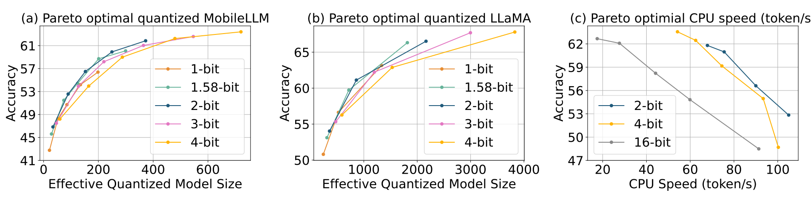

---
tags:
- efficient-inference
- LLMs
- quantisation
- scaling-laws
potm_order: 3
paper_title: 'ParetoQ: Scaling Laws in Extremely Low-bit LLM Quantisation'
paper_authors: Zechun Liu, et al.
paper_orgs: Meta
paper_link: https://arxiv.org/abs/2502.02631
review_authors:
- paulb
---

### The key idea

Quantisation is a key ingredient for efficient and cheap Large Language Model (LLM) servicing. As numerous quantisation recipes have been published over the last couple of years, researchers and practitioners have felt a growing need for an experimental setting comparing all techniques. ParetoQ introduces the first unified framework for comparing different bit-width quantisation approaches (1-bit, 1.58-bit, 2-bit, 3-bit, and 4-bit) for LLMs, with a comprehensive analysis considering five key dimensions: model parameters, token count, bit precision, training scheme and quantisation function. ParetoQ reveals a critical learning transition between 2-bit and 3-bit quantisation, where models quantized to 3-bit and above remain close to their full-precision pre-trained distributions, while lower-bit models require more substantial representation changes. 

### Background

Quantisation is crucial for deploying LLMs efficiently, as it reduces memory requirements and computational costs. Previous research has yielded contradictory conclusions about optimal bit-width – some arguing for 4-bit, others for 1.58-bit quantisation – and training setup (from Quantisation-Aware Training from scratch to simple Post-Training Quantisation). These inconsistencies emerge because prior studies have not systematically compared different bit-widths with the same training procedures and quantisation functions. 

### Method

ParetoQ introduces several methodological improvements in Quantisation-Aware Training (QAT), establishing new guidelines:

* Optimal training budget allocation: the authors found that allocating ~90% of the training tokens to full-precision pre-training and ~10% to quantisation-aware fine-tuning achieves the best results across bit-widths. Additionally, lower bit quantisation (1-bit, 1.58-bit, 2-bit) requires more fine-tuning tokens and exhibits "reconstruction" behaviour (i.e., the model needs to form new semantic representations to maintain performance), while higher bit quantisation (3-bit, 4-bit) reaches saturation faster and shows "compensation" behaviour (i.e. remaining close to their pre-trained distribution).

* Bit-specific quantisation functions: different bit-widths require dedicated quantisation approaches. The researchers developed Stretched Elastic Quant (SEQ) for 1.58-bit and 2-bit quantisation, for a better balance of output levels while maintaining an even quantisation of the full-precision weight span. For 3-bit and 4-bit quantisation, the paper shows that including zero in the quantisation grid is always beneficial.

* In all bit-width quantisation settings, it is shown that a learnable range outperforms statistics-based methods (e.g., min-max, quantiles, etc.)
due to its flexibility in optimizing range parameters with respect to the final loss. The gradient of the scale parameter can be estimated on the backward pass using a straight-through estimator.

### Results

<figcaption>Comparison of ParetoQ with previous SOTA quantisation methods.</figcaption>

The ParetoQ framework achieved state-of-the-art results across all bit-width settings, outperforming the existing literature on specific bit-widths. As presented in the comparison table, it presents a major step forward in terms of accuracy for 2-bit and 3-bit quantisation. The pareto optimal curve is showing the 2-bit and 3-bit quantisation is now an accurate alternative to the more common 4-bit quantisation solution, achieving similar accuracy with improved memory usage. 2-bit quantisation is a particularly promising solution considering hardware constraints for efficient memory packing/unpacking and dot-product implementation.

