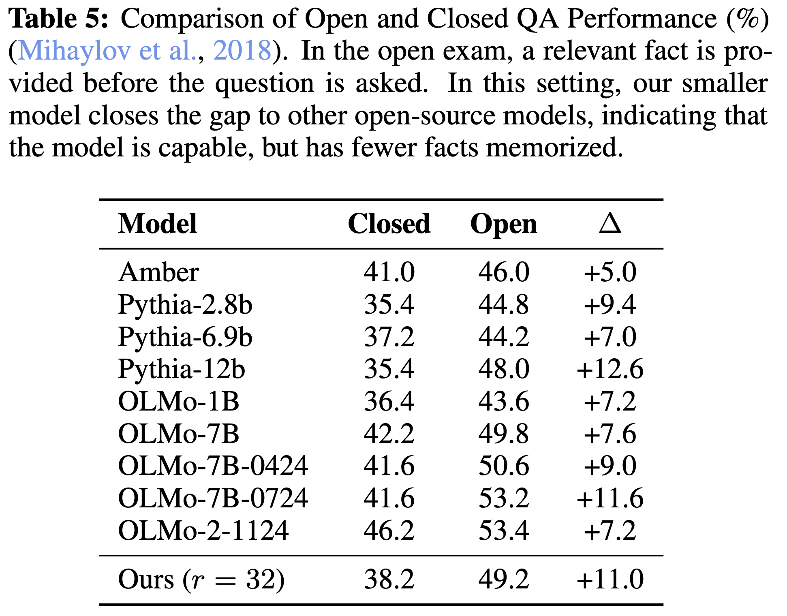

---
tags:
- efficient-inference
- reasoning
- transformers
- speculative-decoding
- LLMs
potm_order: 4
paper_title: 'Scaling up Test-Time Compute with Latent Reasoning: A Recurrent Depth
  Approach'
paper_authors: Jonas Geiping, et al.
paper_orgs: ELLIS Institute Tübingen, University of Maryland, Lawrence Livermore National
  Laboratory
paper_link: https://arxiv.org/abs/2502.05171
review_authors:
- lukehg
---

### The key idea

This work explores the idea of having a recurrent block within a model at inference time,
so that it can vary the amount of compute spent generating each token, without requiring
decoding back into language space. This can capture types of reasoning which are difficult
to express in natural language, and can therefore improve its reasoning capabilities.

<figcaption>A visualization of the Architecture. Each block consists of a number of sub-layers. The blue prelude
block embeds the inputs into latent space, where the green shared recurrent block of layers is repeated to compute the final
latent state, which is decoded by the layers of the red coda block.</figcaption>

### Background

Test-time compute allows models to express intermediate steps or calculations when
solving complex problems, making it effective for tasks that require extensive reasoning.
However, by virtue of autoregressive generation, these intermediate "thoughts" must be
projected down into discretised tokens.

This work argues that models could be more capable if they are not constrained to think
in language space, but rather their native (and continuous) latent space.

### Their method

The authors' solution is to introduce a recurrent unit to allow for additional test-time compute.
This recurrent unit can scale indefinitely, and shares many parallels with RNNs and diffusion models.

The architecture is comprised of a *prelude* (which embeds the input data into latent
space), a recurrent unit which modifies the latent state and can be repeated a variable number of times,
and a *coda*, which decodes the latent space back into a natural language token, and includes the
prediction head of the model. Each block is structured as a transformer-decoder module.

In order to train this architecture with a variable number of iterations through the recurrent unit,
the authors randomly sample the number of iterations for each input sequence. In order to keep the
computation and memory low during training, they only backpropagate through the final $k$ iterations
of the recurrent unit (given that they inject the output of the prelude into each iteration of the recurrent
unit, gradient updates also propagate through the prelude).

### Results

{:class="constrained_img"}

The authors found that their method outperforms Pythia models and is comparable in performance to first-generation 
OLMo models (although falls behind later OLMo models) with just 3.5 billion parameters. As a
proof-of-concept and the first recurrent-depth LLM to be trained at this scale, these results are promising
and indicate more work should be carried out in this space.

In addition to predetermining the number of iterations the model should take through the recurrent unit,
it's also possible to have adaptive compute in a zero-shot manner at test-time. They achieve this by
considering the KL-divergence between two successive passes of the recurrent-block. If it falls below
a certain threshold, then they can stop iterating, sample the output token, and move onto the next token.

<figcaption>Histograms of zero-shot, per-token adaptive exits based on KL difference between steps for questions from MMLU categories,
with and without zero-shot continuous CoT. The mean of each distribution is given in the legends. The exit threshold is fixed to 5 × 10−4.
We see that the model converges quicker on high school mathematics than tasks such as logical fallacies or moral scenarios. On some
tasks, such as philosophy, the model is able to effectively re-use states in its latent CoT and converge quickly on a subset of tokens,
leading to fewer steps required overall.</figcaption>

### Takeaways

Although there is other work looking at latent reasoning for LLMs ([Coconut](https://arxiv.org/abs/2412.06769), for example), this is still
a relatively early piece of work in this space, but initial results are promising. It will be exciting
to follow how this space continues to develop in the weeks and months ahead, and we expect to see
state-of-the-art reasoning models transition their reasoning from language space toward the latent space.
