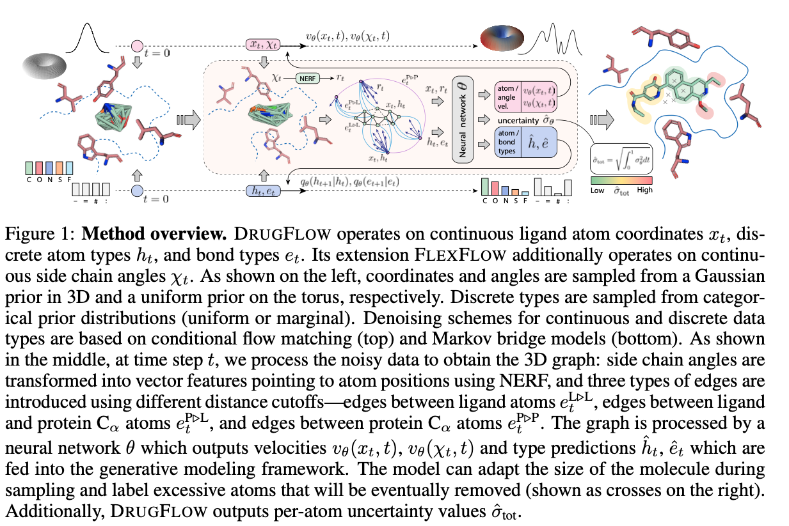
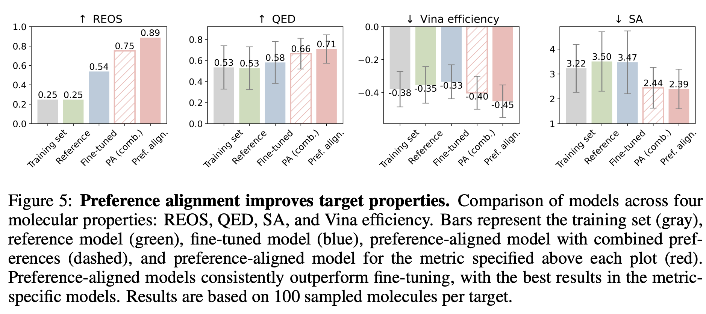

---
tags:
- flow-matching
- drug-design
- GNNs
potm_order: 4
paper_title: Multi-Domain Distribution Learning for De Novo Drug Design
paper_authors: Arne Schneuing, et al.
paper_orgs: EPFL, VantAI, University of Oxford, Aithyra
paper_link: https://openreview.net/forum?id=g3VCIM94ke
review_authors:
- yemanh
---

### The key idea

The authors developed a conditional generative model for structure-based drug design that integrates continuous flow matching and discrete Markov bridges to learn the distribution of the chemical, geometric, and physical aspects of protein-binding ligands. In addition to learning the distribution, the model outputs uncertainty estimates that detect out-of-distribution (OOD) samples and correlate with molecular properties. Generative models are generally optimized to learn the distribution of the training dataset. However, in practice, we are often interested in generating molecules with specific desired properties rather than sampling from the entire distribution. To enable the model to sample from regions with the desired metrics, the authors proposed a Direct Preference Optimization (DPO)-like preference alignment approach, which improves the quality of generated molecules for specific targeted metrics.

### Background

Small molecules are the most common class of drugs, accounting for about $85\%$ of FDA-approved drugs. Developing these drugs is costly and time-consuming, which has sparked interest in computational tools to accelerate the design of small molecules at lower costs.

Traditional computational drug design methods focus on improving specific metrics such as binding affinity or synthesizability. While these approaches are effective at optimizing a single metric, they may come at the expense of others. Recently, generative models have emerged as promising methods to learn "drug-like patterns" from training data. These models are trained to capture the underlying distribution of the training data, but they are not optimized for specific metrics. As a result, the quality of the sampled molecules may be compromised. Therefore, there is a need for a model that captures the multifaceted properties of drugs while still generating molecules with excellent metric evaluations. DRUGFLOW is a generative model, and the authors have developed a preference alignment strategy to improve the quality of generated molecules, thus combining the strengths of both approaches.

### Their method

<figcaption></figcaption>

DRUGFLOW is a conditional probabilistic model that learns ligand atom coordinates ($x_{t}$), atom types ($h_{t}$), bond types ($e_{t}$), and uncertainty estimates at the atom level ($\hat{\sigma}_{\text{tot}}$), as shown in Figure 1. The generative process is conditioned on a fixed protein backbone. The model operates on continuous features (atom coordinates) and discrete features (atom types and bond types). The continuous features are learned using flow matching and sampled from a Gaussian prior distribution, as shown on the left-hand side of Figure 1. The discrete features are learned using a Markov bridge model and sampled from a categorical prior distribution. The authors also developed FLEXFLOW, an extension of DRUGFLOW, which also learns continuous side-chain angles of the protein backbone, but we will not discuss it here.

#### Representation of ligands and protein binding

The model operates on a molecular graph represented as $\mathcal{G} = (\mathcal{z}, \mathcal{e})$, where $\mathcal{z}$ is a set of nodes and $\mathcal{e}$ is the set of edges. Nodes are represented by $\mathcal{z} = [\mathcal{x}, \mathcal{h}]$, with 3D geometric coordinates $x \in \mathbb{R}^{3N}$ and features $h \in \mathbb{R}^{dN}$, where $\mathcal{N}$ is the number of atoms.

- **Ligand representation:** Ligands are represented by atoms as nodes, bonds as edges, and atom types as node features (one-hot encoded).

- **Protein representation:** Amino acids in the protein backbone are represented by the central carbon atom ($C_{\alpha}$) of the backbone of the amino acid. The protein is represented as nodes of ($C_{\alpha}$) and edges between ($C_{\alpha}$) atoms. Edges between amino acids ($C_{\alpha}$) are constructed using a predefined cutoff distance of 10 angstroms. Here, node features include one-hot encoded amino acid types and a vector representation of its atoms.

- Edges are also created between ligand atoms and protein ($C_{\alpha}$) atoms using a predefined cutoff distance of 10 angstroms.

#### Continuous flow matching and uncertainty estimation

The continuous atom coordinates were learnt using Independent-coupling Conditional Flow Matching (ICFM) and considering a Gaussian conditional probability path defined by

 $$
 p_t(x|x_1) = \mathcal{N}(x|\mu_t(x_1), \sigma_t(x_1)^2 I)
 $$
 

 with the flow path

 

 $$\mu_t(x_1) = t x_1 + (1 - t) x_0, \quad \sigma_t(x_1) = \sigma
 $$
 

 to model the flow for ligand coordinates. This results in a constant velocity vector field

$$\dot{x}_t = \frac{x_1 - x_t}{1 - t} = x_1 - x_0$$

The goal of flow matching is to regress from the prior distribution (Gaussian noise) to a desired distribution (the training data distribution). Assuming that the flow matching regression error is normally distributed with standard deviation $\sigma_\theta$, the loss function that maximizes the likelihood of the true vector field under this uncertainty assumption can be written as:

$$
L_{\text{FM-OOD}} = \mathbb{E}_{t, q(x_1), p(x_0)} \left[ \frac{d}{2} \log \sigma_\theta^2(x_t, t) + \frac{1}{2 \sigma_\theta^2(x_t, t)} \| v_\theta(x_t, t) - \dot{x}_t \|^2 + \frac{\lambda}{2} \left| \sigma_\theta^2(x_t, t) - 1 \right|^2 \right]
$$

where $v_\theta(x_t, t) \in \mathbb{R}^d$ and $\sigma_\theta(x_t, t) \in \mathbb{R}$ are two output heads of the neural network, and $\dot{x}_t$ is the ground-truth conditional vector field.

The vector field (${v_\theta(x_t, t)}$) learned using graph neural network  operates on ligand and protein representation. The graph neural network uses Geometric Vector Perceptrons (GVP) to ensure equivariance to global rotation and translation. As shown in Figure 1, the model generates a per-atom uncertainty score in addition to the vector field for flow matching at every sampling step. The total per-atom uncertainty estimate is calculated as the sum of the uncertainties of the particular atom along the flow matching path as defined below:

$$
\hat{\sigma}_{\text{tot}} = \int_0^1 \sigma_\theta^2(x_t, t) \, dt
$$

Atom types and bonds are learned using Markov bridge models, but we will not discuss these here for brevity.

#### Alignment

In real-world applications, for example, when developing a drug to treat a given disease, we are interested in ligands with particular chemical and physical properties. If molecules with such or similar properties were underrepresented in the training set, they would be in the tail of the learned distribution and are less likely to be sampled during generation. To address this challenge, the authors proposed an alignment strategy inspired by Direct Preference Optimization (DPO), commonly used in large language models.

To perform preference alignment, the authors trained a new model $\phi$ and used a fixed reference (pre-trained DRUGFLOW) model $\theta$ for comparison. Only $\phi$ is optimized during training. For each data point $\mathcal{c}$, losses were computed for winning and losing samples: $L_c^w(\phi)$ and $L_c^l(\phi)$, where $L_c^w(\phi) := L_c(x^w, \phi)$ and $L_c^l(\phi) := L_c(x^l, \phi)$. These include the flow matching loss for coordinates and Markov bridge losses for atom and bond types. The same losses are also computed for the reference model $\theta$ for comparison.

The multi-domain preference alignment (MDPA) loss is defined as:

$$
L_{\text{MDPA}}(\phi) = - \log \sigma \left( - \beta_t \sum_c \lambda_c (\Delta_w^c - \Delta_l^c) \right) + \lambda_w L^w(\phi) + \lambda_l L^l(\phi)
$$

where:

- $\phi$: The new model being trained.
- $\theta$: The fixed reference model.
- $L_c^w(\phi)$, $L_c^l(\phi)$: Losses for winning and losing samples in domain $c$.
- $\Delta_w^c = L_c^w(\phi) - L_c^w(\theta)$, $\Delta_l^c = L_c^l(\phi) - L_c^l(\theta)$: Per-domain improvements over the reference model.
- $\lambda_c$: Weight for domain $c$.
- $\lambda_w$, $\lambda_l$: Regularization weights for total winning and losing losses.
- $\beta_t$: Temperature or scaling factor.
- $\sigma$: Sigmoid function.

Regularization is applied through $L_w(\phi)$ and $L_l(\phi)$, which aggregate losses across domains for winning and losing samples, respectively.

### Results

The authors evaluated the performance of the model in terms of learning the training data distribution and absolute metrics. The model's ability to learn the distribution of the training data was assessed by measuring the proximity of the distribution of chemical property metrics in generated molecules to that of the training data.

As shown in Table 1 of the paper, DRUGFLOW outperformed other models in approximating the training data distribution based on metrics measuring the chemical and structural properties of 3D molecules. However, in terms of absolute metric values, the baseline models outperformed DRUGFLOW.

<figcaption></figcaption>

During sampling, the model generates the molecular structure along with an uncertainty estimate. The uncertainty estimate detects out-of-distribution samples. As shown in Figure 2B, samples near the tail of the distribution had higher uncertainty compared to those around the mode. Uncertainty estimation also showed a negative correlation with binding affinity and a positive correlation with both the size of the generated molecules and structural clashes, as shown in Figures 2C,D below.

<figcaption></figcaption>

The authors conducted preference alignment for drug-likeness (QED), synthetic accessibility (SA), vina efficiency score, and rapid elimination of swill (REOS) filters. To train the preference-aligned model:

- Generate multiple molecules using a reference (pre-trained DRUGFLOW model) with the same conditioning protein
- Score the molecules for the metric of interest
- Identify winning and losing pairs
- Perform preference alignment

In addition to preference-aligned models, the authors fine-tuned the pre-trained DRUGFLOW model using only the winning samples and compared their performance. As shown in Figure 4 of the paper (also shown below), the 3D molecules generated by the preference-aligned model exhibited superior chemical properties and binding affinity to the target protein compared to the training set, as well as molecules generated by the reference and fine-tuned models.

<figcaption></figcaption>

### Takeaways
Generative models are trained to learn the distribution of training data, and during sampling or inference, the generated samples reflect this distribution. To use these models for practical applications where we are interested in molecules with specific chemical and physical properties, it is important to consider the representation of molecules with similar features in the training set. Our molecules of interest might lie in the tails of the learned distribution, making them less likely to be sampled. The authors of DRUGFLOW have shown aligning the model using a preference dataset could improve the quality of the generated molecules.

...
