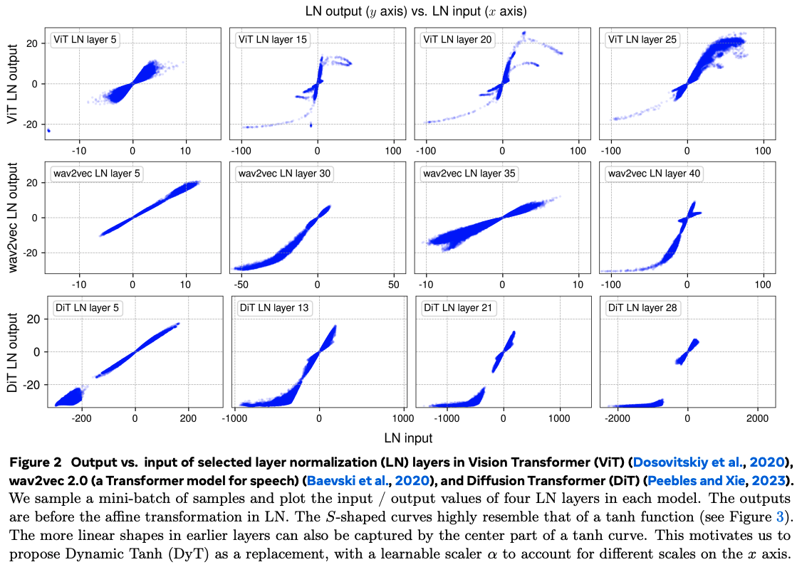
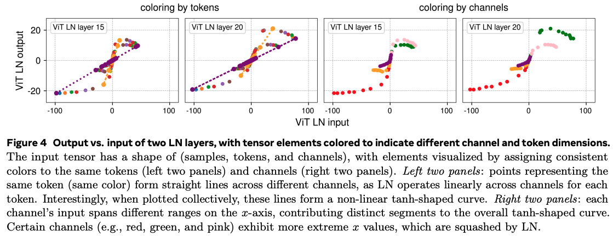
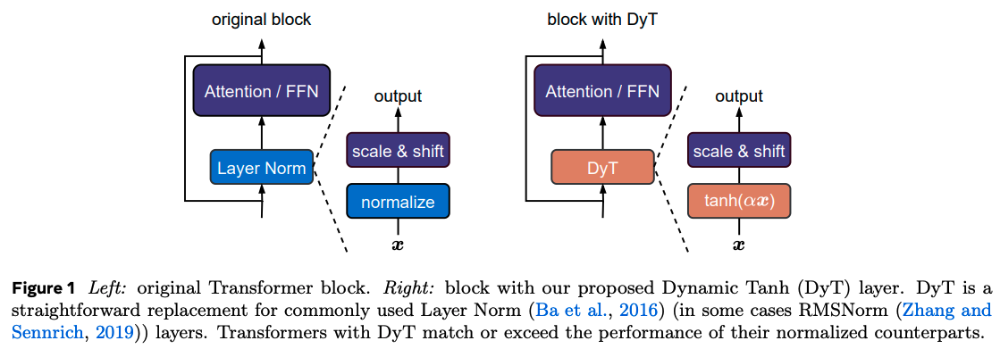
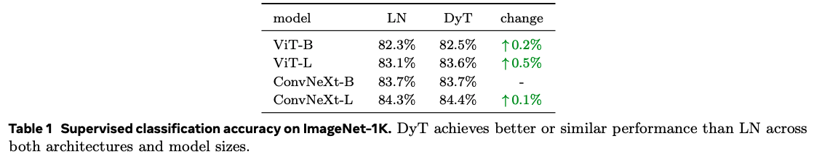
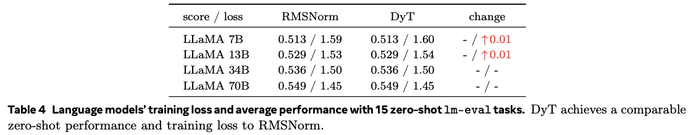
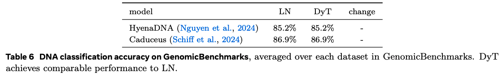

---
tags:
- normalisation
- activation-functions
- transformers
potm_order: 1
paper_title: Transformers without Normalisation
paper_authors: Jiachen Zhu et al.
paper_orgs: FAIR, Meta
paper_link: https://arxiv.org/abs/2503.10622
review_authors:
- lukep
---

### The key idea

In short, the authors looked at the functions learned by layer-norms in a variety of Transformer models and observed that they approximated tanh-like functions. From this observation they propose a `DynamicTanh` layer to replace layer normalisations and demonstrate capable variations on convnets, vision/speech transformers, and large language models.

### Their method

The authors push data through pretrained vision and speech transformers and show that input/output mappings (pre-affine transform) in later layers are non-linear, and have a distinct S-shape reminiscent of $\tanh$.

This non-linearity arises because layer-norm computes means and standard deviations on a per-token basis. As such the token-wise mapping through normalisation is linear. However, activation values along particular channels that are consistently large in absolute value increase the variance sufficiently such that affected tokens will have weaker slopes in their individual normalisations. Unaffected tokens have lower variance, and hence stronger slopes in their normalisation. The net effect is such that the extreme values produced across these channels are effectively soft-capped.

I found this result sufficiently unintuitive that I needed to write a small example [IPython notebook](https://github.com/graphcore-research/graphcore-research.github.io/blob/main/notebooks/2025-03-DynamicTanh.ipynb) on synthetic data to grok this properly.

This observation begs the question of whether inserting the tanh function in place of layer-norm can produce equally capable transformer models. As such the authors propose `DynamicTanh`: $\textrm{DynT}(x; \alpha, \gamma, \beta) = \gamma * \tanh(\alpha x) + \beta$, where $\alpha$ is a learnable scalar and $\gamma$, $\beta$ are affine parameters equivalent to those used by layer-norm.

### Results

The authors train a bunch of different models with various architectures (transformers, convnets, state-space), modalities (image, text, speech, DNA), and sizes in supervised and self-supervised settings.

The main takeaway is that it kind of just works for smaller transformers, occasionally with a few tweaks needed to the training recipe to improve numerical stability (e.g., using Adam $\beta_2 = 0.95$)

Interestingly, $\alpha$ seems to follow the inverse standard deviation of activations throughout training, providing a global rescaling similar to batch-norm without needing to collect activation statistics.

{:.img-medium}

Large language model training with `DynamicTanh` requires heavier tuning. Successful convergence of training depends on the initial value of $\alpha$ and appears to require different values for attention and non-attention layers. The initial value must also decrease with increased model width.

### Takeaways

The use of $\tanh$ in place of layer-norm is appealing given it throws away the need for expensive reductions required for computing activation statistics. As we move matrix multiplications down to lower and lower bit-widths, these reductions become relatively more expensive as part of training.

The key caveat is that the lower cost of training large language models with `DynamicTanh` is lost when required to sweep two extra hyperparameters. A $\mu$P-like hyperparameter transfer rule would be extremely helpful to mitigate this.
