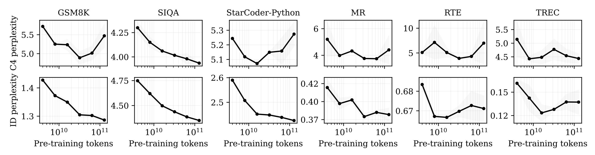

---
tags:
- LLMs
- fine-tuning
potm_order: 3
paper_title: Overtrained Language Models Are Harder to Fine-Tune
paper_authors: Jacob Mitchell Springer, et al.
paper_orgs: Carnegie Mellon University, Stanford University, Harvard University, Princeton
  University
paper_link: https://arxiv.org/abs/2503.19206
review_authors:
- douglaso
---

### The key idea

Current generations of LLMs are often "overtrained" on trillions of tokens since pretrained model performance continues to increase past the <a href="https://arxiv.org/abs/2203.15556" target="_blank">Chinchilla</a> point of optimal pretraining compute. We often assume that a better pretrained model would result in better task performance after fine-tuning, but this work challenges this assumption.

In the headline results (below), the authors take OLMo-1B intermediate checkpoints and show that the best performance after instruction fine-tuning is achieved with the 2.3 trillion token checkpoint, and performance degrades after 3 trillion tokens.

{:class="constrained_img"}
<figcaption>Figure 1. Language models with extensive pre-training can exhibit catastrophic overtraining, where the performance of post-trained models degrades as the pre-training stage is extended.</figcaption>

### Results - open checkpoints

First, the authors show degradations with continued pretraining empirically using open LLM checkpoints (see Figure 1 above and Figure 2 below). The effect is more common in _Out Of Distribution_ (OOD) tasks, which were not present in the fine-tuning protocol, in contrast to _In Distribution_ (ID) tasks which were. If it were confined to OOD tasks, this would be catastrophic forgetting, but since it is present in ID tasks, the authors propose the term **catastrophic overtraining**. Since it worsens with continued pretraining, the models exhibit _progressive sensitivity_ to modification.

<figcaption>Figure 2. Extending pre-training can degrade performance after fine-tuning Anthropic-HH (left) and LLaVA (right).</figcaption>

### Results - controlled pretraining

There is a confounding factor with the above results since intermediate checkpoints did not finish their learning rate decay schedule and this could cause the appearance of catastrophic overtraining. To control for this, the authors pretrain their own small LMs and observe catastrophic overtraining on some tasks, with RTE and TREC showing ID degradation with additional pretraining tokens.

<figcaption>Figure 6. Catastrophic overtraining after hyperparameter tuning: extending pre-training can lead to the eventual degradation of the C4 OOD perplexity (top) and ID perplexity (fine-tuning task; bottom), even after hyperparameter tuning.</figcaption>

### Results - theory

Finally, the authors provide a theoretical insight into the effect. For a simplified model, they show that random perturbations inserted after pretraining runs of increasing duration will degrade pretraining loss monotonically with duration. The core idea is that the model becomes more sensitive to small singular values in the mapping that is being learnt, over training. This increased sensitivity leads to degradation when the model parameters are perturbed. Then they show a similar result when fine-tuning on a misaligned task. These results directly concern catastrophic forgetting, since the fine-tuning task causes degradation in the original task. The authors argue that pretraining capabilities are important after fine-tuning and therefore these results are indicative of catastrophic overtraining too.

### Takeaways

Catastrophic overtraining is an interesting idea, perhaps related to recent results showing that continued pretraining can reduce performance after quantisation ([Kumar et al.](https://arxiv.org/abs/2411.04330)). There is mounting evidence of progressive sensitivity — models trained for longer are more sensitive to modification. It isn't yet clear if it is practical to work around this sensitivity with careful fine-tuning (e.g. regularisation, as mentioned in this work) and if this can result in a better outcome than shorter pretraining.
