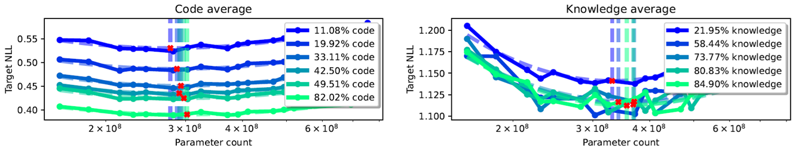
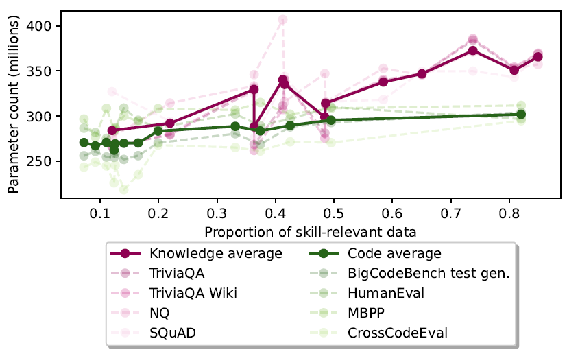

---
tags:
- LLMs
- scaling-laws
potm_order: 2
paper_title: 'Compute Optimal Scaling of Skills: Knowledge vs Reasoning'
paper_authors: Nicholas Roberts, et al.
paper_orgs: Meta (GenAI)
paper_link: https://arxiv.org/abs/2503.10061
review_authors:
- albertoc
---

### The key idea

The authors investigate the differences in optimal LLM parameter count, for a fixed training budget, when looking separately at knowledge-based skills and reasoning-based skills, rather than using Aggregate Performance  (e.g. validation loss) as it's usually done in scaling-laws papers. They show evidence that knowledge QA tasks are capacity-hungry, while reasoning (in the form of coding) tasks are data-hungry.

<figcaption>Figure 1. The skill-dependent compute optimal parameter count for knowledge (a) and code (b) skills (in red) compared to the APE CO (in black). In (c), the log-scale differences in parameter count between skill CO and APE CO are plotted. </figcaption>

### Background

When training a model, the compute budget (i.e., total number of FLOPs) can be increased by scaling either the model size or the amount of training data. In the case of LLMs, the FLOPs budget is typically estimated as $B \approx 6pt$, where $p$ is the parameter count and $t$ is the number of training tokens. Scaling-laws aim at quantifying the Compute Optimal (CO) model size $p$ which minimizes the loss on a validation set, for a fixed training budget $B$. This is done by first fitting IsoFLOP curves to the validation loss of models of different sizes but trained with the same compute budget, and then fitting a power law to the minima of these curves (as shown for instance in Figure 1).

### Method

The authors consider a set of 19 common evaluation datasets for LLMs, dividing them into two groups: those quantifying knowledge skills (e.g., Trivia QA) and those quantifying code skills (e.g., HumanEval). They then infer the skill-dependent CO parameter count by looking separately at the validation loss on the two groups and comparing the resulting power laws with the one from the [LLama 3 herd paper](https://arxiv.org/pdf/2407.21783), which was fitted to an Aggregate Performance Estimator (APE). The models have sizes ranging from 40M to 8B parameters and are pretrained on a datamix comprising 58.4% documents that are high in factual knowledge, 19.9% documents containing code, with the remaining 21.7% not falling in any category. They go on to study how the skill-dependent CO varies when changing the proportion of relevant data in the training datamix, and whether the two COs can be aligned in this way.

### Results

As shown in Figure 1, there is a difference between knowledge and code skills: the former prefers capacity over data, compared to the APE curve, while the latter is more data-hungry. The difference is more evident in lower compute regimes.

To understand how much this difference is a consequence of the ratio of knowledge vs code documents used as training data, the authors train models with a fixed compute budget but change the relative proportions in the datamix. Unsurprisingly, increasing the amount of skill-dependent training data improves the performance on that specific skill, but - more notably - also the COs shift, towards being more capacity-hungry (Figure 2).

<figcaption>Figure 2. IsoFLOP curves ($B = 6 \times 10^{18}$) for various code and knowledge QA datamixes, showing a shift in CO parameter count. </figcaption>

However, even when correcting for the proportion of skill-relevant data, a fundamental difference between knowledge and code remains, with knowledge still being substantially more capacity-hungry (Figure 3). This can be explained by the fact that knowledge is much harder to compress than code.

{:class="constrained_img"}
<figcaption>Figure 3. On average, knowledge-based tasks require more parameters than code, for the same proportion of skill-relevant data seen during pretraining. </figcaption>

Finally, the authors observe that, while it is possible in general to align the COs for the two skills when fixing a specific validation dataset, the optimal parameter count for the same skill varies massively (up to 30%, in low-budget regimes) across validation sets. This highlights the importance of choosing a validation set that adequately represents what the model should be able to capture.