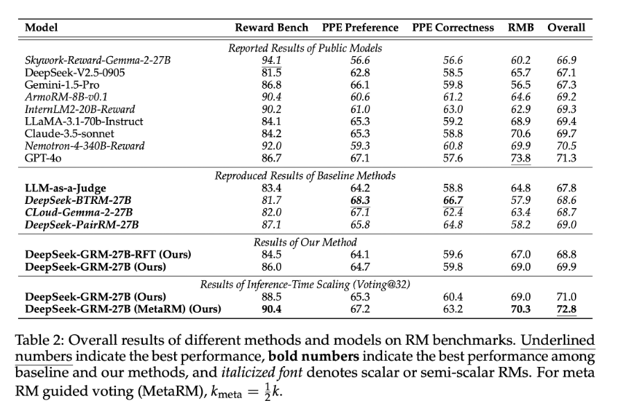

---
tags:
- LLMs
- reward-modeling
- reinforcement-learning
- inference-time-compute
- test-time-compute
potm_order: 2
paper_title: Inference-Time Scaling for Generalist Reward Modeling
paper_authors: Zijun Liu et al.
paper_orgs: DeepSeek-AI, Dept. of ComputerSci & Tech. Tsinghua University, Institute
  for AI Industry Research (AIR) Tsinghua University
paper_link: https://arxiv.org/abs/2504.02495
review_authors:
- ariannas
---

### The key idea

Recent studies have highlighted the critical role of reward models (RMs) in post-training reinforcement learning (RL) in providing high-quality reward signals that help Large Language Models (LLMs) perform well in domains where correctness can be automatically verified, such as coding and mathematics. 

However, generating reliable rewards becomes far more challenging in less structured or open-ended domains where answers cannot be automatically verified. At the same time, there is growing interest in making reward quality scale with available inference-time compute - improving as more sampling or computational resources are used.

This paper addresses both challenges by introducing **Self-Principled Critique Tuning (SPCT)**, a novel learning method that enables **Generalist Reward Models (GRMs)** to generate adaptive, high-quality rewards and effectively leverage increased **inference-time compute**. 

This approach is implemented in **DeepSeek-GRM-27B**, a Gemma-2-27B-based post-trained with SPCT and enhanced with a secondary Meta Reward Model (MetaRM) to further improve inference-time scaling performance, as shown in Figure 1. 

{:class="constrained_img"}
<figcaption><strong>Figure 1.</strong> Inference-time scaling performance with different RMs on all RM benchmarks. Results are shown with up to 8 samples for each method, and are further scaled to 32 samples for ours. Non-italic font indicates models based on Gemma-2-27B.</figcaption>

### Their method

The authors adopt a **pointwise generative** reward modeling paradigm. Pointwise scoring assigns individual rewards to each response, enabling flexibility across diverse input formats, while the generative approach produces textual judgements or *critiques* from which reward scores are derived. 

To enhance performance, they apply **sampling-based** aggregation, generating multiple reward sets per query and combining them to produce a final score.

This setup lays the foundation for their core innovation — the **Self-Principled Critique Tuning (SPCT)** method, which further improves reward quality and scalability. As suggested from previous studies, the authors incorporate "*principles*" generated by the GRM to guide the RM and crucially they treat these not as a pre-processing step, but as part of the reward generation itself. The GRM generates *principles* based on the input query and answers, and then produces *critiques* and assigns rewards according to these generated *principles*. This adaptive approach allows the reward generation process to align with different inputs contexts and nuances.

As shown in Figure 3, SPCT begins with rejective fine-tuning to train the model on properly formatted principles and critiques, followed by rule-based online RL (via GRPO) to refine output quality and improve the model’s ability to distinguish between high- and low-quality responses.

To scale reward quality at inference time, the authors use sampling-based strategies: the model generates multiple reward samples per query, assigns pointwise scores, and aggregates them — typically by summing — to obtain a robust final reward. This approach leverages diverse judgments to approximate a consensus, reducing bias from any single sample. Finally, a **Meta Reward Model (MetaRM)** filters the sampled rewards, selecting only the highest-quality critiques for aggregation, further improving reliability and reducing bias.

### Results - RM benchmarks

Table 2 show that the post-trained DeepSeek-GRM-27B outperforms the baseline methods (reimplemented by the authors) and matches or exceeds the performance of leading models like GPT-4o and Nemotron-4-340B-Reward.

### Results - inference-time scalability

Table 3 and Figure 1 demonstrate that with inference-time scaling (using 32-sample voting) the model achieves the best overall performance, which improves further when combined with MetaRM-guided voting. 

{:class="constrained_img"}
<figcaption><strong>Table 3.</strong> Inference-time scalability results of different methods on RM benchmarks. Settings are the same as Table 2.</figcaption>

### Results - scaling inference vs training costs

Figure 4 compares the benefits of inference-time scaling versus model size scaling. Remarkably, the 27B-parameter DeepSeek-GRM, when paired with 32-sample voting, reaches performance comparable to or better than much larger models, even the 671B MoE model. 

### Takeaways

This paper marks an important step toward building a true Generalist Reward Model (GRM), introducing the SPCT learning method to generate high-quality, adaptive rewards across diverse tasks. While the results are promising, the authors acknowledge that challenges remain, particularly in tasks with highly subjective reward criteria or those requiring external knowledge. 

The paper also demonstrates the strong potential of inference-time scaling, showing that smarter use of compute can deliver major performance gains — a promising direction for future research on efficient, scalable reward systems.
