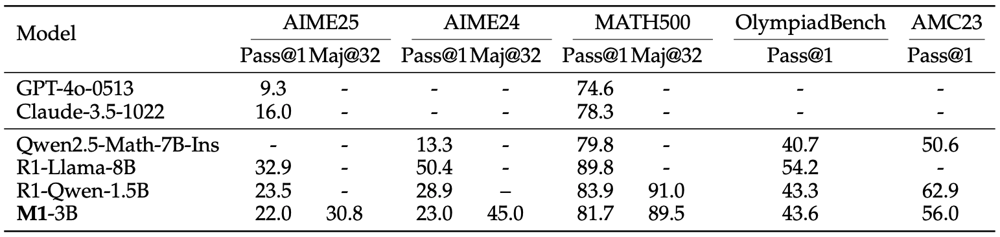

---
tags:
- LLMs
- mamba
- reasoning
potm_order: 3
paper_title: 'M1: Towards Scalable Test-Time Compute with Mamba Reasoning Models'
paper_authors: Junxiong Wang et al.
paper_orgs: TogetherAI, Cornell University, University of Geneva, Princeton University
paper_link: https://arxiv.org/abs/2504.10449
review_authors:
- kheerann
---

### The key idea
Language models applied to reasoning have recently been shown to benefit from longer chain-of-thought sequences, which require the model to process a longer context.
However, transformer-based models suffer from a quadratic increase in computational complexity with respect to context length.
The authors tackle this problem using a novel hybrid reasoning model (M1) based on Mamba, which has been shown to be computationaly more efficient than transformers [[Gu and Dao, COLM 2024]](https://arxiv.org/abs/2312.00752). In doing so, they give the first hybrid Mamba-based reasoning model whose performance on math reasoning tasks outperforms transformer-based reasoning models.

### Their method
The authors adapt the multi-step approach proposed in [[Wang et al., NeurIPS 2024]](https://arxiv.org/abs/2408.15237) to design their 3B parameter M1 model:
1. *Initialisation & Distillation.* Beginning with the pre-trained Llama-3.2-3B model, they replace transformer attention heads with Mamba-based ones and initialise them with the corresponding transformer weights. 
See Figure 1 for the procedure. Then, they distil the hybrid model using the reverse KL divergence. 

    
    <figcaption><strong>Figure 1.</strong> An outline of the MambaInLlama initialisation procedure used in the M1 model, which is from [Wang et al., NeurIPS 2024].</figcaption>

2. *Supervised Finetuning.* They finetune the resulting model from step 1 in two ways. First, on the large set of math problems OpenMathInstruct-2. Then, on math problems and solutions generated by reasoning models, which includes OpenR1-Math-220k, OpenThoughts-114k-math, and ServiceNow-AI/R1-Distill.

3. *Reinforcement Learning.* They subsequently enhance performance using an altered Group Relative Policy Optimization (GRPO) strategy. In particular, they remove the KL term that penalises policies that are different to the original, and they add an entropy term to encourage diversity in the policy. The altered GPRO loss they use is

    $$L_\text{GPRO}(\Theta) = \mathbb{E}\left[\frac{\pi_{\Theta}(a \mid s)}{\pi_{\Theta_\text{old}}(a \mid s)} \cdot \hat{A}(s, a)\right] + \eta \cdot H(\pi_\Theta).$$ 

### Results
The authors evaluate the performance of their M1-3B model in terms of reasoning (Table 1), inference speed (Figure 2), and test-time scaling (Figure 3):

1. *Reasoning.* M1-3B outperforms all non-reasoning language models and the Qwen2.5-Math-7B-Instruct reasoning model in all benchmarks. It slightly underperforms against the DeepSeek-R1-Distill-Qwen-1.5B reasoning model in almost all benchmarks. 

    {:class="constrained_img"}
    <figcaption><strong>Table 1.</strong>Reasoning performance results. Pass@1 refers to a percentage mark using a single sample per question and Maj@32 refers to a majority vote on 32 samples per question. </figcaption>

2. *Inference Speed.* As batch size and generation length are scaled up, M1-3B shows better speedups compared to other models of similar and even smaller size, with up to a 3x speed up when compared to the Llama-3.2-3B model, which M1-3B is based on.

    {:class="constrained_img"}
    <figcaption><strong>Figure 2.</strong>Inference speed results when using prompt length 256 and decoding length 4096 (left) and when using batch size 128 (right).</figcaption>

3. *Test-Time Scaling.* Given a fixed compute-time budget, M1-3B ultimately outperforms DeepSeek-R1-Distill-Qwen-1.5B on math reasoning tasks when allowed to scale either the number of scoring samples or the length of the context/chain-of-thought.

    {:class="constrained_img"}
    <figcaption><strong>Figure 3.</strong>Results for test-time scaling with a fixed compute time budget (x-axis) when allowed to vary number of samples (left) and length of context (right).</figcaption>

### Takeaways
The M1-3B model shows that transformers are not the only good option for reasoning models. This hybrid model built on Mamba obtains improved computational efficiency and performance over even the larger Qwen2.5-Math-7B-Instruct reasoning model. However, for the smaller DeepSeek-R1-Distill-Qwen-1.5B model, it is only able to gain an improved reasoning performance by taking advantage of the more efficient inference time, that is, allowing for 'more reasoning' in a fixed amount of time.

...
