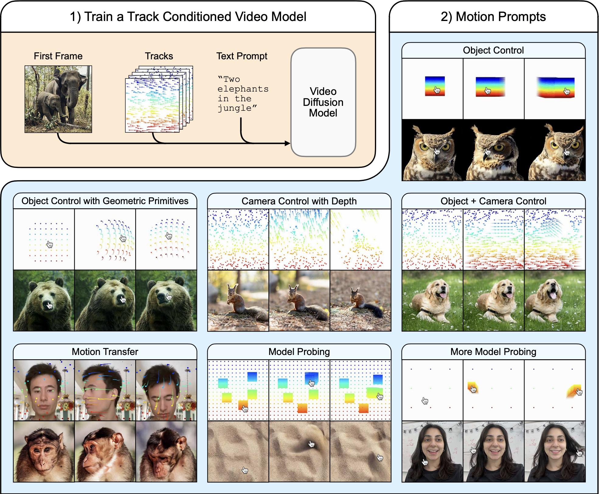

---
tags:
- diffusion
- generative-models
potm_order: 1
paper_title: 'Motion Prompting: Controlling Video Generation with Motion Trajectories'
paper_authors: Daniel Geng et al.
paper_orgs: Google Deepmind, University of Michigan and Brown University
paper_link: https://arxiv.org/abs/2412.02700
review_authors:
- alexc
---

### The key idea
The central concept of Motion Prompting is to gain fine-grained control over video generation by conditioning a video diffusion model on spatio-temporally sparse or dense motion trajectories. These trajectories, termed "motion prompts", are presented as a powerful complementary control scheme to text, which often struggles to convey the complex nuances of motion. The goal is to achieve more expressive and precise control over the generated video content by enabling users to specify desired movements directly.

<figcaption>Motion Prompting system overview and results: 1) Diffusion model system is conditioned on a single image, motion tracks and text. 2) The different capabilities of the trained model: object control, camera control, simultaneous object and camera control, motion transfer, and model probing</figcaption>

### Background
Significant progress has been made in generative models for images and videos using diffusion models. While text prompts can generate impressive visuals, they are limited in controlling specific spatial compositions in images or intricate motions in videos. To address spatial control, ControlNet was introduced. This architecture enhances pretrained text-to-image diffusion models by adding spatial conditioning. ControlNet works by keeping the original model's parameters locked and creating a trainable copy of its encoding layers, connected by "zero convolutions" - zero initialized layers such that the conditioning signal doesn't affect the diffusion process at the beginning of training. This design allows learning various spatial conditions while preserving the backbone's quality. In parallel, models like Lumiere advanced text-to-video generation by synthesising the entire temporal duration of a video in a single pass using a Space-Time U-Net architecture built on a pretrained text-to-image model. This contrasts with methods that rely on generating keyframes and using temporal super-resolution, which can struggle with global temporal consistency. Motion Prompting builds directly on these foundations, adapting the ControlNet approach to provide granular motion control within a video diffusion model framework like Lumiere.

### Their method
The Motion Prompting approach trains a ControlNet adapter on top of a pretrained video diffusion model, specifically leveraging Lumiere. The conditioning signal is provided through motion trajectories, or point tracks, which encode the movement and visibility of points across time. This allows for flexible control over any number of points, applying to objects, the camera, or the entire scene, and supporting temporally sparse constraints. The motion prompts are encoded into a space-time volume and fed into a trainable copy of the base model's encoder, similar to the original ControlNet design, while the pretrained backbone remains fixed. The training procedure follows ControlNet principles and exhibits a "sudden convergence phenomenon" where the model quickly learns to follow the condition. To make specifying motion easier, they propose motion prompt expansion, which converts simple user inputs like mouse drags into more detailed motion tracks.

### Results
The Motion Prompting framework demonstrates versatility through various applications enabled by this single trained model:

 - Object and camera control.
 - "Interacting" with an image using mouse drags to manipulate content like hair or sand.
 - Motion transfer, applying motion from a source video to a different first frame.
 - Drag-based image editing.

The approach also reveals emergent behaviors, such as realistic physics, suggesting its utility for probing the underlying video model's understanding of the world. Failures can be used to identify limitations in the model's learned representations and its grasp of physics. Quantitative evaluations were performed on the DAVIS dataset using various metrics. These tests measured how accurately the generated video matched the desired motion and assessed the overall visual quality and realism. The results showed that the Motion Prompting model generally outperformed baseline methods across these different measures.A human study using a two-alternative forced choice protocol also indicated that users preferred the results of Motion Prompting over baselines in terms of motion adherence, realistic motion quality, and visual quality.
To see dynamic examples of these capabilities, readers are encouraged to explore the gallery of results on the paper's website: https://motion-prompting.github.io/.
