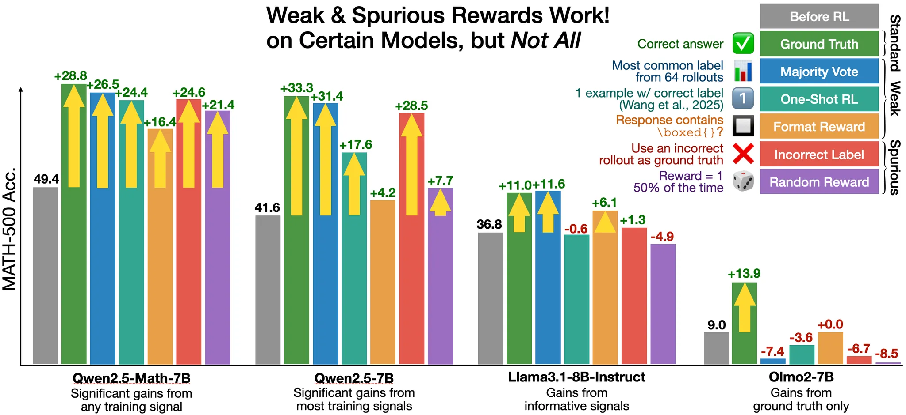

---
tags:
- LLMs
- reinforcement-learning
- reasoning
- fine-tuning
potm_order: 4
paper_title: 'Spurious Rewards: Rethinking Training Signals in RLVR'
paper_authors: Rulin Shao, Shuyue Stella Li, Rui Xin and Scott Geng
paper_orgs: University of Washington, Allen Institute for AI and University of California,
  Berkeley
paper_link: https://github.com/ruixin31/Rethink_RLVR/blob/main/paper/rethink-rlvr.pdf
review_authors:
- samot
---

### The key idea

The authors (claim to) boost significantly [Qwen-Math](https://arxiv.org/abs/2409.12122v1) performance via reinforcement learning (RL) with *random*, or even *spurious*, rewards on the MATH-500 benchmark. This hints at models' already possessing reasoning abilities, which the RL procedure "coaxes out", rather than developing.

<figcaption>Figure 1. MATH-500 accuracy after 150 steps of RLVR on various training signals. We show that even "spurious rewards" (e.g., rewarding *incorrect* labels or with completely random rewards) can yield strong MATH-500 gains on Qwen models. Notably, these reward signals do not work for other models like Llama3 and OLMo2, which have different reasoning priors.</figcaption>

>   **NB**. The baseline evaluations in this paper, and related ones, have been [called into question](https://safe-lip-9a8.notion.site/Incorrect-Baseline-Evaluations-Call-into-Question-Recent-LLM-RL-Claims-2012f1fbf0ee8094ab8ded1953c15a37). They [suggest](https://safe-lip-9a8.notion.site/Incorrect-Baseline-Evaluations-Call-into-Question-Recent-LLM-RL-Claims-2012f1fbf0ee8094ab8ded1953c15a37#2012f1fbf0ee80319fb6ee27b1474624) an under-reporting of ~15 percentage points (49.4% vs 64.3%) here. This is raised in a [short thread](https://x.com/YiranWu18/status/1927491538386342229) on the original [post on X](https://x.com/StellaLisy/status/1927392717593526780). Still, *some* of the claimed gain is not absorbed by correct baseline evaluation.
>   
>   With all this in mind, the claims in the current paper (outlined below), and from similar papers, should be taken with a pinch of salt.

### Background

Reinforcement Learning with Verifiable Rewards (RLVR) has become a standard approach for enhancing reasoning in LLMs. The conventional wisdom that high-quality supervision signals are essential has been challenged recently, from [training on only one example](https://arxiv.org/abs/2504.20571) to [training without verifiers](https://arxiv.org/abs/2504.16084) or [sampling more from the base model](https://arxiv.org/abs/2504.13837) all improving maths capabilities.

The current paper asks and addresses the question,

>   "What is a minimum requirement for rewards to provide meaningful RLVR training signals? Do rewards even need to be correctly aligned?"

### Their method

RLVR experiments with Qwen2.5-Math-7B, the de facto model that has been widely used by the community for reinforcement learning, were performed using different ground-truth supervision across multiple benchmarks.

Somewhat surprisingly, it is possible to almost match the ground-truth with incorrect or random rewards. This finding directly challenges the prevailing understanding of reinforcement learning's role in improving AI reasoning capabilities.

### Results

The MATH-500 benchmark is the focus. The baseline model was tested (no RLVR), alongside four RLVR approaches (including the genuine truth), with results tabulated below.

| Reward      | Description                   | Claim       | Adjusted* |
|-------------|-------------------------------|-------------|-----------|
| *Format*    | reward if contains `\boxed{}` | **+16.4%**  |  **~0%**  |
| *Random*    | uniform 0/1-valued reward     | **+21.4%**  |  **~5%**  |
| *Incorrect* | reward only incorrect answers | **+24.6%**  | **~10%**  |
| *Truth*     | ground-truth reward           | **+28.8%**  | **~15%**  |

*"Adjusted" here is an estimation of the boost after removing ~15%, as mentioned above (and [here](https://safe-lip-9a8.notion.site/Incorrect-Baseline-Evaluations-Call-into-Question-Recent-LLM-RL-Claims-2012f1fbf0ee8094ab8ded1953c15a37#2012f1fbf0ee80319fb6ee27b1474624)).

Whilst none of the other options perform as well as RLVR with the true labels, random and incorrect rewards get pretty close. Interestingly, other models analysed (LLaMA 3.2B Instruct and OLMo 2 7B) did *not* show such gains.

### Takeaways

One interpretation is that the model can already reason (fairly well), and that RLVR is more *teasing out* this capability, rather than *improving* it. This agrees with [the authors' interpretation](https://rethink-rlvr.notion.site/Spurious-Rewards-Rethinking-Training-Signals-in-RLVR-1f4df34dac1880948858f95aeb88872f):

>   "RLVR with spurious rewards can serve as a mechanism to amplify and surface useful reasoning representations learned during pre-training."

**NB.** Remember, though, that the baseline evaluations have been seriously questioned. This, in turn, reduces the claimed gains, almost wiping out several of them.
