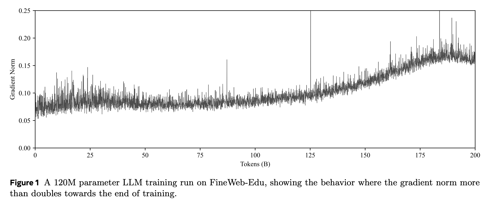
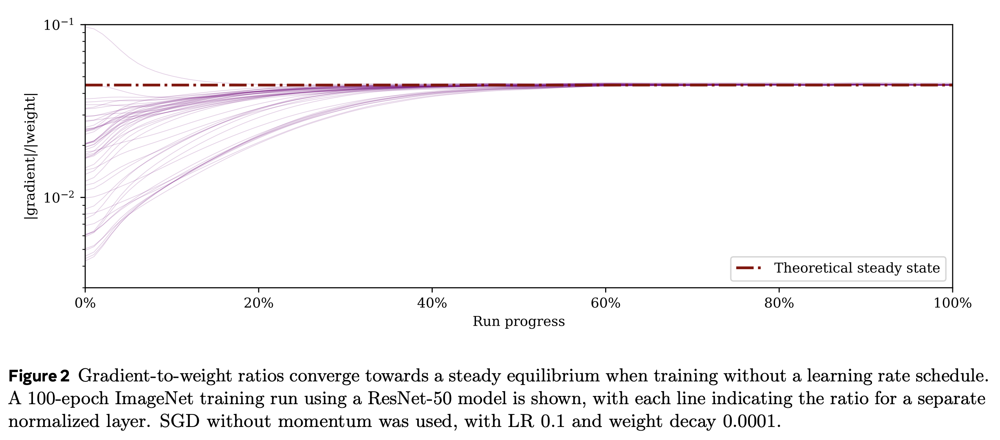

---
tags:
- training-dynamics
potm_order: 1
paper_title: Why Gradients Rapidly Increase Near the End of Training
paper_authors: Aaron Defazio
paper_orgs: FAIR at Meta
paper_link: https://arxiv.org/abs/2506.02285
review_authors:
- callumm
---

### The key idea

When training machine learning models in low precision, it is important to ensure that none of the values in the computations overflow the range of the format you are using, lest the process crash. Even if all of the values are kept in the representable range, the training may perform better if the values stay in the region with the best signal-to-noise ratio for a given floating-point format. For this reason, it is ideal that the norms of the activations, gradients and weights stay within a certain range throughout training.

However, it has been observed that in some long training runs the norm of the gradient vector increases rapidly towards the end of training. For example, in the training run in Figure 1, the norm of the gradient vector roughly doubles towards the end of training.

The paper shows that this is due to the interaction between weight decay, normalisation layers, and the learning rate schedule, proposing a simple correction to fix this undesired behaviour.

### Theory

We can see why the gradient norm increases by considering the steady state dynamics of a single layer of the model. In particular, we consider linear layers that are immediately followed by a normalisation operation such as RMSNorm or LayerNorm. The key property that these layers have is that their gradients are orthogonal to their weights, that is, their dot product is 0. We denote the weights of a given layer at timestep $t$ by $x_t$, its gradient by $g_t$, the learning rate at this point in the schedule by $\gamma_t$, and the weight decay by $\lambda$. By considering a single SGD step with weight decay, we have:

$$ x_t = x_t - \gamma_t g_t - \gamma_t \lambda x_t $$
$$ x_t = (1 - \lambda \gamma_t) x_t - \gamma_t g_t $$
$$ \left\| x_t \right\| ^2 = (1 - \lambda \gamma_t)^2 \left\| x_t \right\| ^2 + \gamma_t ^ 2 \left\| g_t \right\| ^2 $$
$$ (2 \lambda \gamma_t - \lambda^2 \gamma_t^2) \left\| x_t \right\| ^2 = \gamma_t^2 \left\| g_t \right\| ^2 $$

Further assuming that $ \lambda^2 \gamma_t^2 \ll 2 \lambda \gamma_t$ and that this term can be ignored, we have:

$$ 2 \lambda \gamma_t \left\| x_t \right\| ^2 = \gamma_t^2 \left\| g_t \right\| ^2 $$
$$ \frac{\left\| g_t \right\|}{\left\| x_t \right\|} = \sqrt{\frac{2 \lambda}{\gamma_t}} $$

In a typical learning-rate schedule, the learning rate is decayed to 0 or to a small fraction of the maximum learning rate, so we expect the ratio $ \left\| g_t \right\| / \left\| x_t \right\| $ to increase rapidly towards the end of training. A similar argument, though a more approximate one, gives a similar result for Adam.

This behaviour can be seen clearly in a training run for ImageNet with SGD.

This issue can be addressed by making the weight decay proportional to the learning rate in accordance with the learning rate schedule.

$$ \hat{\lambda}_t = \frac{\lambda \gamma}{\gamma_{\text{max}}} $$

Then we have:

$$ \frac{\left\| g_t \right\|}{\left\| x_t \right\|} = \sqrt{\frac{2 \lambda}{\gamma_{\text{max}}}} $$

### Practice

This is a lovely theoretical result, but many modern LLM architectures (e.g., Llama) don't actually have many linear layers immediately followed by normalisation.
Instead, normalisation is typically applied after adding the input to the previous layer (i.e. after the residual connection).
The argument might still hold water anyway: almost all pairs of vectors in very high-dimensional Euclidean space are nearly orthogonal, so one may argue that it is still 
fine to neglect the $ \left\langle x_t, g_t \right\rangle $ term.

The paper shows that applying this correction to pretraining a Llama model with AdamW (calling the resulting optimisation algorithm AdamC) stabilises the norms of the 
gradients and the weights, as well as giving a lower loss throughout training.

In conclusion, this method is a promising way to control the norms of the gradients throughout training, and may be a key component of low-precision model training in the future.
