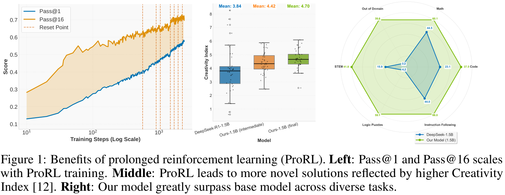

---
tags:
- LLMs
- training-dynamics
- fine-tuning
- reasoning
- reinforcement-learning
potm_order: 2
paper_title: 'ProRL: Prolonged Reinforcement Learning Expands Reasoning Boundaries
  in Large Language Models'
paper_authors: Mingjie Liu, et al.
paper_orgs: NVIDIA
paper_link: https://arxiv.org/abs/2505.24864
review_authors:
- samot
---

### The key idea

Reinforcement learning (RL) has had a resurgence in LLMs with application to reasoning models. However, contention remains regarding whether RL *expands* capabilities or simply amplifies high-reward outputs *already learned*. In *ProRL*, the authors from NVIDIA argue for the former. They find examples in which RL-trained models outperform even pass@*k* evaluations with large *k*—i.e., when the original model is given many attempts. This is achieved via *prolonged* RL training, suggesting that RL training scales effectively with increased compute.

The model weights are released to support further research: [`https://huggingface.co/nvidia/Nemotron-Research-Reasoning-Qwen-1.5B`](https://huggingface.co/nvidia/Nemotron-Research-Reasoning-Qwen-1.5B).

### Background

Recent reasoning-focused LLMs, like OpenAI-o1/o3 or DeepSeek-R1, require significant inference-time compute, often driven by long chain-of-thought (CoT) strategies. RL is proposed to improve the inherent reasoning abilities, instead of simply throwing more compute. The authors posit that negative conclusions from prior attempts stem from methodological limitations, rather than fundamental RL ones:

1.  Overreliance on specialised domains (e.g., maths) where models are often overtrained during pre- and post-training phases, restricting the potential for exploration.
2.  Premature termination of RL training before models can explore and develop, typically no more than hundreds of steps.

### Their method

The authors introduce *ProRL* to address these constraints. It enables extended RL training across diverse tasks, which they hypothesise is crucial for generalisation. With this, they develop *Nemotron-Research-Reasoning-Qwen-1.5B*, which the authors argue is the best performing 1.5B reasoning model. It significantly outperforms its base, *DeepSeek-R1-1.5B*, and matches or even surpasses *DeepSeek-R1-7B* across a diverse range of benchmarks.

Group Relative Policy Optimisation (GRPO) is utilised, with a couple of variations addressing entropy collapse and instability via a KL penalty and periodic resetting.

### Results

The base model, from which the prolonged RL training is initiated, is *DeepSeek-R1-1.5B*. They find significant improvement over the baseline, and even compete with the 7B version:
    
>   +15.7% on maths; +14.4% on code; +25.9% on STEM, +22.0% on instruction following; +54.8% on text-based logic puzzles from Reasoning Gym.

It also surpasses the maths- and code-specialised baselines *DeepScaleR* and *DeepCoder* by +4.6% and +6.5%, respectively. Full details are given in the evaluation table below.

This demonstrates the value in their prolonged training; see Figure 1 above. It does not however address *generalisation*. To this end, the model is evaluated on three *out-of-distribution* benchmarks: *acre*, *boxnet* and *game\_of\_life\_halting*: it performs very well on all of these, far exceeding even the 7B version.

Their study finds that the effectiveness of RL in *improving reasoning* (measured by pass@128) is strongly influenced by the initial capability. Specifically, when the model already performs well, little is gained; when it initially performs poorly (even completely failing), a marked increase can be observed.

<figcaption>Figure 3. Left: ProRL expands a model's reasoning boundary most effectively on tasks where the base model initially struggles. Right: Tasks with minimal gains post-RL highlighted in a circle tend to have a lower creativity index, indicating higher overlap with pretraining data.</figcaption>

### Takeaways

The paper provides compelling evidence that RL truly can expand LLM's reasoning *abilities*, not just improve their extraction. This is achieved by incorporating KL penalties and periodic reference-policy resets during an extended RL training period. It culminated in a state-of-the-art 1.5B reasoning model which performs well on several benchmarks, indicating its generalist properties.
