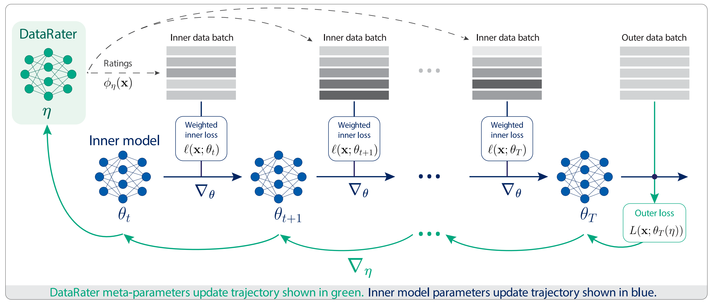

---
tags:
- LLMs
- dataset
potm_order: 3
paper_title: 'DataRater: Meta-Learned Dataset Curation'
paper_authors: Dan A. Calian, Gregory Farquhar, Iurii Kemaev, Luisa M. Zintgraf, et
  al.
paper_orgs: Google DeepMind
paper_link: https://arxiv.org/abs/2505.17895
review_authors:
- paulb
---

### The key idea

As documented by many foundational models papers, data quality is fundamental to the training of large language models (LLMs). This DataReader research work approaches dataset curation as a meta-learning problem, which can be learnt during training of LLMs, leading to more accurate fine-grained data filtering compared to commonly used hand-crafted heuristics. 

### Background

Numerous technical reports on state-of-art LLMs have highlighted the importance of training on high quality data. Hence many research groups have put great efforts into dataset curation, building complex manual curating pipelines. For instance datasets such as C4 or FineWeb have extensively documented the various filtering stages used: URL filtering, quality heuristics, content filtering, deduplication, ...

Additionally, the training of foundation models relies more and more on the use synthetic data. The later has the potential to generate an unlimited quantity of samples, but also highlights the clear need of automated systems which can automatically identify data worth keeping.

### Method

The DataRater model is a 50M parameters transformer architecture outputting normalized weights on every sample in a micro-batch. It is trained using a meta-learning approach: the outer loss (i.e. used for training the DataRater) is back-propagated through multiple inner model updates. In other words, the DataRater observes how different data points affect the inner model updates, and adjust the sample weights accordingly.

A DataRater is trained on each dataset using a population of eight 400M inner language models. Once frozen, a DataRater model will be run as a small inference task during the training of larger LLMs, allowing online filtering of the input dataset at every micro batch (i.e. removing the bottom-K samples, for a pre-defined K filter rate). 

### Results

As mentioned above, the DataRater approach is useful if a frozen model can be successfully re-used for dataset filtering over a range of model sizes. Additionally, dataset quality varies substantially, from highly curated ones such as C4 to largely unclean ones like the Pile. As a consequence, before training a large model with a DataRater, a filtering hyperparameter sweep is necessary to understand which proportion of a dataset can be safely discarded at every micro-batch without hurting validation accuracy.

As presented in the figure above, a filtering hyperparameter sweep can be performed at a relatively small model size (i.e. 50M parameters), and transferred to much large models (>1B parameters). Interestingly, this hyperparameter transfer is effective across a scope of datasets, from 10% filtering on C4 to 75% on the Pile.

Finally, the DataRater approach is showing robustness across a variety of downstream tasks: in experiments over 3 datasets, 4 models and 7 metrics, 73 out 84 downstream tasks results are improved.

