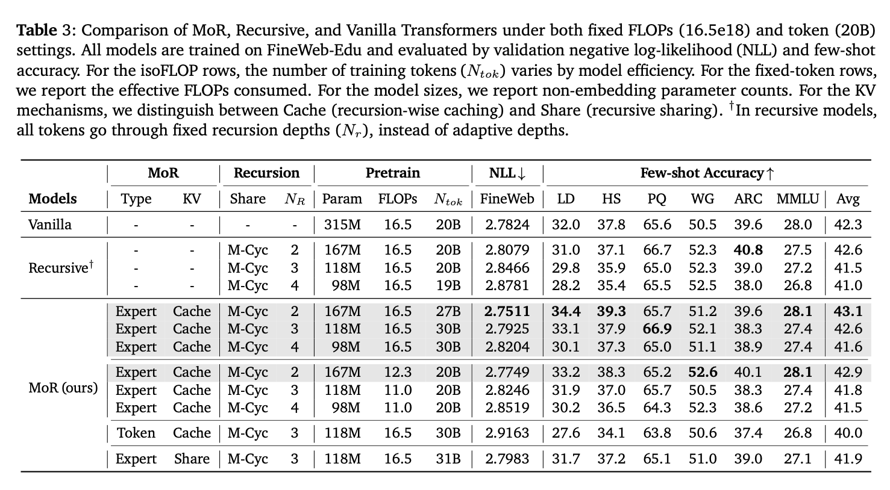
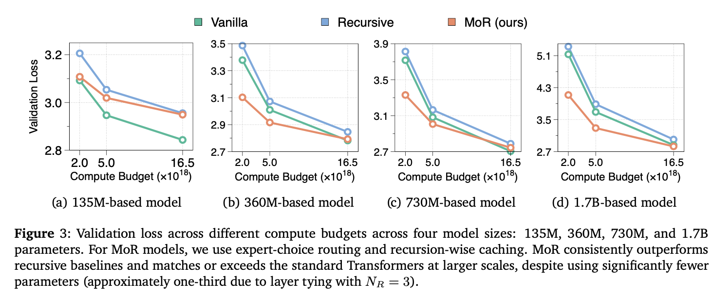
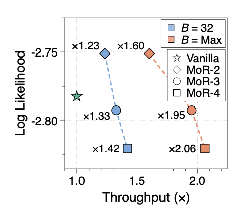

---
tags:
- efficient-inference
- mixture-of-experts
- LLMs
potm_order: 2
paper_title: 'Mixture-of-Recursions: Learning Dynamic Recursive Depths for Adaptive
  Token-Level Computation'
paper_authors: Sangmin Bae, Yujin Kim, Reza Bayat, et al.
paper_orgs: KAIST AI, Mila, Google [Cloud, DeepMind, Research], University of Montreal
paper_link: https://arxiv.org/abs/2507.10524
review_authors:
- lukar
---

### The key idea

While modern transformer-based LLMs have showcased impressive capabilities, they have significant computational and memory costs associated with training and inference, motivating the research into improving their efficiency. In the current work, the authors tackle improving *parameter efficiency* (i.e., can we get the same performance with fewer parameters), as well as *adaptive computation* (i.e., adaptively using more or less compute depending on the "difficulty" of the input), by introducing the *Mixture-of-Recursions* architecture. By considering a sequence of transformer layers as a single "recursion block", the authors train a routing layer that effectively decides how many times each token should be passed through the block. The authors showcase that the performance of this architecture can match the standard transformer architecture for the same computational cost, while leading to a significant decrease in parameter count due to its recursive nature.

### Their method

The authors take inspiration from the standard *Mixture-of-Experts* (MoE) approaches (see e.g., [Switch Transformers](https://arxiv.org/abs/2101.03961)), as well as previous attempts at adaptive computation using router-based networks ([Mixture-of-Depths](https://arxiv.org/abs/2404.02258)), in order to construct an approach that can adaptively re-apply a sequence of layers based on the estimated input difficulty.

**Recursive block**

The recursive block is constructed by either grouping the full sequence of transformer layers into the block that can then be cyclically re-applied ("cycle strategy"), or by keeping the initial and final layers as standard (non-recursive) layers, and re-applying only the middle ones ("middle-cycle strategy").

**Mixture-of-Recursions**

In order to decide how many times each token should pass through the recursive block, the authors adapt the methods from the MoE literature. There are two main approaches that they consider:

* Expert-choice routing: Each recursion depth is regarded as an "expert" that chooses the top-$k$ tokens to pass through the stage — only the tokens that passed through the previous recursion stage can be selected at the current one, thus, tokens "exit early" when they are not selected at a particular recursion depth. The router takes the previous hidden state and produces a scalar score for each token in the sequence. Thus, at each recursion stage, the router selects $k$ tokens corresponding to the highest router scores (Figure 2a). Note that, at each stage, $k$ is chosen so that progressively fewer tokens pass to the next one (figure showcases $k = 9, 6, 3$).

* Token-choice routing: The recursion depth for each token in the sequence is decided immediately at the input to the block; by considering each recursion depth $r$ as an "expert", the router calculates a score for each expert (with the number of experts equal to the maximum number of recursions allowed $N_r$), and the token is assigned to the expert corresponding to its largest score (top-1 routing). This is shown in Figure 2b.

In both cases, the router consists of a linear layer followed by a non-linearity; for expert choice, it produces a scalar score using a `tanh`/`sigmoid` function, while for token-choice it produces a $N_r$-sized vector, using a `softmax` non-linearity.

Both approaches come with well-known pros and cons. In the case of expert-choice, there is an issue with "information leakage", as the later tokens can influence the decisions for the previous ones in the sequence, which can be addressed by training an auxiliary router (that predicts if the token would be selected without considering other tokens in the sequence). On the other hand, token-choice often needs additional auxiliary "load balancing" in order to make sure each expert is assigned an equal number of tokens.

**KV caching**

As some tokens "exit early", they will not have their key-value pairs available at later recursive iterations. In order to deal with this, the authors try two approaches (depicted in Figure 2c):

* Recursion-wise KV caching: Attention is restricted to the tokens that are available at the given recursion depth. This means that the number of available tokens that can be attended to shrinks with each recursive step, leading to a less computationally intensive attention operation at each recursive step.

* Recursive KV sharing: As all tokens pass through the recursive block at least once, another approach is to re-use the key-value pairs after the first recursive depth for each of the consecutive ones. Thus, at each depth the queries can attend to the full sequence, but the key-value pairs are only calculated once, during the first recursive pass.

### Results

The main results are shown in Table 3. The downstream tasks used are LAMBADA (LD), HellaSwag (HS), PIQA (PQ), WinoGrande (WG), ARC (Easy and Challenge), and MMLU. The best performing setting utilises expert-choice (Expert), with recursion-wise caching (Cache), and middle-cycle recursion scheme (M-Cyc). For the same training FLOPs, the MoR model is able to have similar/better performance as the vanilla transformer, but with half of the original number of parameters. Increasing the number of recursive steps ($N_r$) can further decrease the total number of parameters, but at some cost of performance.

The authors also test the performance of the models at the same compute budget as the size is scaled up, for fixed recursion depth $N_r = 3$ (Figure 3). The results indicate that the MoR architecture can outperform the vanilla transformer, however, the gap decreases as the compute budget is increased, suggesting that the lower number of parameters might be reaching a capacity limit.

{.img-small}
<figcaption>Figure 4. Throughput comparison</figcaption>

Finally, the authors showcase how the approach can lead to improvement in throughput compared to the vanilla transformer for a fixed number of effective parameters (360M), shown in Figure 4 (the "maximum" batch size line indicates the throughput when the largest batch size that fits on the GPU is used). As the maximum number of recursion depths is increased, throughput can be increased at the expense of decreased performance.

### Takeaways

The authors showcase an interesting spin on the standard MoE approach: while MoE techniques improve model performance at a fixed computational budget (at the expense of higher memory requirements), the paper suggests that the same routing techniques can be used to dynamically adjust the computation applied to each token, showcasing a way of obtaining similar performance as the standard transformer, with a smaller memory footprint.
