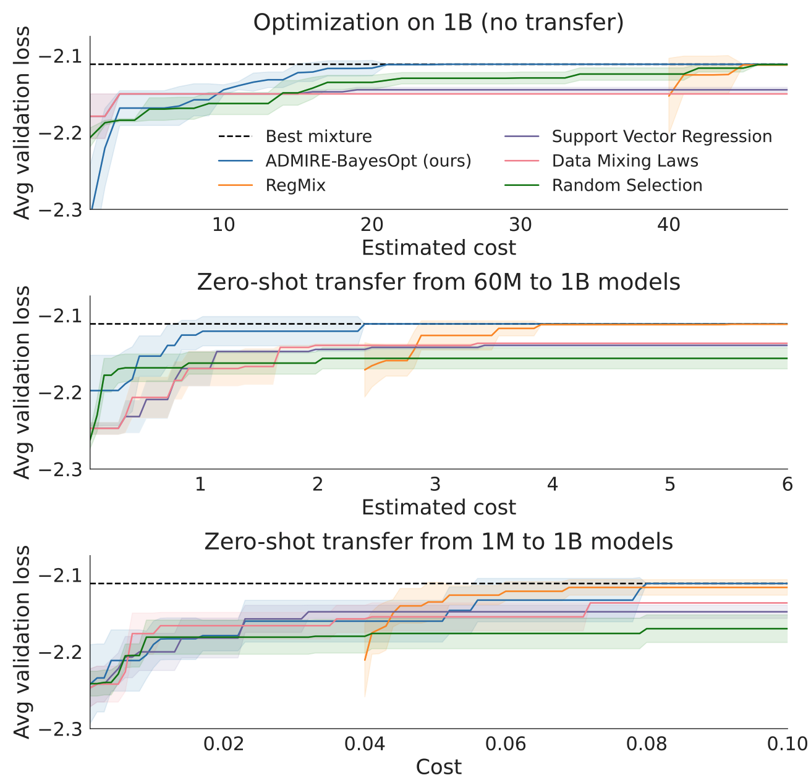

---
tags:
- optimisation
- dataset
- fine-tuning
- active-learning
- efficient-training
potm_order: 1
paper_title: 'ADMIRE-BayesOpt: Accelerated Data MIxture RE-weighting for Language
  Models with Bayesian Optimization'
paper_authors: Shengzhuang Chen, et al.
paper_orgs: Thomson Reuters Foundational Research, Imperial College London, University
  of West Virginia, Graphcore
paper_link: https://arxiv.org/abs/2508.11551
review_authors:
- michaelp
---

This is a Graphcore co-authored paper.

### The key idea
While model design and architectures have received a lot of attention, there has been comparatively less focus on dataset based optimizations. We have a large language model that we wish to finetune for some given benchmark and we have multiple training datasets, e.g. Wikipedia, Github, maths, etc. to finetune our model. Hypothetically, we could train using only one dataset we think is most appropriate, or we could train using a uniform mixture of all training sets. Realistically, we would not expect the ideal mixture to be so simple and as the number of datasets grows, e.g. 10 or more, manually tuning the data mixture becomes less feasible and finding an optimal mixture becomes exponentially harder. As the data mixture significantly affects performance, the risk of lost performance due to a sub optimal mixture becomes much more likely.

In practice, one would use expert prior knowledge, and previous works have used a grid search over a range of mixtures, or training a small language model on a range of mixtures and using the best mixture on the small model to train one large language model.

This work reframes the mixture optimization problem as a sequential iterative search: one may choose a data mixture, choose a model (small, medium, large), train and measure validation score, then choose the next mixture and model, train + validate, and repeat. In contrast with grid search or random search, determining each new experiment can be done with the hindsight of all past experiments, a search algorithm can focus on the most promising regions of mixture space.

Motivated by the extensive hyperparameter and black box optimization literature, this paper proposes to use Multi-Fidelity Bayesian Optimization (MFBO) as the search algorithm. At each iteration the MFBO algorithm chooses the model and data mixture and at the end returns the best mixture for the large model.

Further, the paper provides a dataset of training runs, each run consists of the data mixture, the model size and the validation scores and other metadata. Future work on data mixture optimization can use these runs to compare algorithms without the need for a large GPU compute cluster.

<figcaption>Figure 1. The ADMIRE-BayesOpt loop.  Top left: each data mixture $\boldsymbol{\pi}$ is a vector of non-negative mixture weights that sum to unity $\sum_i \pi_i = 1$. Top right: each mixture weight $\boldsymbol{\pi}$ has a corresponding scalar validation performance $y$ and mixtures with scores are used as a training dataset for a Gaussian process regression model. The GP model provides a mean and uncertainty estimate of $y$ at new unseen mixture $\boldsymbol{\pi}$. The acquisition function quantifies the benefit of using  a mixture to train a model and measure validation score. Bottom: the acquisition value for a range of mixtures varies for each model size, the large model provides the most benefit but at the most cost. The purple point for medium model has the highest acquisition value, it is chosen for training and evaluation and added ot the GP dataset.  </figcaption>

### Background

While a Bayesian optimization tutorial is beyond the scope of this post, here is a quick introduction.

Starting from a small set of evaluated mixtures, $\{(\boldsymbol{\pi}_1,y_1),....,(\boldsymbol{\pi}_n, y_n)\}$, classical BO methods consist of two components: a Gaussian process regression model trained on the evaluated mixtures so far mapping a new mixture $\boldsymbol{\pi}$ to a prediction and uncertainty $N(y ;\mu (\boldsymbol{\pi}), \sigma^2(\boldsymbol{\pi}))$ and an acquisition function $\alpha(\boldsymbol{\pi})\in\mathbb{R}$ that at any given $\boldsymbol{\pi}$ uses the model to quantify the expected benefit of hypothetically training the model and measuring the validation objective $y$. The acquisition function captures the exploration-exploitation trade-off and this work uses [Expected Improvement](https://link.springer.com/article/10.1023/A:1008306431147) and [Max Value Entropy Search](https://arxiv.org/abs/1703.01968). The mixture with the highest acquisition value,

$$
\boldsymbol{\pi}_{n+1}=\arg\max \alpha(\boldsymbol{\pi}),
$$

is used to train a model and measure validation performance $y_{n+1}$. The new point is added to the dataset for the GP model, the model is updated the algorithm repeats. 

Multi-Fidelity Bayesian Optimization augments the search space with a fidelity level, in this case a model size parameter, at each iteration the algorithm must determine a mixture and a model $(\boldsymbol{\pi}, m)$. The Gaussian process regression model must be designed to predict over the joint $(\boldsymbol{\pi}, m)$ space as well as the acquisition function $\alpha(\boldsymbol{\pi}, m)$. Each model size has a corresponding cost of evaluation, $c_m$ where the small model is cheaper than the large model and the acquisition function uses the cost the quantify the acquisition value per unit cost of training a given model with a given mixture, for a given mixture, a large model may cost twice the compute the train than a small model, yet it may provide 3 time the hypothetical benefit, then the large model will have higher acquisition function value and will be chosen for the next experiment.

### Experiments
There are two benchmark datasets of pre-trained runs that can be used for comparing data mixture optimization algorithms
- [**Pile**](https://arxiv.org/abs/2101.00027) is a dataset of English text for LLM training, this was used by the authors of the [RegMix](https://arxiv.org/abs/2407.01492) data mixture optimization algorithm who provide a set of dataset of training results for 1M, 60M and 1B parameter language models with different mixtures.
- [**Tülu**](https://arxiv.org/abs/2411.15124) is a collection post-training datasets, in this work the authors use this to train Qwen2.5-500M, Qwen2.5-3B, Qwen2.5-7B models with a variety of randomly generated mixtures and measured validation metrics.

#### Zero-Shot Transfer
The first set of experiments restricts the optimization algorithms to only use one model to evaluate a data mixture, e.g. use a small model to find the optimal data mixture, then for performance measurement, use the best mixture to train one large model and measure large model validation performance, transfer the optimal mixture from small to large in a "zero shot" fashion, without any large model training data. ADMIRE-BayesOpt out-performs non-sequential methods. Though when optimizing the mixture for a small model, the algorithms do not converge to the best large model mixture, there is a ceiling on how well zero-shot transfer can work.

<figcaption>Figure 2. Large model validation performance over time when optimizing mixture using a single model and transferring best single-model mixture for use on large model. For small models, (bottom row, middle row), the algorithms do not converge to the best large model mixture.</figcaption>

#### Multi-Fidelity Optimization
The ceiling on zero-shot transfer can be removed by simply optimizing the mixture for just the large model. However this is the most computationally expensive and small models can act as cheap approximate proxy for the large model.
In the second set of experiments, the optimization algorithm is free to choose a mixture and also choose from 1M, 60M, 1B models for Pile and 500M, 3B, 7B models for Tülu with varying cost, all with the goal of finding the best mixture for the large model. The Gaussian Process regression is used to predict the best mixture for the large model and the corresponding validation performance is reported. The optimization algorithm can now converge to the best large model mixture (red) with much less compute than using only the large model (blue).

<figcaption>Figure 3. Large model validation performance over time when the data mixture optimizer can choose a mixture and a model size at each iteration (red) vs when it can only choose the large model (blue). </figcaption> 

### Takeaways
- LLM performance is sensitive to training data mixture and should be a key consideration in model training
- Each model size has a different optimal data training mixture
- Using Multi-Fidelity Bayesian Optimization yields higher performing data mixtures within a given wall clock time than restricting to one model size.
