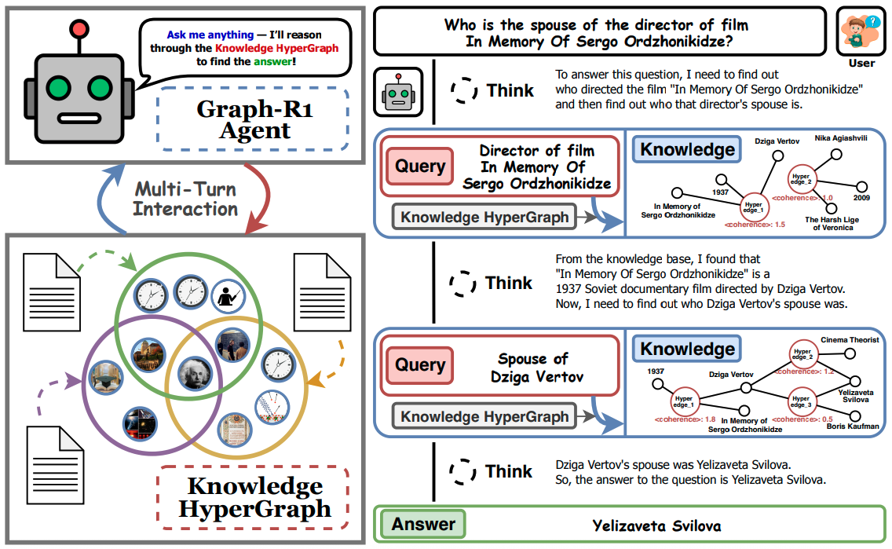
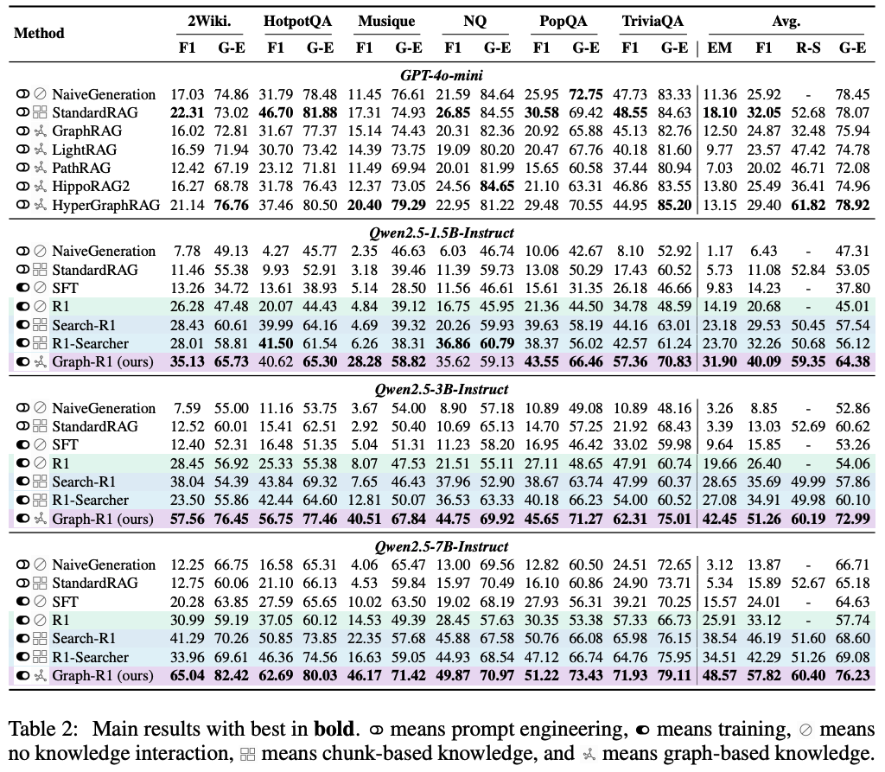

---
tags:
- retrieval-augmented-generation
- reinforcement-learning
- LLMs
potm_order: 3
paper_title: 'Graph-R1: Towards Agentic GraphRAG Framework via End-to-end Reinforcement
  Learning'
paper_authors: Haoran Luo et al.
paper_orgs: Beijing University of Posts and Telecommunications, Nanyang Technological
  University, National University of Singapore, Beijing Institute of Computer Technology
  and Application, Beijing Anzhen Hospital, Capital Medical University
paper_link: https://arxiv.org/abs/2507.21892
review_authors:
- kheerann
---

### The key idea
The authors present an agentic approach for RAG where, in each step, an LLM-based agent is given the choice to either (1) retrieve more information for its context or (2) terminate and answer the query. Their LLM-based agent is fine-tuned from a pretrained LLM using an end-to-end reinforcement learning (RL) objective based on Group Relative Policy Optimization (GPRO) that rewards the agent for the format of the response and the quality of the response upon termination. Compared to previous work for agentic RAG (e.g., [R1-Searcher](https://arxiv.org/abs/2503.05592) and [Search-R1](https://arxiv.org/abs/2503.09516)), the key difference in their approach is in the retrieval step. They perform retrieval from a knowledge hypergraph that is constructed based on the underlying corpus of documents.

### Their method

<figcaption>Figure 1. An illustration of Graph-R1.</figcaption>

*Hypergraph Construction.* They first use the corpus of documents $K$ to construct a knowledge hypergraph $G = (V, E)$ where, for each document $d \in K$, they do the following:
1. Extract relational facts $\\{(e_i, V_{e_i})\\} \sim \pi_\text{ext}(d)$ using an LLM-based extractor $\pi_\text{ext}(d)$.
2. For each fact $(e_i, V_{e_i})$ extracted, add the hyperedge $e_i$ to $E$ and each of its corresponding entities $v \in V_{e_i}$ to $V$.

*Hyperedge Retrieval.* Then, given any query $q$ and an embedding model $\phi$, retrieving from the corpus of documents can be performed directly by retrieving hyperedges from the hypergraph $G$ as follows:
1. Embed the query $q$ using $\phi$ to get the embedding vector $\phi(q)$. Then, obtain the top-$k_E$ hyperedges $F_E \subseteq E$ whose embedding vectors using $\phi$ are most similar to $\phi(q)$. This makes up the final set of hyperedges retrieved in this step.
    

    $$
    F_E = \text{argmax}_{e \in E}^{k_E}\{\text{sim}(\phi(e), \phi(q) )\}
    $$
    

2. Extract the entities $V_q$ present in the query $q$ using an LLM-based extractor and embed them using $\phi$ to get a single embedding vector $\phi(V_q)$. Then, obtain the top-$k_V$ entities $R_V \subseteq V$ whose embedding vectors using $\phi$ are most similar to $\phi(V_q)$. Finally, all hyperedges that contain at least one entity in $R_V$ are added to the final set of hyperedges retrieved in this step.
    

    $$
    R_V = \text{argmax}_{v \in V}^{k_V}\{\text{sim}(\phi(v), \phi(V_q) )\}
    $$
    $$
    F_V = \bigcup_{v \in R_V} \{e \in E | v \in V_{e} \}
    $$
    

3. All the hyperedges in $E$ are then scored by summing their reciprocal ranks w.r.t. the sets $F_V$ and $F_E$ where the reciprocal rank is $0$ if not present in the corresponding set. Then, using this score, only the top-$k$ hyperedges are kept for the final set $F^*$ of hyperedges retrieved based on the query $q$.
    

    $$
    F^* = \text{argmax}_{e \in E}^{k}\{\frac{1}{\text{rank}(e; F_E)} + \frac{1}{\text{rank}(e; F_V)}\}
    $$
    

*Multi-Step Reasoning Format.* Given a query from the user, the LLM-based agent performs multi-step reasoning where, in each step, it starts with a thinking phase (within `<thinking></thinking>` tags) based on the previous context (initialised with the original query) that produces an action to either retrieve or terminate. Retrieving consists of generating an appropriate query (within `<query></query>` tags) that is used to retrieve further knowledge from the hypergraph (outlined above), which is then added to the LLMs context (within `<knowledge></knowledge>` tags). Terminating consists of generating the final answer (within `<answer></answer>` tags).

*Rewards for GRPO-based RL.* During the RL fine-tuning process, for each training question, the agent uses the current policy to generate $N$ possible multi-step reasoning trajectories. The policy is then updated using the [GRPO framework](https://arxiv.org/abs/2402.03300) where each step of the trajectory is rewarded for adhering to the above response format and the final step (i.e., upon termination) is rewarded for returning the correct answer.
In particular, given a $T$-step reasoning trajectory, each appropriately formatted step is given a score of $0.5$ with an overall maximum of $1.0$; and, conditioned on a maximum format score of $1.0$ with an outputted answer $\textbf{ans}_o$, the answer reward is computed as the token-level F1 score w.r.t. the golden answer $\textbf{ans}_g$. Finally, the score is the sum of both of these rewards subtract $1$.

$$
R_\text{format} = \text{min}\{1.0, 0.5 \cdot \sum_{t=1}^T \textbf{I}(\text{step } t \text{ is well-formatted})\}
$$

$$
R_\text{answer} = \textbf{I}(R_\text{format} = 1.0 ) \cdot \frac{2 \cdot |\text{tokens}(\text{ans}_o) \cap \text{tokens}(\text{ans}_g)|}{|\text{tokens}(\text{ans}_o)| + |\text{tokens}(\text{ans}_g)|}
$$
$$
R_\text{final} = R_\text{format} + R_\text{answer} - 1.0
$$

where $\textbf{I}(.)$ is the indicator function.

### Experiments
The authors compare the performance of Graph-R1 on several question-answer datasets using various Qwen2.5 models as the initial pretrained LLM for RL fine-tuning. See Table 2 below (taken from their paper) for the results of their experiments. 

In all experiments, they use [`bge-large-en-v1.5`](https://arxiv.org/abs/2402.03216) as the embedding model (i.e., $\phi$ mentioned above), and in all runs of Graph-R1 they use `gpt-4o-mini` for the LLM-based knowledge extractor (i.e., $\pi_\text{ext}$ mentioned above). 

### Conclusion
The authors show that representing the corpus of documents as a knowledge hypergraph increases the representability of the information in the corpus. Furthermore, through their agentic RAG approach, they show that the knowledge hypergraph allows for effective information retrieval in the form of hyperedges. On the other hand, the computational complexity of retrieval from the hypergraph grows linearly w.r.t. the number of hyperedges in the knowledge hypergraph, which is much larger than the number of documents in the corpus and could be inefficient for large corpora.