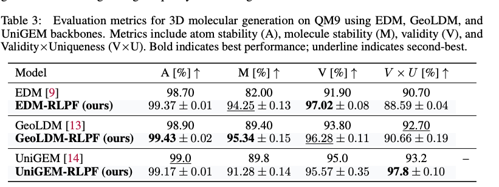

---
tags:
- diffusion
- reinforcement-learning
- molecule-generation
- ligand
potm_order: 2
paper_title: Guiding Diffusion Models with Reinforcement Learning for Stable Molecule
  Generation
paper_authors: Zhijian Zhou, et al.
paper_orgs: Fudan University, Shanghai Innovation Institute, Shanghai Academy of Artificial
  Intelligence for Science
paper_link: https://arxiv.org/abs/2508.16521
review_authors:
- yemanh
---

### The key idea

The authors developed Reinforcement Learning with Physical Feedback (RLPF), a model for generating physically realistic 3D molecular structures. While diffusion models with equivariant neural networks capture molecular geometry, they often fail to ensure physical stability. RLPF addresses this issue by fine-tuning a pretrained model with proximal policy optimization. The key contribution is the use of force field based reward functions, which provides physical feedback to guide molecule generation towards energetically stable and valid conformations. Experiments on QM9 and GEOM-drug show that RLPF significantly improves stability, and generalizes across model backbones.

### Their method

RLPF uses reward signals derived from force field-based metrics to fine-tune pretrained diffusion models to guide the generation of physically realistic and energetically stable molecules. Figure 1 shows the overall workflow of RLPF and it contains three main components:

1. **Trajectories sampling**  
   Using the pre-trained model $p_{\theta_{\text{old}}} $ generate $K$ molecular trajectories by denoising latent variables over $ T $ timesteps. This process captures both the intermediate states $ z_t $ and the final molecular structure $z_0 = (x, h) $.  

2. **Rewards calculation**  
   The generated molecules $z_0 = (x, h)$ are evaluated using reward functions, extended tight binding (xTB) based force deviation and valency-based stability. These evaluations yield scalar rewards $ r(x, h) $.  

3. **Fine-tune with RL**  
   For each trajectory $ k $, the reward $ r(x^k, h^k) $ is normalized to obtain an advantage estimate $ \hat{A}^k_t $. The importance sampling ratio $ I^k_t(\theta) $ is computed using log-likelihood scores. Finally, a PPO-style clipped policy objective is optimized to update the model parameters $ \theta $.  

The molecule generation is formulated as MDP defined by the following components:

- **State**: $s_t = (z_t, t, c)$, where $c$ is the conditioning variable (if available), $t$ the timestep, and $z_t = [x_t, h_t]$ the latent at step $t$. The $x_t$ and $h_t$ are atom $3D$ coordinate and atom type encoding, respectively. 
- **Action**: $ a_t = z_{t-1}$, corresponding to the output of the reverse diffusion step.  
- **Policy**: $\pi(a_t \mid s_t) = p_\theta(z_{t-1} \mid z_t, t, c)$, which is the diffusion backbone neural network parameterized by parameters $\theta$.
- **Reward**: $ R(s_t, a_t) = r(z_0, c) \;\; \text{if } t=0,\; \text{and } 0 \;\text{otherwise}$.  

Generating a molecule consists a trajectory from step $t=T$ to $t=0$, where the $z_0$ from the final diffusion step is the final denoised sample.  Suppose a trajectory $\tau$ denote a state-action sequence $s_0, a_0, s_1, a_1, \ldots, s_T, a_T$. 

The total reward of the trajectory is given by $R(\tau) = \sum_{t=0}^{T} r(s_t, a_t) = r(s_0) $, since reward is only available at the last step only. 

The goal is to learn a policy, $p_\theta$, that maximizes the expected reward over the trajectories with performance objective ($J(\theta)$).

 $$
J(\theta) = \mathbb{E}_{\tau \sim p_{\theta}(.)}\left[ \;  R(\tau)\; \right] 
= \sum_{\tau} p_{\theta}(\tau) R(\tau)
$$

The goal is to find $\theta$ that maximizes $J(\theta)$:

 $$
\max_{\theta} J(\theta) 
= \max_{\theta} \sum_{\tau} p_{\theta}(\tau) R(\tau)
$$

This aims to find a policy that assigns larger probabilities to trajectories that have high reward and lower probabilities to trajectories with lower reward. This is achieved using gradient based optimization

$$
\nabla_\theta J(\theta) =  \mathbb{E}_{\tau \sim p_{\theta}(.)} \left[ \nabla_\theta \log p_{\theta}(\tau) R(\tau) \right]
$$

For stability reason, the authors applied PPO-style surrogate objective defined below:

$$
\mathcal{L}^{\text{CLIP}}_{\text{RLPF}}(\theta) := \mathbb{E}_t \left[ \sum_{k=0}^K \min \left( I_t^k(\theta) \hat{A}_t^k, \text{clip}(I_t^k(\theta), 1 - \epsilon, 1 + \epsilon) \hat{A}_t^k \right) \right]
$$

where $p_{\theta old}$ denotes the diffusion model before the current update.

For each time step t and trajectory k, the importance sampling ratio ($I_t^k(\theta)$) is defined as :

$$
I_t^k(\theta) := \frac{p_\theta(z_{t-1}^k \mid z_t^k)}{p_{\theta_{\text{old}}}(z_{t-1}^k \mid z_t^k)},
$$

 The advantage estimate $\hat{A}_t^k$ is computed via standardization of the scalar reward:

$$
\hat{A}_t^k := \frac{r^k(x_t^k, h_t^k) - \mu}{\delta},
$$

where $\mu$ and $\sigma$ are the running mean and standard deviation of recent rewards across trajectories.

The reward used to guide generation is the deviation of generated molecules from their equilibrium structure measured by root mean square deviation (RMSD) of atomic forces. These were computed using two methods: quantum mechanical calculations at the B3LYP/6-31G(2df,p) level of theory or the semi-empirical GFN2-xTB force field. 

### Results

RLPF was evaluated on QM9 and GEOM-drug datasets. RLPF fine-tuned models were compared with a range of state-of-the-art generative baselines, including EDM, EDM-BRIDGE, GEOLDM, EDN, GeoBFN, and UniGEM. Molecular quality metrics, such as atom stability, molecule stability, chemical validity, uniqueness, and novelty were used to compare the performance of the molecules

As shown in Table 1, EDM fine-tuned with RLPF (EDM-RLPF) consistently improved the results of molecular metrics compared with the baseline EDM model on the QM9 dataset. While baseline EDM performance was inferior compared with the their baseline model, EDM-RLPF outperformed other baseline models in three out of four metrics used by the authors.  The baseline models were trained with configuration provided in the original papers.  Moreover, on GEOM-drug dataset, EDM-RLPF improved atom stability from $81.3\%$ to $87.53\%$ and increased validity from $91.9\%$ to $99.20\%$ compared with EDM model.

During fine-tuning, the same pre-training data was used.  The number of denoising time steps $T$ is set to $1000$, with $K = 512$ sampled trajectories per epoch and the model was fine-tuned using force deviation reward computed via DFT at the B3LYP/6-31G(2df,p) level. 

<figcaption></figcaption>

Furthermore, to evaluate genralizability of RLPF, the authors applied RLPF to other generative model backbones beyond EDM. As shown in the Table 2, RLPF consistently improves atom stability, molecule stability, and validity across all backbones.

<figcaption></figcaption>

Overall, RLPF could be flexibly integrated into different architectures and improves physical plausibility of generated molecules using physics inspired feedback during training.

