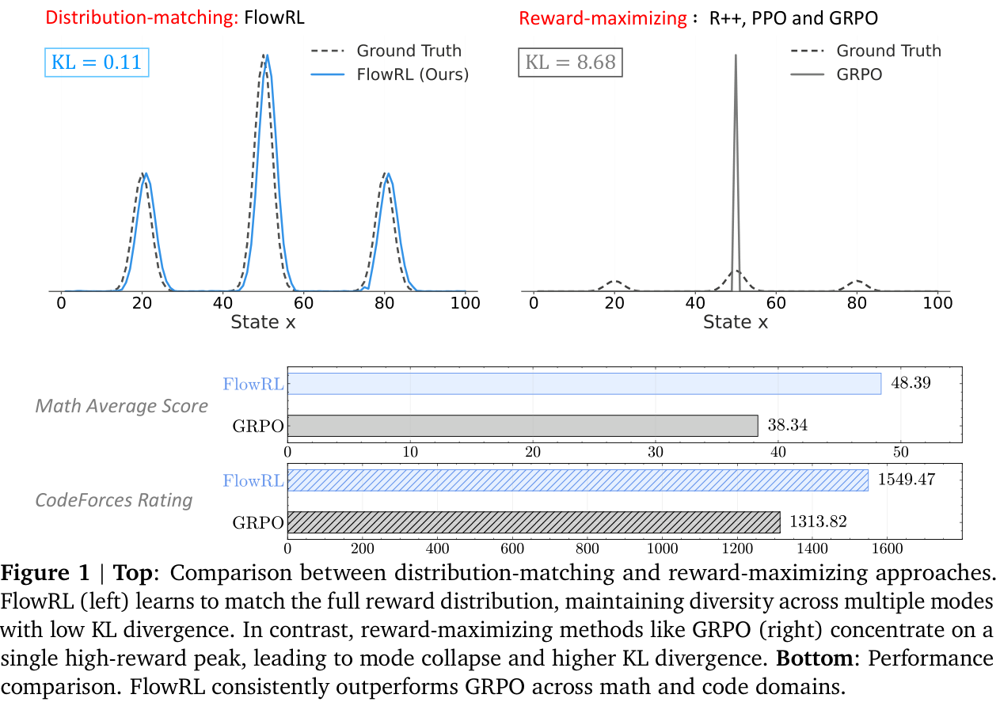
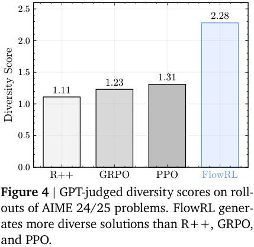

---
tags:
- LLMs
- reasoning
- reinforcement-learning
potm_order: 0
paper_title: 'FlowRL: Matching Reward Distributions for LLM Reasoning'
paper_authors: Xuekai Zhu, et al.
paper_orgs: Shanghai AI Laboratory
paper_link: https://arxiv.org/abs/2509.15207
review_authors:
- samot
---

### The key idea

Reinforcement learning (RL) has become the dominant paradigm for fine-tuning LLMs to give them 'reasoning capabilities'. Recent reasoning models adopt *reward-maximising* methods (eg, PPO, GRPO or one of the many variants). These can over-optimise dominant reward signals, potentially neglecting less frequent but equally valid reasoning paths, thus reducing diversity.

**FlowRL** uses the framework of GFlowNets ([2023](https://jmlr.org/papers/v24/22-0364.html)) to transform *scalar* rewards into a target *distribution*, using a learnable partition function, and minimises the (reverse) KL divergence between the policy and target distribution. More diverse generation is observed, with improved scores on certain benchmarks.

>   NB. It is worth pointing out that GFlowNets have been used in LLM fine-tuning in the past. Particularly, *Flow of Reasoning* ([2025](http://arxiv.org/abs/2406.05673)) formulates multi-step LLM reasoning as a Markovian flow on a directed acyclic graph (DAG).

### Background

RL plays a crucial role in post-training of LLMs. Training algorithms have progressed through several key stages: from REINFORCE ([1999](https://proceedings.neurips.cc/paper_files/paper/1999/file/464d828b85b0bed98e80ade0a5c43b0f-Paper.pdf)), through TRPO ([2015](https://arxiv.org/abs/1502.05477)) and PPO ([2017](https://arxiv.org/abs/1707.06347)), to GRPO ([2024](https://arxiv.org/abs/2402.03300)) and its variants. These all aim to maximise reward signals, potentially leading to model collapse. One of the key aspects of TRPO was to introduce a KL penalty to prevent this collapse. More recent adaptations include adjusting the clip ratio (DAPO, [2025](http://arxiv.org/abs/2503.14476)) or resetting the reference model (ProRL, [2025](http://arxiv.org/abs/2505.24864)), all with the objective of increasing diversity.

The paper uses the machinery of *generative flow networks* (GFlowNets) introduced by Bengio et al ([2023](https://jmlr.org/papers/v24/22-0364.html)). The following brief description is taken from §2. GFlowNets are a probabilistic framework for training stochastic policies to sample discrete, compositional objects (eg, graphs or sequences) in proportion to a given reward. The core principle (see Figure 2) is to balance forward and backward probability flows at each state, inspired by flow matching (Bengio et al, [2021](https://arxiv.org/abs/2106.04399)).

### Their method

The paper introduces **FlowRL**, a policy optimisation algorithm designed to align the policy model with the *full reward distribution* encouraging mode coverage—rather than *reward maximisation* which tries to find the 'best' local mode. The core idea is to introduce a learnable partition function that converts scalar rewards into a target distribution; the objective is to then minimise the (reverse) KL divergence between the policy and this.

This KL objective is based on the trajectory balance formulation from GFlowNets. Prior work on GFlowNets typically operated on short trajectories in small discrete spaces. To address challenges of long CoT (chain-of-thought) training, two key techniques are adjusted:

-   *length normalisation* to tackle gradient explosion in variable-length CoT reasoning;
-   *importance sampling* to correct for distribution mismatch between generated rollouts and the current policy.

Both these arise frequently in other LLM post-training contexts but need to be adjusted to the GFlowNets set-up.

### Results

FlowRL is compared with 'vanilla' RL algorithms: REINFORCE++ ([2025/01](http://arxiv.org/abs/2501.03262)), PPO ([2017/07](https://arxiv.org/abs/1707.06347)) and GRPO ([2024/12](https://arxiv.org/abs/2402.03300)). The benchmarks are across maths and code domains, using both base and distilled LLMs of reasonable size: 32B and 7B, respectively. Consistent performance improvements are observed (see note below), as well as (perhaps, more importantly) increased diversity of generated reasoning paths—although, metrics on such are less precisely defined.

>   NB. It must be pointed out that none of the more modern variants, such as DAPO ([2025/03](http://arxiv.org/abs/2503.14476)), ProRL ([2025/05](http://arxiv.org/abs/2505.24864)) or GSPO/GMPO ([2025/07](http://arxiv.org/abs/2507.18071)/[2025/07](http://arxiv.org/abs/2507.20673)) are compared. Many of these *explicitly* address lack of diversity. Little can be inferred regarding, say, FlowRL vs DAPO or ProRL.

### Takeaways

The paper introduces a new framework for LLM reasoning, and benchmarks it vs some modern, albeit vanilla, RL algorithms.

-   *Positives.*
    -   Mainstream LLM reasoning approaches are (highly?) unsatisfying, particularly the lack of diversity.
    -   The paper effectively proposes an alternative paradigm, using GFlowNets as a tool, and the diversity certainly improves, significantly in some cases.

-   *Negatives.*
    -   The lack of discussion on the other recent (earlier) paper using GFlowNets (FoR, [2024](http://arxiv.org/abs/2406.05673)) is disappointing from an academic standing.
    -   The lack of comparison with state-of-the-art RL training algorithms prohibits any real conclusion on whether GFlowNets are a better way to go than reward-maximisation.

-   *Conclusion*.
    -   Despite its shortcomings, this reviewer finds the paper very interesting, and could definitely serve as a foundation for further research.
    -   Replication studies, with better benchmarks, are highly encouraged.
