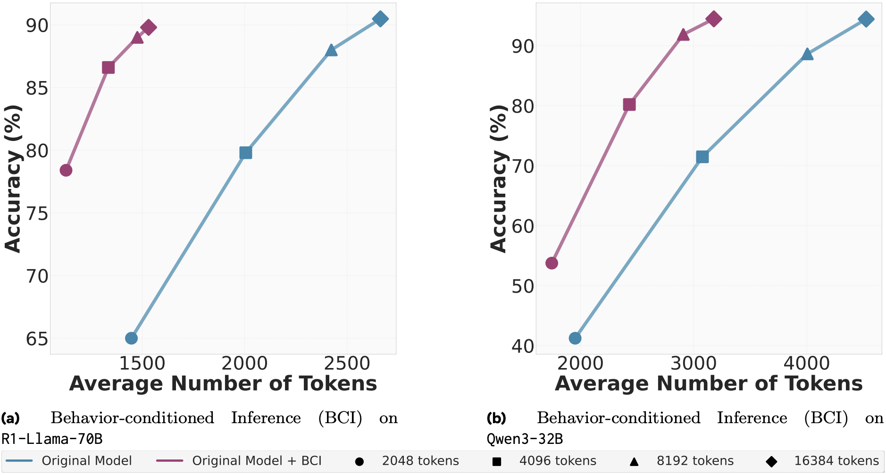
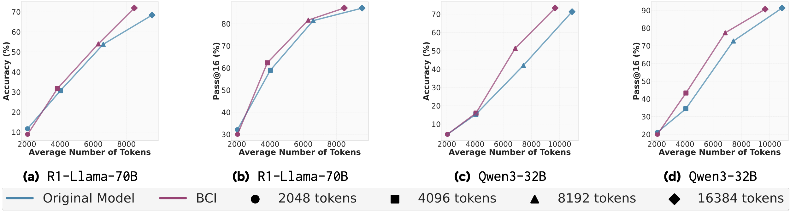
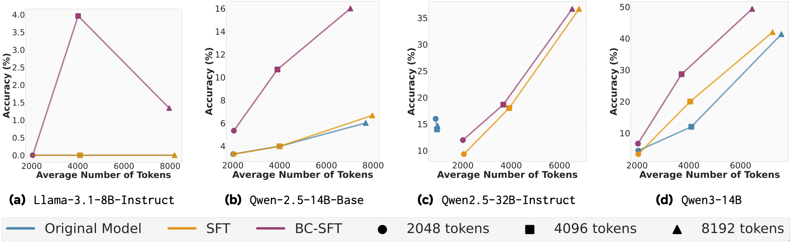
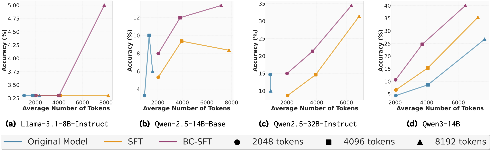

---
tags:
- LLMs
- reasoning
- RAG
- self-improvement
- efficient-inference
potm_order: 1
paper_title: 'Metacognitive Reuse: Turning Recurring LLM Reasoning Into Concise Behaviors'
paper_authors: Aniket Didolkar, et al.
paper_orgs: Meta, Mila-Quebec AI Institute, Princeton University
paper_link: https://arxiv.org/abs/2509.13237
review_authors:
- dobrikg
---

<!-- [200 words is a rough guide for the length of a summary. -->
<!-- Feel free to go a fair bit over or under if needs be. -->
<!-- The editor will fix any issues with images being rendered too wide/narrow etc. -->
<!-- See README for how to view locally if you wish to (not required. Contact CB if this -->
<!-- is broken for you.)] -->

### The key idea

> "_Do not rediscover the wheel, if you have already done it once!_"
>
>  -- paraphrased **TL;DR**

According to Didolkar et al., this is the key lesson we should teach LLMs. Why?
The authors have observed that while rapid progress in the performance of
Chain-of-Thought approaches has been made, this has also led to an
effectiveness/efficiency decline. From where? Because **the LLMs re-derive
knowledge from scratch too often**, resulting in less room for exploration and
larger token output.


The proposed remedy is _metacognitive reuse_. Instead of providing a set of
facts/rules, we let the LLMs synthesise their own _behaviours_. These are
concise pieces of knowledge, reusable across questions/datasets and models.


<figcaption markdown="1">

**Behaviour Curation Pipeline (left)**: All the 3 stages of behaviour curation
pipeline: _solution_, _reflection_, _extraction_. LLM A is referred to as the
<tt>Metacognitive Strategist</tt>. **Reasoning with behaviours (right; in
gray)**: The three proposed ways to utilise behaviours -- inference,
self-improvement and supervised fine-tuning (SFT). LLM B and LLM C are a
student and teacher LLMs respectively.

</figcaption>
Once synthesised, Didolkar et al. propose three ways to utilise extracted
behaviours:
* Behaviour-conditioned inference (BCI) -- the set of behaviours is pre-extracted
  from a (different) strategist LLM.
* Behaviour-guided self-improvement -- the set of behaviours is extracted as we
  process questions/tasks from the same LLM.
* Behaviour-conditioned supervised fine-tuning -- a Behaviour-conditioned
  teacher model synthesises a training set of question/solution pairs, used to
  fine tune the student model.

### Background

[Chain-of-Thought](https://arxiv.org/abs/2201.11903) (CoT) prompting is a
technique in prompt engineering for large language models. It encourages the
LLM to break down complex reasoning tasks into a sequence of intermediate
reasoning steps (a “chain”) before arriving at a final answer. This helps
improve performance on multi-step problems (e.g. arithmetic, logic,
commonsense) at the cost of outputting long reasoning traces (more output
tokens = higher expenditure). Unfortunately, the chain might still be flawed.
More enumerative [beam-search-like
approaches](https://arxiv.org/abs/2412.09078), can resolve this, but the
computation required is even higher.

### Their method

**Behaviour curation** &ensp; There is a lack of formal definition of
behaviour. At the risk of repeating myself, authors define it _in the main
text_ as "a reusable skill---concise piece of knowledge---distilled from an
LLM's chain of thought" (p.4). E.g.:

```
behaviors_angle_sum: The sum of the interior angles of a triangle is 180 degrees. Use
                     this property to find the missing angle when two angles are known.
```

The proposed extraction pipeline consists of three stages. The
<tt>Metacognitive Strategist</tt> (DeepSeek-R1-Distill-Llama-70B) first
generates a reasoning trace + a final answer. These are then used for the
reflection prompt, which is also fed back to the same LLM, to allow it to
filter out illogical chains and also generate new candidate behaviours. The
<tt>Metacognitive Strategist</tt> is also used for the generation of the final
set of behaviours, which are to be appended to the behaviour handbook.


Out of the three prompts, perhaps the most insightful is the reflection prompt.
Behaviour is defined there as "a note or skill", which "can be a strategy, a
trick, or a technique", or "it can also be a general rule or a commonsense
principle", and, most importantly, **"is not a solution to the problem, but can
be used to solve it"**. Correctness analysis prompting aside, the authors
explicitly require the model to consider how a behaviour "would have helped in
reducing the answer length".


**Behaviour usage$\approx$RAG** &ensp; A naive approach to behaviour
conditioned inference (BCI) would be to simply make them part of the context.
Such an approach, however, would bloat the number of input tokens and, as a
result, have higher cost than CoT. The authors also note this: instead of
feeding in all behaviours, for a question $Q_i$, a subset of behaviours $B_i$
is retrieved and the solution $S_i$ is generated based on the $(B_i, Q_i)$
pair. The retrieval function depends on the dataset -- topic-matching is used for
MATH, FAISS top-40 cosine similarity lookup for AIME.

When it comes to Behaviour-guided self-improvement, there is some confusion
going on inside me. $\S4.2$ states:

> behaviours [...] are then fed back [...] to solve the same question **or new
> questions**

and that the
implementation "closely follows that of BCI". In the experimental setup
($\S5.2$), the text suggests that the approach is a behaviour-guided variant of
the Critique-and-Revise baseline and that

> [...] reasoning traces are generated per question which are used [...] to
> curate a behaviour handbook **for that question**

The inline equation $((B, Q),\rightarrow R_2)$ (note the lack of subindexes)
also suggest that there is no RAG-like lookup as in BCI, nor that the
previously curated behaviours are used for the current or future questions.
Whether this is indeed the case or is just a clarity issue with the writeup,
only the authors can tell. (Open-sourcing the code to reproduce the experiments
could also have answered my questions).

As both of the above approaches use extra input tokens, the authors also
present Behaviour-conditioned SFT (BC-SFT). The aim of BC-SFT is to
"internalise" the set of behaviours in the weights of the model -- when
answering any new questions, the fine-tuned model will not be conditioned on a
behaviour handbook. It will be invoking those behaviours, based on its parameter
weights. Importantly, to achieve that **the student model is never
conditioned on a handbook**, neither during training, nor during inference.

<!-- Latex can be included in the standard way, either inline: $R=\sum _{t=0}^{\infty }\gamma ^{t}r_{t}$ -->

<!-- Or as a block: -->

<!-- $$ -->
<!-- Q_{t+1}^{A}(s_{t},a_{t})=Q_{t}^{A}(s_{t},a_{t})+\alpha _{t}(s_{t},a_{t})\left(r_{t}+\gamma Q_{t}^{B}\left(s_{t+1},\mathop {\operatorname {arg~max} } _{a}Q_{t}^{A}(s_{t+1},a)\right)-Q_{t}^{A}(s_{t},a_{t})\right). -->
<!-- $$ -->

<!-- Code can also be included in the standard way: -->

<!-- ``` -->
<!-- import popart -->

<!-- builder = popart.Builder() -->

<!-- # Build a simple graph -->
<!-- i1 = builder.addInputTensor(popart.TensorInfo("FLOAT", [1, 2, 32, 32])) -->
<!-- i2 = builder.addInputTensor(popart.TensorInfo("FLOAT", [1, 2, 32, 32])) -->

<!-- o = builder.aiOnnx.add([i1, i2]) -->
<!-- ``` -->

### Results

The authors experiment on [MATH](https://arxiv.org/abs/2103.03874) as well as
both [AIME](https://arxiv.org/abs/2503.21380v2) (2024, 2025) variants.
Behaviour usage (conditioning/self-improvement/SFT) is performed on open-source
reasoning LLMs -- DeepSeek-R1, which in the plots is referred to as
**<tt>R1-Llama-70B</tt>** and Qwen. The <tt>Metacognitive Strategist</tt> model
is always fixed to DeepSeek. For MATH, behaviours are synthesised from a
subsample of it and for AIME -- from past iterations (2022, 20223) of the
benchmark. In the plots that follow, while no standard deviations are reported
(since we measure both accuracy and token usage, stds could look like an
ellipse around each point), results are average across 80 seeds -- check paper
for further technical details. Unless otherwise stated, the x-axis is the
average number of tokens **produced** per solution and the y-axis is average
accuracy. The different symbols are the enforced upper limit on number of
output tokens.

**_N.B. #1_** Before we proceed to analyse the plots, please be aware
the axis limits vary between plots, sometimes quite drastically (cf. SFT
plots). I am aware the authors are trying to make a point, but do not vary
limits... at least not within one figure... or at least without being
explicit about it.

**_N.B. #2_** For the reader's entertainment, I have tried to be as independent
as possible in my analysis, i.e. only copying plots, but not copy-pasting the
authors' text.



<figcaption> BCI performance on MATH </figcaption>

<figcaption> BCI performance on AIME-24 </figcaption>

<figcaption> BCI performance on AIME-25 </figcaption>

Starting with the BCI performance, there is a clear advantage, both in terms of
tokens produced and accuracy on the MATH dataset. This advantage however is
much smaller and _questionable, without standard deviations,_ on both AIME
variants, especially at lower token limits (2048 and 4096). At higher token
limits, we do see more substantial improvements, particularly for BCI with
DeepSeek. While concrete numbers would certainly have been appreciated, the
reduction in output tokens for DeepSeek seemingly varies between 5% and 30%.
Upon visual inspection, such reductions are much rarer for Qwen. In all cases,
accuracy is preserved or improved (sometimes slight, sometimes substantial,
hard to judge visually).


<figcaption> Behaviour-guided Self-improvement on AIME-24. All LLMs used are DeepSeeks. </figcaption>

Again, for self-improvement, analysis of results can be split into two parts --
for the 2048 token limit, behaviours hurt more than help as there is both an
increase in tokens produced and a drop in accuracy. For larger limits, and
especially the largest, behaviour-guided self-improvement can give 10% boost in
the accuracy and 20% boost in Pass@16., but at the cost of threefold increase
in the output tokens. Also note, that for this result, there is the ambiguity
if the behaviour handbook is synthesised for each question individually or for
the whole dataset.


<figcaption markdown="1">

BC-SFT on AIME-24. DeepSeek is the teacher model, each pane is a different
student model. <tt>**Llama-3.1-8B**</tt> is not DeepSeek!

</figcaption>

<figcaption> BC-SFT on AIME-25. </figcaption>

When it comes to supervised fine tuning, the student model has to have a
sufficient capacity in order to grok behaviours -- the 8B model's accuracy is
limited to 5%. This conclusion is further reinforced from the fact that BC-SFT
results for Qwen-2.5 32B and the lowest token limit often match/exceed accuracy
of the 14B variant, across all limits. Newer model variants also benefit more
from behaviour conditioning, than past iterations of the same architecture (cf.
Qwen3 vs Qwen2.5). And while accuracy improvement to the baseline SFT can
be threefold (which is actually 10%, note the scale!) and is observed across
all token limits, reduction in the token count is still a larger token limit
(8192) luxury. A table with concrete token counts is lacking in the paper, but
I would estimate the reduction to be 10-15%.

### Takeaways

So, what score would the Reviewer #2 inside me give? Despite my initial hopes,
I am leaning towards rejection. The idea of metacognitive-reuse seems novel and
exciting enough for me, but the experiments execution is a bit flawed. The
authors discuss the efficiency implications of having a larger input but:
* Never state any end-to-end costs -- even with amortised computation and
  cheaper rates on input, this is a necessary information (see below).
* Never visualise how the behaviour handbook grows or analyse its redundancy --
  out of the 1k subsampled MATH questions, the <tt>Metacognitive
  Strategist</tt> extracted 785 behaviours (p. 7). For AIME, out of
  16$\times$60=960 reasoning traces -- 1457 behaviours (p. 7). On average, the
  model finds a new pattern from almost every given question! In that case, in
  a real world scenario, will we need to run the <tt>Strategist</tt> for every
  question (requires 3 prompts; cache hits unlikely)?
* Never compare to other, non-prompting, test-time compute scaling techniques,
  such as [latent reasoning](https://arxiv.org/pdf/2507.06203) -- if latent
  reasoning is both cheaper/more accurate, then the above approach is
  obsolete. I am not certain that this will be the case, but I call for a
  comparison.
