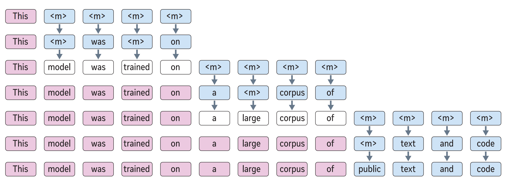

---
tags:
- LLMs
- efficient-inference
potm_order: 1
paper_title: Set Block Decoding is a Language Model Inference Accelerator
paper_authors: Itai Gat, Heli Ben-Hamu, et al.
paper_orgs: Meta
paper_link: https://arxiv.org/abs/2509.04185
review_authors:
- douglaso
---

### The key idea

Set block decoding is a parallel sequence generation algorithm that accelerates token generation by producing multiple tokens simultaneously. The approach requires fine-tuning LLMs to support non-causal generation. Similar to discrete diffusion techniques, a block of $k$ (e.g. 16) tokens is initialized with special mask `<m>` tokens. Then through an iterative sampling process requiring at most $k$ steps, these mask tokens are progressively replaced with generated tokens.

, then '<m> was <m> on', then 'model was trained on', before sampling the next block of 4, etc.">
<figcaption>Figure 2b. Inference in blocks of $k=4$ tokens. Note that 1-4 tokens are accepted in each step, reducing the number of forward passes through the model compared with autoregressive generation.</figcaption>

### Background

Traditional autoregressive inference is both compute and more importantly memory bandwidth-intensive. To generate a sequence from an LLM trained to predict the next word, we first _prefill_ the context, passing it through the model to generate the KV cache and first token. Then to _generate_ the next $N$ tokens from a model of $P$ densely activated parameters, we must perform $N$ additional passes through the model, where each pass requires all $P$ parameters to be transferred from memory to the compute unit, executing at least $P$ multiply-accumulate operations.

Many techniques aim to improve upon this autoregressive next-word-prediction baseline. These can be split into reducing the work per pass or reducing the number of passes ($< N$). This work fits into the second category, which also includes [speculative sampling](https://arxiv.org/abs/2302.01318) and [discrete diffusion](https://arxiv.org/abs/2506.13759).

### Their method

The authors train a model to predict independent distributions for future tokens. Given a block of $k$ tokens at indices $[t, t+k)$, partitioned into two sets: $\mathcal{M}$ corresponding to indices of unknown tokens and $\mathcal{J}$ corresponding to indices of known (already-sampled) tokens, model predicts $p(x_{i \in \mathcal{M}} \mid x_{<t}, x_{\mathcal{J}})$, where $x$ is the sequence of discrete tokens. Practically, this is achieved by applying a non-causal attention pattern over the $k$ indices in $\mathcal{M} \cup \mathcal{J}$ and using special mask tokens `<m>` at unknown token indices in $\mathcal{M}$.

Since the model predicts distributions for all unknown future tokens at every step, one must decide which subset to accept (sample) at that step. The authors accept tokens whose predictive distribution has entropy below a threshold $\gamma$. If no distribution has entropy below $\gamma$, they accept the single token with the lowest entropy. Thus, larger $\gamma$ means accepting more tokens per step, which is faster but potentially less accurate.

Therefore, the inference procedure follows (see figure 2b, above):

1. Query the model with the current prefix, followed by a non-causal sequence of $k$ $\times$ `<m>`.
2. Replace each `<m>` token whose predictive distribution $p(x_{i} \mid \ldots)$ has entropy less than $\gamma$ with a sample from $p(x_{i} \mid \ldots)$.
3. If any `<m>` tokens remain, query the model with the current sequence and repeat from (2). Otherwise go to (1).

To support queries of this form at inference time, the authors train the model on a mixture of a next-token prediction loss and masked-token prediction loss, where the masking rate is sampled uniformly in $[0, 1]$ for each sequence.

### Results

Results shown above, across various reasoning and chat benchmarks, demonstrate a mild accuracy degradation for set block decoding (SBD) versus the next token prediction (NTP) baseline, depending on the task. The speedup for $\gamma_{\text{high}}$ is larger than $\gamma_{\text{low}}$, but it typically incurs a larger degradation in task accuracy. Speedup show in this plot corresponds to the reduction in the number of forward passes through the model, which is appropriate proxy for the performance of bandwidth-bound cases such as small-batch generation. This is supplemented by theoretical speedup analysis based on a roofline hardware model, but the paper lacks physical wall-clock speedup benchmarks.

### Takeaways

One possible concern is that the model may generate intermediate samples that look like `PREFIX <m> <m> TOKEN`, i.e. where there are two as-yet-unchosen tokens between the known `PREFIX` and sampled `TOKEN`. After committing to this, the sampling procedure cannot later decide to insert just one token—it can only progress by performing an _unmask-and-sample_ action on the sequence, never by _insert_ or _delete_. Discrete diffusion approaches such as [seed diffusion](https://arxiv.org/abs/2508.02193) often have such capabilities. The ability to insert & delete mean that the model does not have to commit to tokens appearing in precise relative positions, independent of the intervening tokens: an idea that seems hard to justify in the context of language modelling.

Altogether, this is a promising technique for mitigating the autoregressive sequence generation bottleneck, as it is able to generate multiple tokens with a single forward pass through the model, doing so in a reasonably flexible manner thanks to the entropy heuristic. I'd be interested to see further evolutions of this and related methods.
