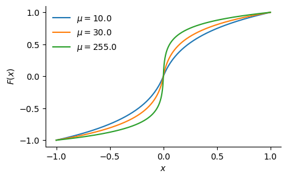
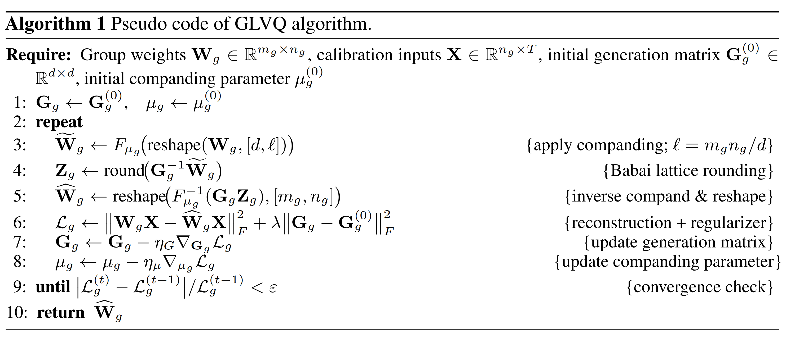

---
tags:
- efficient-inference
- quantisation
potm_order: 1
paper_title: Learning Grouped Lattice Vector Quantizers for Low-Bit LLM Compression
paper_authors: Xi Zhang, et al.
paper_orgs: Nanyang Technological University, Alibaba Group, Southwest Jiaotong University
paper_link: https://arxiv.org/abs/2510.20984
review_authors:
- douglaso
---

### The key idea

The paper introduces grouped lattice vector quantisation (GLVQ), a weight quantisation technique that splits weight tensors into groups, selects a bit width for each group based on a local importance score, compresses their range using a _companding_ nonlinearity, then splits groups into vectors, before rounding to a lattice. The companding function and lattice basis matrix both are trained with a short run on calibration data. This is illustrated below.

{:.img-large}

### Their method - dequantisation

The dequantisation procedure for a single group of weights starts from low-bit integer indices, reshaped into a matrix multiply (to resolve the point on the lattice) followed by an elementwise nonlinearity (inverse-companding).

I.e. the following pseudocode (using concrete shapes for clarity) for a single vector within a group:

```py
# Given:
#   w_indices:   int{b}[8]      (e.g. int2; b is shared over a group of [4096, 128] weights)
#   lattice_G:   float[8, 8]    (shared over the group)
#   mu:          float          (shared over the group)
#   compand_inv: (float, float) -> float

w_tilde = lattice_G @ w_indices
weights = [compand_inv(w, mu) for w in w_tilde]
```

### Their method - quantisation

The quantisation procedure follows four steps:

**1. Weight Groups** First, divide each weight tensor into large groups (e.g. size $4096 \times 128$) - these groups will be quantised independently, sharing quantiser parameters within each group, and trading off flexibility against overhead.

**2. Salience-determined bit allocation** Based on activations from calibration data, choose bit-widths per weight group to minimise the local objective $D_{\text{KL}}(\mathrm{Softmax}(W x) \,\|\|\, \mathrm{Softmax}(\hat{W}x))$, where $W$ is the original weight, quantised to $\hat{W}$ and $x$ is a calibration input. E.g. if the _average_ bit width target is 2 bits/param, more sensitive groups might be allocated 3 bits/param, and less sensitive groups 1 bit/param.

**3. Companding** Since the quantiser in the following step is linear, it is helpful to first compress the range of weights. Use a _companding function_ (elementwise nonlinearity), defined as:

<div>
$$
F(x) = \text{sign}(x) \frac{\ln(1 + \mu \lvert x \rvert)}{\ln(1 + \mu)}
$$
</div>

where $\mu > 0$ is a learned parameter per group. For example, for various $\mu$ values, the companding function looks like this:

{.img-small}

**4. Lattice vector quantisation** Finally, split each group into vectors (e.g. size 8), and quantise each vector by rounding to the (approximate) nearest point on a learned lattice. The lattice is defined by a basis matrix $G$ (size $8 \times 8$ in this example) as $\\{Gz \| z\in \text{int}\\{b\\}^8\\}$, which is trained using an alternating scheme: first fixing $G$ and optimising the integer indices using the Babai closest-vector algorithm, then fixing the integer indices and optimising $G$ with gradient descent.

Putting everything together, the quantisation procedure for a group of weights follows:

{:.img-large}

### Results

A comparison with other post-training quantisation methods on Llama 2 show competitive results at 2-4 bits/param:


Performance benchmarks also show the memory bandwidth achieved for GLVQ dequantisation before matrix-vector product, as well as overall tok/s benchmarks:

{:.img-large}

The results are also supported by an ablation of each aspect described in the method section, as well as for more fine-grained design decisions. We omit this here for brevity, although they are a valuable part of the paper.

### Takeaways

I really liked this technique and paper — the results seem strong and the performance analysis and ablation are thorough. Like many post-training quantisation papers, which use _global_ calibration data from a forward pass through the model, and _local_ gradient-based optimisation, I would be interested to confirm that this is significantly cheaper than quantisation-aware training, so would like to see PTQ compared against QAT in papers like this.
